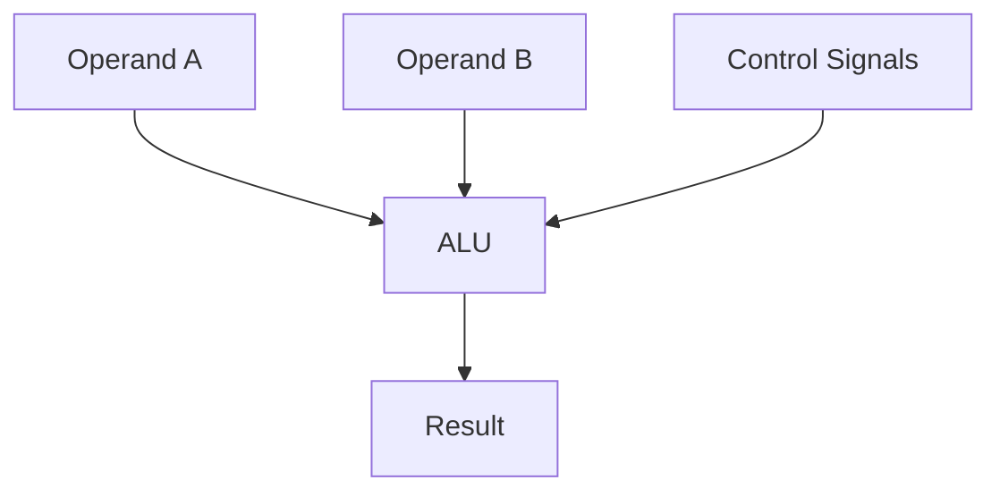
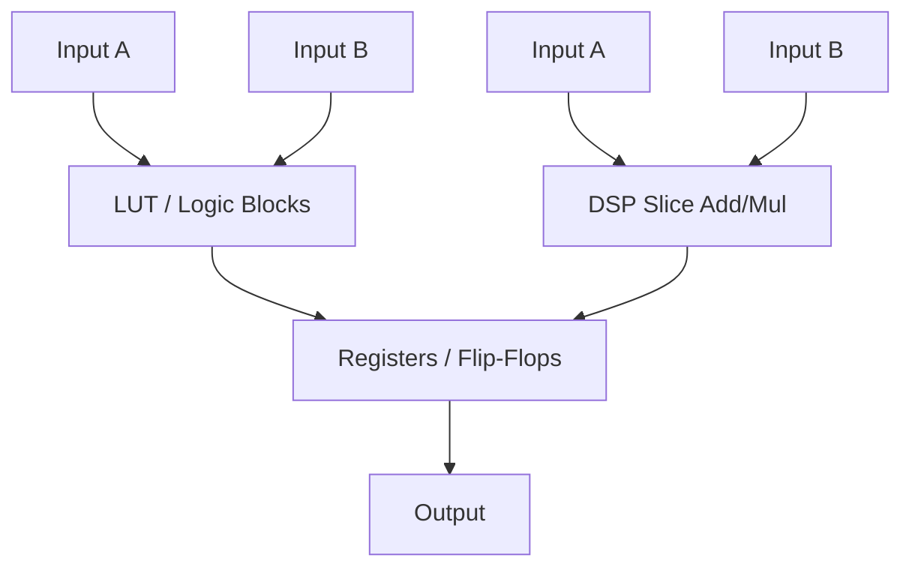

## Difference between a CPU ALU and FPGA implementations:

---

### **1. CPU ALU (fixed hardware)**

* **Purpose:** Performs arithmetic & logic operations (add, sub, AND, OR, XOR, etc.)
* **Fixed:** You cannot change how it works; only control which operation it performs via a control signal.
* **Width:** Typically fixed (e.g., 32-bit or 64-bit).

---

### **2. FPGA (flexible hardware fabric)**

* **Purpose:** Can implement **anything**, including ALUs, state machines, DSP filters, packet routers, etc.
* **Flexible:** You decide how many “ALUs,” their width, and operations.
* **Parallelism:** You can have **many operations at once**, unlike a single CPU ALU.

---

### **Key Differences in Text**

| Feature            | CPU ALU                   | FPGA Implementation                 |
| ------------------ | ------------------------- | ----------------------------------- |
| Fixed/programmable | Fixed                     | Fully programmable                  |
| Parallelism        | Usually single            | Many operations in parallel         |
| Logic resources    | Dedicated ALU gates       | LUTs, DSP slices, FFs               |
| Scope              | Arithmetic & logic only   | Anything: ALU, state machines, etc. |
| Customization      | Limited (control signals) | Full: width, operations, pipeline   |

---

💡 **Takeaway:**

* On a CPU, ALU = fixed hardware block.
* On an FPGA, an ALU is **just one possible block you can create**, but you don’t have to — you build exactly the logic your system needs.

---

If you want, I can make a **small text example of FPGA “ALU” code vs a custom logic module**, so you can see how you actually implement one in HDL. Do you want me to do that?
