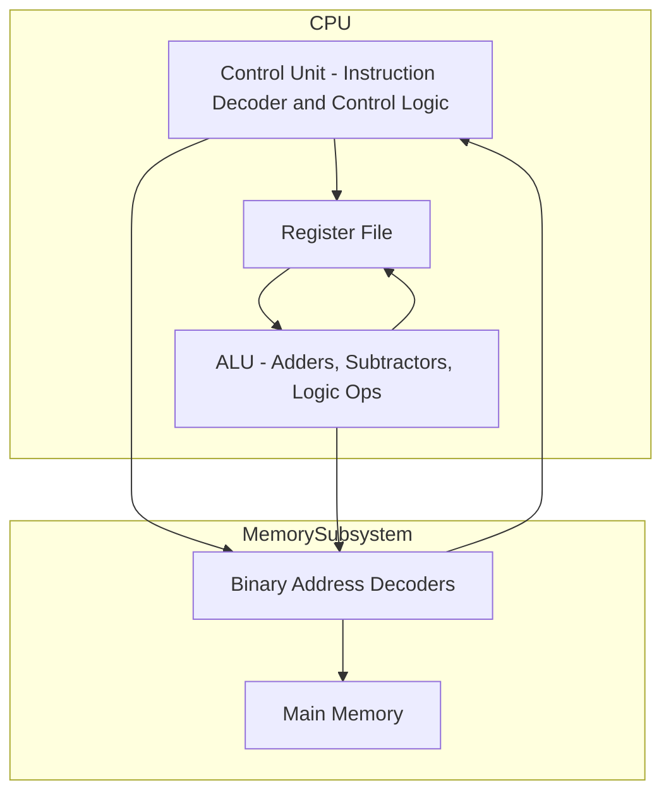

```mermaid
flowchart TD

    subgraph CPU
        CU[Control Unit - Instruction Decoder and Control Logic]
        RF[Register File]
        ALU[ALU - Adders, Subtractors, Logic Ops]

        CU --> RF
        RF --> ALU
        ALU --> RF
    end

    subgraph MemorySubsystem
        DEC[Binary Address Decoders]
        MEM[Main Memory]
        DEC --> MEM
    end

    CU --> DEC
    ALU --> DEC
    DEC --> CU

```

# :books: References

- [ ] [HOW TRANSISTORS RUN CODE?](https://www.youtube.com/watch?v=HjneAhCy2N4)
