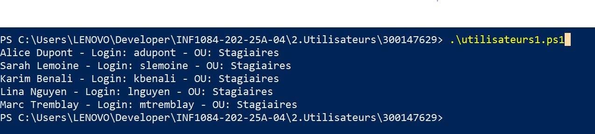
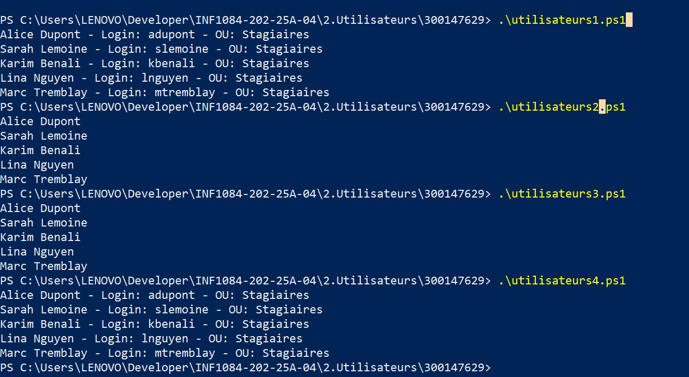

Exercice 1: Creer une liste utilisateurs et  en les ajoutants

Exercice 2:Ajouter tous les utilisateursdont l'OU ="Stagiaires" dans Groupe

Exercice 3: afficher tous les utilisateurs ayant prenom 'a' et 'b'

