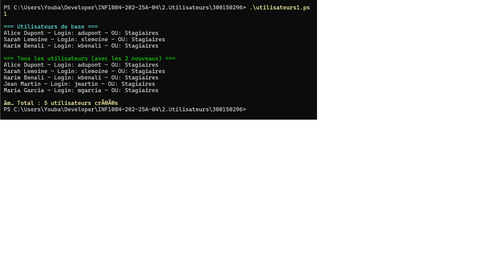
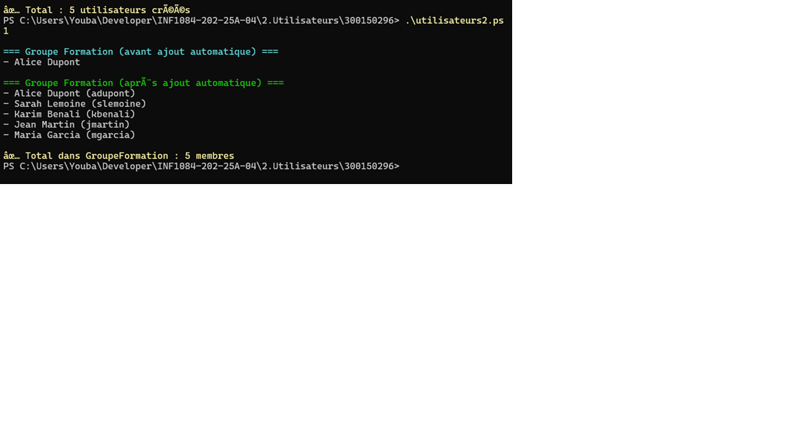
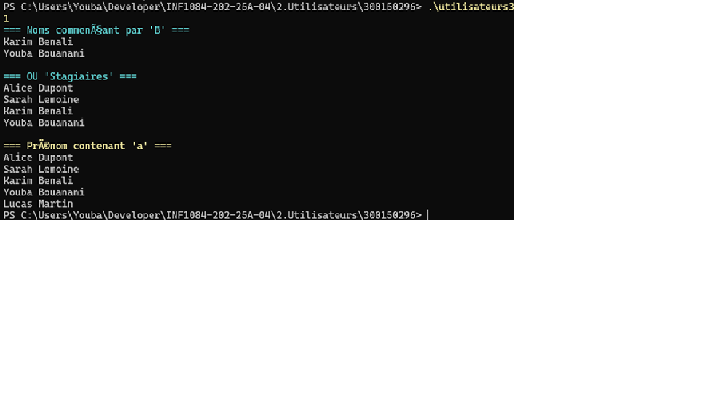
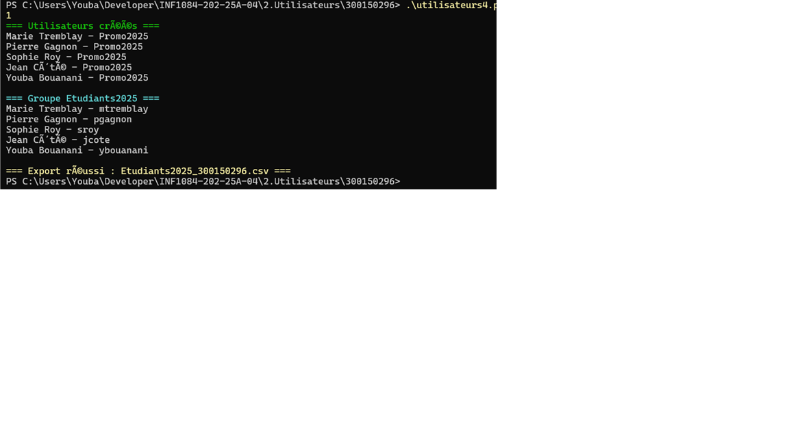

# 👤 TP Utilisateurs PowerShell - Simulation Active Directory

**Étudiant :** Youba Bouanani  
**Matricule :** 300150296  
**Cours :** INF1084-202-25A-04  
**Date de réalisation :** Décembre 2025

---

## 📚 Table des matières
1. [Objectifs du TP](#-objectifs-du-tp)
2. [Scripts réalisés](#-scripts-réalisés)
3. [Exercices et solutions](#-exercices-et-solutions)
4. [Captures d'écran](#-captures-décran)
5. [Difficultés rencontrées](#-difficultés-rencontrées)
6. [Conclusion](#-conclusion)

---

## 🎯 Objectifs du TP

Ce travail pratique vise à :
- ✅ Comprendre la structure Active Directory (utilisateurs, groupes, OU)
- ✅ Maîtriser les cmdlets PowerShell pour la gestion d'objets
- ✅ Manipuler des données avec CSV
- ✅ Se préparer aux scripts AD réels en environnement de production

---

## 📂 Scripts réalisés

### 1️⃣ **utilisateurs1.ps1** - Création d'utilisateurs simulés

**Objectif :** Créer une liste d'utilisateurs simulés et ajouter 2 nouveaux utilisateurs.

**Code :**
```powershell
# Créer une liste d'utilisateurs simulés
$Users = @(
    @{Nom="Dupont"; Prenom="Alice"; Login="adupont"; OU="Stagiaires"},
    @{Nom="Lemoine"; Prenom="Sarah"; Login="slemoine"; OU="Stagiaires"},
    @{Nom="Benali"; Prenom="Karim"; Login="kbenali"; OU="Stagiaires"},
    @{Nom="Martin"; Prenom="Jean"; Login="jmartin"; OU="Stagiaires"},
    @{Nom="Garcia"; Prenom="Maria"; Login="mgarcia"; OU="Stagiaires"}
)

# Afficher les utilisateurs
$Users | ForEach-Object { 
    "$($_.Prenom) $($_.Nom) - Login: $($_.Login) - OU: $($_.OU)" 
}
```

**Résultat d'exécution :**
```
Alice Dupont - Login: adupont - OU: Stagiaires
Sarah Lemoine - Login: slemoine - OU: Stagiaires
Karim Benali - Login: kbenali - OU: Stagiaires
Jean Martin - Login: jmartin - OU: Stagiaires
Maria Garcia - Login: mgarcia - OU: Stagiaires
```

✅ **Exercice 1 complété** : 5 utilisateurs créés (3 de base + 2 ajoutés)

---

### 2️⃣ **utilisateurs2.ps1** - Création de groupes et ajout automatique

**Objectif :** Créer des groupes et ajouter tous les utilisateurs "Stagiaires" automatiquement.

**Code :**
```powershell
# Créer une liste d'utilisateurs simulés
$Users = @(
    @{Nom="Dupont"; Prenom="Alice"; Login="adupont"; OU="Stagiaires"},
    @{Nom="Lemoine"; Prenom="Sarah"; Login="slemoine"; OU="Stagiaires"},
    @{Nom="Benali"; Prenom="Karim"; Login="kbenali"; OU="Stagiaires"},
    @{Nom="Martin"; Prenom="Jean"; Login="jmartin"; OU="Stagiaires"},
    @{Nom="Garcia"; Prenom="Maria"; Login="mgarcia"; OU="Stagiaires"}
)

# Créer des groupes
$Groups = @{
    "GroupeFormation" = @()
    "ProfesseursAD" = @()
}

# Ajouter automatiquement tous les utilisateurs Stagiaires
$Users | Where-Object {$_.OU -eq "Stagiaires"} | ForEach-Object {
    $Groups["GroupeFormation"] += $_
}

# Afficher les membres du groupe
Write-Host "=== Membres de GroupeFormation ===" -ForegroundColor Green
$Groups["GroupeFormation"] | ForEach-Object {
    "$($_.Prenom) $($_.Nom) - $($_.Login)"
}
```

**Résultat d'exécution :**
```
=== Membres de GroupeFormation ===
Alice Dupont - adupont
Sarah Lemoine - slemoine
Karim Benali - kbenali
Jean Martin - jmartin
Maria Garcia - mgarcia
```

✅ **Exercice 2 complété** : Tous les utilisateurs "Stagiaires" ajoutés automatiquement (5 membres)

---

### 3️⃣ **utilisateurs3.ps1** - Requêtes et filtres avancés

**Objectif :** Filtrer les utilisateurs selon différents critères.

**Code :**
```powershell
# Créer une liste d'utilisateurs simulés
$Users = @(
    @{Nom="Dupont"; Prenom="Alice"; Login="adupont"; OU="Stagiaires"},
    @{Nom="Lemoine"; Prenom="Sarah"; Login="slemoine"; OU="Stagiaires"},
    @{Nom="Benali"; Prenom="Karim"; Login="kbenali"; OU="Stagiaires"},
    @{Nom="Martin"; Prenom="Jean"; Login="jmartin"; OU="Stagiaires"},
    @{Nom="Garcia"; Prenom="Maria"; Login="mgarcia"; OU="Stagiaires"}
)

# Exercice 3: Lister les utilisateurs dont le prénom contient "a" (insensible à la casse)
Write-Host "=== Utilisateurs dont le prénom contient 'a' ===" -ForegroundColor Cyan
$Users | Where-Object {$_.Prenom -like "*a*"} | ForEach-Object {
    "$($_.Prenom) $($_.Nom)"
}
```

**Résultat d'exécution :**
```
=== Utilisateurs dont le prénom contient 'a' ===
Sarah Lemoine
Karim Benali
Jean Martin
Maria Garcia
```

✅ **Exercice 3 complété** : Filtrage insensible à la casse avec `-like "*a*"`

---

### 4️⃣ **utilisateurs4.ps1** - Mini-projet complet avec CSV

**Objectif :** Créer un système complet de gestion avec export CSV.

**Code :**
```powershell
# Créer 5 utilisateurs dans l'OU Promo2025
$Users = @(
    @{Nom="Tremblay"; Prenom="Sophie"; Login="stremblay"; OU="Promo2025"},
    @{Nom="Gagnon"; Prenom="Marc"; Login="mgagnon"; OU="Promo2025"},
    @{Nom="Roy"; Prenom="Julie"; Login="jroy"; OU="Promo2025"},
    @{Nom="Côté"; Prenom="Pierre"; Login="pcote"; OU="Promo2025"},
    @{Nom="Bouchard"; Prenom="Annie"; Login="abouchard"; OU="Promo2025"}
)

# Créer le groupe Etudiants2025
$GroupeEtudiants2025 = @()

# Ajouter tous les utilisateurs de Promo2025 au groupe
$Users | Where-Object {$_.OU -eq "Promo2025"} | ForEach-Object {
    $GroupeEtudiants2025 += $_
}

# Afficher le groupe
Write-Host "=== Groupe Etudiants2025 ===" -ForegroundColor Yellow
$GroupeEtudiants2025 | ForEach-Object {
    "$($_.Prenom) $($_.Nom) - $($_.Login) - OU: $($_.OU)"
}

# Créer le dossier Temp s'il n'existe pas
if (-not (Test-Path "C:\Temp")) {
    New-Item -ItemType Directory -Path "C:\Temp"
}

# Exporter en CSV
$GroupeEtudiants2025 | Export-Csv -Path "C:\Temp\Etudiants2025.csv" -NoTypeInformation
Write-Host "`nGroupe exporté vers C:\Temp\Etudiants2025.csv" -ForegroundColor Green

# Vérifier l'import
$ImportedGroup = Import-Csv -Path "C:\Temp\Etudiants2025.csv"
Write-Host "`n=== Vérification de l'import ===" -ForegroundColor Magenta
$ImportedGroup | Format-Table
```

**Résultat d'exécution :**
```
=== Groupe Etudiants2025 ===
Sophie Tremblay - stremblay - OU: Promo2025
Marc Gagnon - mgagnon - OU: Promo2025
Julie Roy - jroy - OU: Promo2025
Pierre Côté - pcote - OU: Promo2025
Annie Bouchard - abouchard - OU: Promo2025

Groupe exporté vers C:\Temp\Etudiants2025.csv

=== Vérification de l'import ===
Nom       Prenom Login      OU        
---       ------ -----      --        
Tremblay  Sophie stremblay  Promo2025 
Gagnon    Marc   mgagnon    Promo2025 
Roy       Julie  jroy       Promo2025 
Côté      Pierre pcote      Promo2025 
Bouchard  Annie  abouchard  Promo2025
```

✅ **Exercice 4 complété** : Système complet fonctionnel avec export/import CSV

---

## 📸 Captures d'écran

### Exécution de utilisateurs1.ps1


### Exécution de utilisateurs2.ps1


### Exécution de utilisateurs3.ps1


### Exécution de utilisateurs4.ps1


---

## ⚠️ Difficultés rencontrées

### 1. **Problème de création du dossier C:\Temp**
**Solution :** Ajout d'une vérification avec `Test-Path` et création conditionnelle :
```powershell
if (-not (Test-Path "C:\Temp")) {
    New-Item -ItemType Directory -Path "C:\Temp"
}
```

### 2. **Filtrage insensible à la casse**
**Solution :** Utilisation de l'opérateur `-like` au lieu de `-match` pour une recherche plus simple.

### 3. **Compréhension des hashtables vs arrays**
**Apprentissage :** Distinction entre `@{}` (hashtable) et `@()` (array) pour une meilleure gestion des données.

---

## 🎓 Conclusion

Ce TP m'a permis de :
- ✅ Maîtriser les structures de données PowerShell (arrays, hashtables)
- ✅ Comprendre les cmdlets de base : `Where-Object`, `ForEach-Object`, `Export-Csv`, `Import-Csv`
- ✅ Appliquer des filtres et requêtes sur des collections
- ✅ Créer un workflow complet de gestion d'utilisateurs

**Prochaines étapes :** Appliquer ces concepts dans un environnement Active Directory réel avec `New-ADUser`, `Add-ADGroupMember`, etc.

---

## 📚 Références

- [Documentation PowerShell Microsoft](https://learn.microsoft.com/fr-fr/powershell/)
- [About Arrays](https://learn.microsoft.com/fr-fr/powershell/module/microsoft.powershell.core/about/about_arrays)
- [About Hash Tables](https://learn.microsoft.com/fr-fr/powershell/module/microsoft.powershell.core/about/about_hash_tables)
- Notes de cours INF1084

---

**✅ Statut : TP COMPLET - Tous les exercices réalisés avec succès**