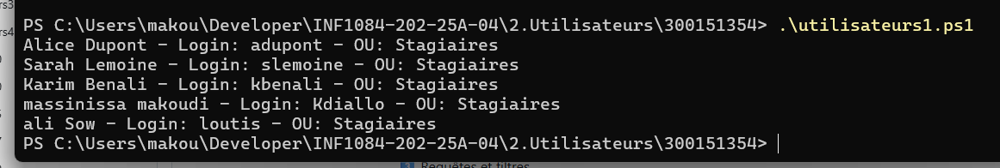
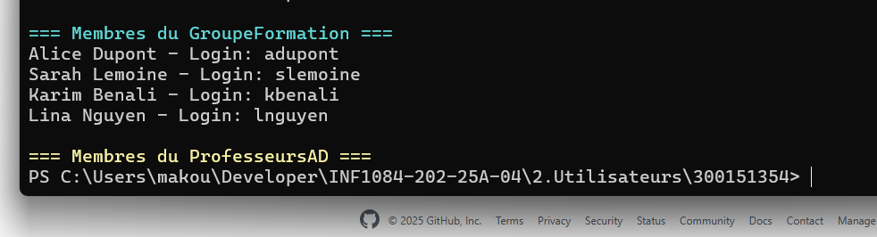
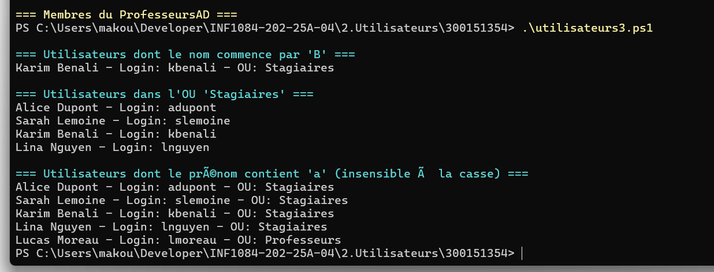

Exercice 1 : on vas Créer une liste d’utilisateurs et en ajouter 2 nouveaux

Exercice 2  :on vas Ajouter tous les utilisateurs dont l’OU = "Stagiaires" dans GroupeFormation

Exercice 3  :on vas  Lister tous les utilisateurs dont le prénom contient "a" et "b"

Exercice 4  :on vas Exporter les utilisateurs simulés et créer un groupe ImportGroupe

