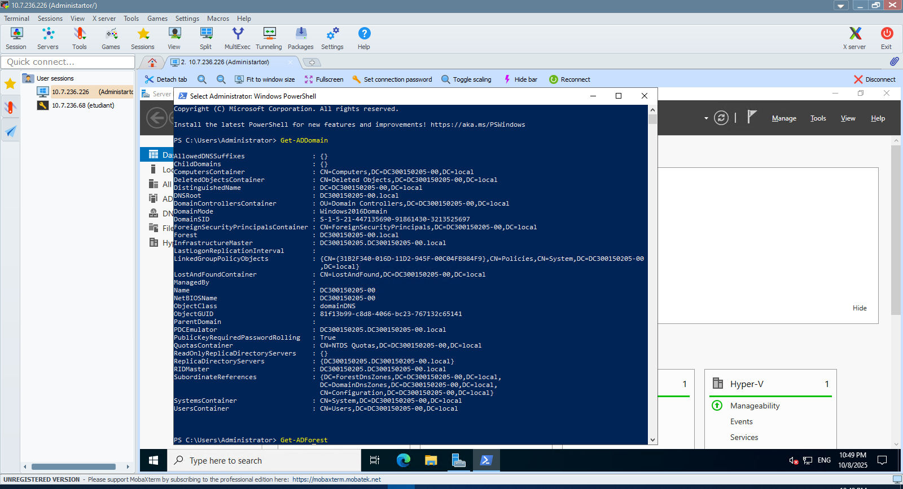
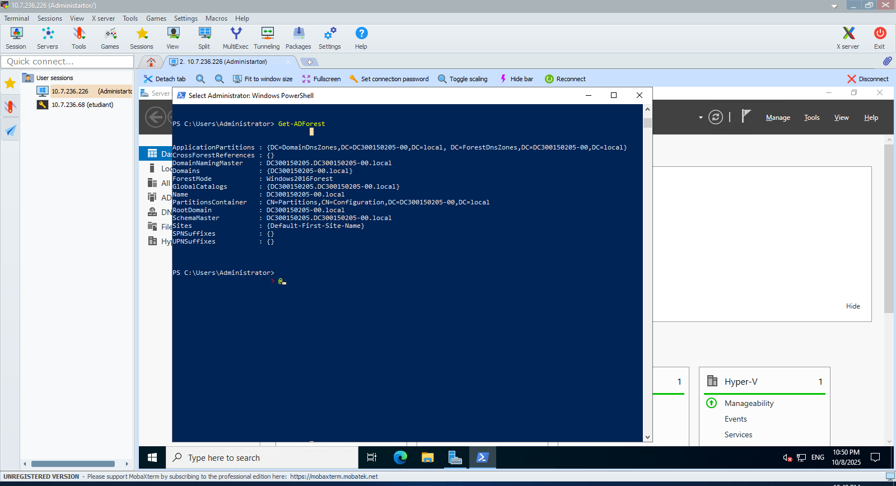

#300150205

---

## 📦 Installation

```powershell
PS C:\Users\Administrator> Install-WindowsFeature AD-Domain-Services -IncludeManagementTools
```

<details>
<summary>📋 Output</summary>

```powershell
Success Restart Needed Exit Code      Feature Result
------- -------------- ---------      --------------
True    No             Success        {Active Directory Domain Services, Group P...
```

</details>

---

## 🌐 Domain Configuration

```powershell
PS C:\Users\Administrator> Get-ADDomain
```

<details>
<summary>📊 Domain Details</summary>

```powershell
AllowedDNSSuffixes                 : {}
ChildDomains                       : {}
ComputersContainer                 : CN=Computers,DC=DC300150205-00,DC=local
DeletedObjectsContainer            : CN=Deleted Objects,DC=DC300150205-00,DC=local
DistinguishedName                  : DC=DC300150205-00,DC=local
DNSRoot                            : DC300150205-00.local
DomainControllersContainer         : OU=Domain Controllers,DC=DC300150205-00,DC=local
DomainMode                         : Windows2016Domain
DomainSID                          : S-1-5-21-447135690-91861430-3213525697
ForeignSecurityPrincipalsContainer : CN=ForeignSecurityPrincipals,DC=DC300150205-00,DC=local
Forest                             : DC300150205-00.local
InfrastructureMaster               : DC300150205.DC300150205-00.local
LastLogonReplicationInterval       :
LinkedGroupPolicyObjects           : {CN={31B2F340-016D-11D2-945F-00C04FB984F9},CN=Policies,CN=System,DC=DC300150205-00
                                     ,DC=local}
LostAndFoundContainer              : CN=LostAndFound,DC=DC300150205-00,DC=local
ManagedBy                          :
Name                               : DC300150205-00
NetBIOSName                        : DC300150205-00
ObjectClass                        : domainDNS
ObjectGUID                         : 81f13b99-c8d8-4066-bc23-767132c65141
ParentDomain                       :
PDCEmulator                        : DC300150205.DC300150205-00.local
PublicKeyRequiredPasswordRolling   : True
QuotasContainer                    : CN=NTDS Quotas,DC=DC300150205-00,DC=local
ReadOnlyReplicaDirectoryServers    : {}
ReplicaDirectoryServers            : {DC300150205.DC300150205-00.local}
RIDMaster                          : DC300150205.DC300150205-00.local
SubordinateReferences              : {DC=ForestDnsZones,DC=DC300150205-00,DC=local,
                                     DC=DomainDnsZones,DC=DC300150205-00,DC=local,
                                     CN=Configuration,DC=DC300150205-00,DC=local}
SystemsContainer                   : CN=System,DC=DC300150205-00,DC=local
UsersContainer                     : CN=Users,DC=DC300150205-00,DC=local
```




---

## 🌲 Forest Configuration

```powershell
PS C:\Users\Administrator> Get-ADForest
```

<details>
<summary>📊 Forest Details</summary>

```powershell
ApplicationPartitions : {DC=DomainDnsZones,DC=DC300150205-00,DC=local, DC=ForestDnsZones,DC=DC300150205-00,DC=local}
CrossForestReferences : {}
DomainNamingMaster    : DC300150205.DC300150205-00.local
Domains               : {DC300150205-00.local}
ForestMode            : Windows2016Forest
GlobalCatalogs        : {DC300150205.DC300150205-00.local}
Name                  : DC300150205-00.local
PartitionsContainer   : CN=Partitions,CN=Configuration,DC=DC300150205-00,DC=local
RootDomain            : DC300150205-00.local
SchemaMaster          : DC300150205.DC300150205-00.local
Sites                 : {Default-First-Site-Name}
SPNSuffixes           : {}
UPNSuffixes           : {}
```




