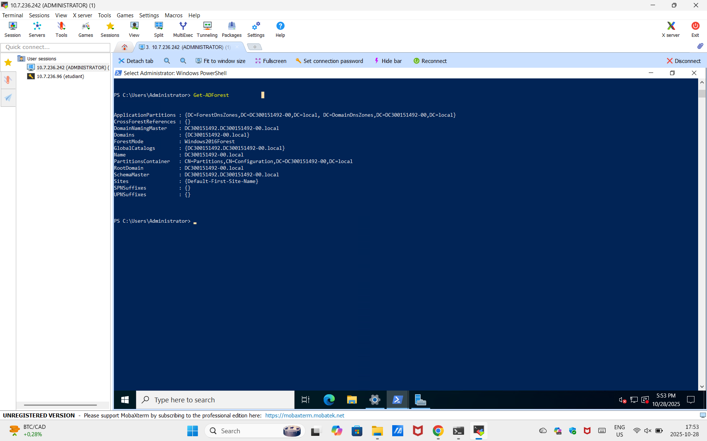

# Documentation Active Directory
**Projet :** #300151492  

---

## 🔧 Étape 1 : Installation des Rôles AD DS

Cette section décrit l'installation initiale des services de domaine Active Directory.

### Commande PowerShell
```powershell
PS C:\Users\Administrator> Install-WindowsFeature AD-Domain-Services -IncludeManagementTools
```

### Résultat de l'Installation

<details>
<summary>💡 Cliquez pour voir les détails de l'installation</summary>

```powershell
Success Restart Needed Exit Code      Feature Result
------- -------------- ---------      --------------
True    No             Success        {Active Directory Domain Services, Group P...
```

✅ **Statut :** Installation réussie  
🔄 **Redémarrage requis :** Non  
📦 **Composants installés :** Active Directory Domain Services + Outils de gestion
</details>

---

## 🏢 Étape 2 : Vérification de la Configuration du Domaine

Analyse complète des paramètres du domaine Active Directory.

### Commande d'Inspection
```powershell
PS C:\Users\Administrator> Get-ADDomain
```

<details>
<summary>🔍 Voir la configuration complète du domaine</summary>


```powershell
AllowedDNSSuffixes                 : {}
ChildDomains                       : {}
ComputersContainer                 : CN=Computers,DC=DC300151492-00,DC=local
DeletedObjectsContainer            : CN=Deleted Objects,DC=DC300151492-00,DC=local
DistinguishedName                  : DC=DC300151492-00,DC=local
DNSRoot                            : DC300151492-00.local
DomainControllersContainer         : OU=Domain Controllers,DC=DC300151492-00,DC=local
DomainMode                         : Windows2016Domain
DomainSID                          : S-1-5-21-447135690-91861430-3213525697
ForeignSecurityPrincipalsContainer : CN=ForeignSecurityPrincipals,DC=DC300151492-00,DC=local
Forest                             : DC300151492-00.local
InfrastructureMaster               : DC300151492.DC300151492-00.local
LastLogonReplicationInterval       :
LinkedGroupPolicyObjects           : {CN={31B2F340-016D-11D2-945F-00C04FB984F9},CN=Policies,CN=System,DC=DC300151492-00,DC=local}
LostAndFoundContainer              : CN=LostAndFound,DC=DC300151492-00,DC=local
ManagedBy                          :
Name                               : DC300151492-00
NetBIOSName                        : DC300151492-00
ObjectClass                        : domainDNS
ObjectGUID                         : db9c5f39-529e-458a-b563-ce80b674d08b
ParentDomain                       :
PDCEmulator                        : DC300151492.DC300151492-00.local
PublicKeyRequiredPasswordRolling   : True
QuotasContainer                    : CN=NTDS Quotas,DC=DC300151492-00,DC=local
ReadOnlyReplicaDirectoryServers    : {}
ReplicaDirectoryServers            : {DC300151492.DC300151492-00.local}
RIDMaster                          : DC300151492.DC300151492-00.local
SubordinateReferences              : {DC=ForestDnsZones,DC=DC300151492-00,DC=local, DC=DomainDnsZones,DC=DC300151492-00,DC=local, CN=Configuration,DC=DC300151492-00,DC=local}
SystemsContainer                   : CN=System,DC=DC300151492-00,DC=local
UsersContainer                     : CN=Users,DC=DC300151492-00,DC=local
```

### Capture d'Écran


</details>

---

## 🌐 Étape 3 : Vérification de la Configuration de la Forêt

Analyse des paramètres de la forêt Active Directory et des services d'infrastructure.

### Commande d'Inspection
```powershell
PS C:\Users\Administrator> Get-ADForest
```

<details>
<summary>🌲 Voir la configuration complète de la forêt</summary>


```powershell
ApplicationPartitions : {DC=ForestDnsZones,DC=DC300151492-00,DC=local, DC=DomainDnsZones,DC=DC300151492-00,DC=local}
CrossForestReferences : {}
DomainNamingMaster    : DC300151492.DC300151492-00.local
Domains               : {DC300151492-00.local}
ForestMode            : Windows2016Forest
GlobalCatalogs        : {DC300151492.DC300151492-00.local}
Name                  : DC300151492-00.local
PartitionsContainer   : CN=Partitions,CN=Configuration,DC=DC300151492-00,DC=local
RootDomain            : DC300151492-00.local
SchemaMaster          : DC300151492.DC300151492-00.local
Sites                 : {Default-First-Site-Name}
SPNSuffixes           : {}
UPNSuffixes           : {}
```

### Capture d'Écran


</details>

---
