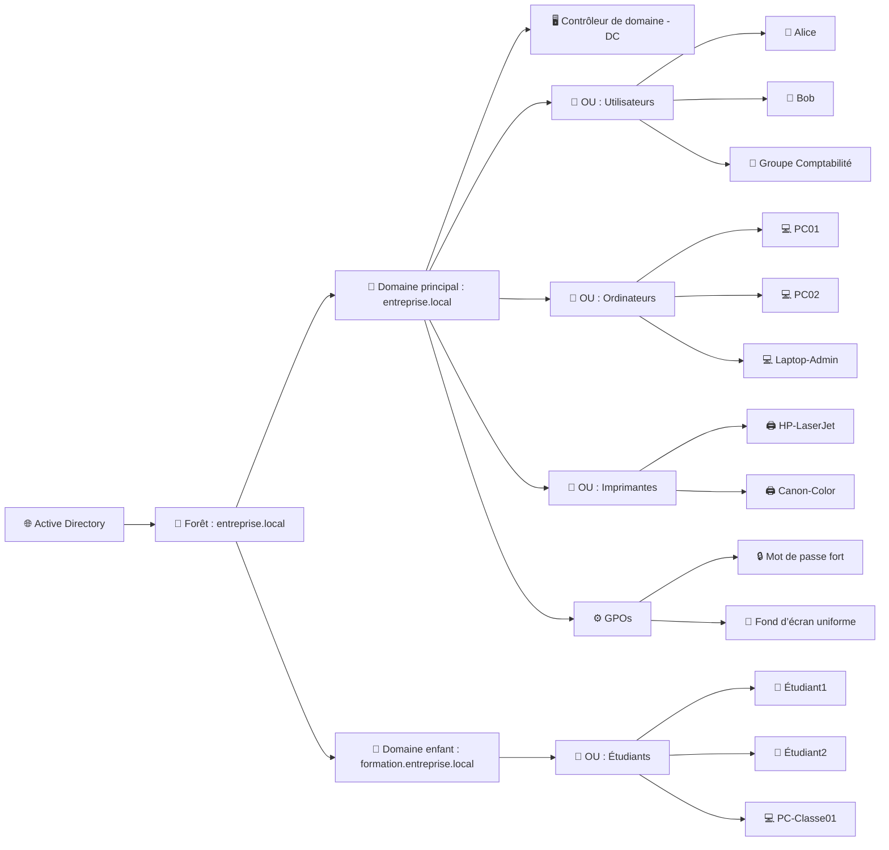

# :link: VMs

|:hash: | Fonctions                                          |
|-------|:---------------------------------------------------|
| :one: | [:tada: Participation](.scripts/Participation.md)  |
| :two: | [:checkered_flag: Verification](.scripts/Check.md) |


<details>
<summary>📚 Table des matières</summary>

- [:link: VMs](#link-vms)  
- [🌐 Active Directory (AD)](#🌐-active-directory-ad)  
  - [🧩 1.1 Rôle d’un service d’annuaire (Directory Service)](#-11-rôle-dun-service-dannuaire-directory-service)  
  - [🧍‍♂️🖨️💻 1.2 Objets trouvés dans Active Directory](#%E2%80%8D%EF%B8%8F%EF%B8%8F-12-objets-trouvés-dans-active-directory)  
  - [🏛️ 1.3 Concepts et composants clés d’Active Directory](#-13-concepts-et-composants-clés-dactive-directory)  
  - [🔗 1.4 Approbations Active Directory (Trusts)](#-14-approbations-active-directory-trusts)  
  - [🧠 À retenir](#-à-retenir)  
- [:scroll: Installation et configuration d’un domaine Active Directory](#scroll-installation-et-configuration-dun-domaine-active-directory)  
  - [1️⃣ Qu’est-ce qu’un domaine dans Active Directory ?](#1️⃣-quest-ce-quun-domaine-dans-active-directory-)  
  - [2️⃣ Quel est le rôle principal d’un contrôleur de domaine ?](#2️⃣-quel-est-le-rôle-principal-dun-contrôleur-de-domaine-)  
  - [3️⃣ Pourquoi le DNS est-il indispensable à Active Directory ?](#3️⃣-pourquoi-le-dns-est-il-indispensable-à-active-directory-)  
  - [4️⃣ Quelle est la différence entre une forêt et un arbre ?](#4️⃣-quelle-est-la-différence-entre-une-forêt-et-un-arbre-)  
  - [5️⃣ Que contient le dossier SYSVOL ?](#5️⃣-que-contient-le-dossier-sysvol-)  
  - [6️⃣ Quel service gère les connexions et l’authentification au domaine ?](#6️⃣-quel-service-gère-les-connexions-et-lauthentification-au-domaine-)  
  - [7️⃣ Que fait le mot de passe DSRM ?](#7️⃣-que-fait-le-mot-de-passe-dsrm-)  
  - [8️⃣ Quelle commande permet d’ouvrir la console “Active Directory Users and Computers” ?](#8️⃣-quelle-commande-permet-douvrir-la-console-active-directory-users-and-computers-)  
- [:abacus: Laboratoires](#abacus-laboratoires)  
  - [🚀 Installation AD : Étapes avec PowerShell](#-installation-ad--étapes-avec-powershell)  
    - [1. Renommer le serveur](#1-renommer-le-serveur)  
    - [2. Installer le rôle AD DS](#2-installer-le-rôle-ad-ds)  
    - [3. Créer un nouveau domaine (nouvelle forêt)](#3-créer-un-nouveau-domaine-nouvelle-forêt)  
    - [4. Vérifier l’installation](#4-vérifier-linstallation)  
  - [🎯 Résultat](#-résultat)

</details>


## 🌐 **Active Directory (AD)**

---

### 🧩 **1.1 Rôle d’un service d’annuaire (Directory Service)**

Un **service d’annuaire** est une **base de données centralisée** qui stocke et organise des informations sur les **ressources d’un réseau** (utilisateurs, ordinateurs, imprimantes, groupes, etc.).

**Rôle principal :**

* ✅ **Authentification** : vérifier l’identité des utilisateurs et ordinateurs (login/mot de passe).
* ✅ **Autorisation** : contrôler l’accès aux ressources selon les droits.
* ✅ **Administration centralisée** : gérer tout le réseau depuis un seul endroit.
* ✅ **Répertoire d’entreprise** : fournir des informations à jour sur les ressources et utilisateurs.

👉 Exemple : **Active Directory Domain Services (AD DS)** de Microsoft est le service d’annuaire le plus utilisé dans les réseaux Windows.

---

### 🧍‍♂️🖨️💻 **1.2 Objets trouvés dans Active Directory**

Dans AD, tout est représenté sous forme **d’objet**.
Chaque objet correspond à une ressource du réseau et possède des **attributs** (nom, mot de passe, adresse IP, etc.).

**Objets principaux :**

| Type d’objet                      | Description                                                       | Exemple d’attributs                     |
| --------------------------------- | ----------------------------------------------------------------- | --------------------------------------- |
| 👤 **Utilisateur**                | Représente une personne qui se connecte au domaine.               | Nom, mot de passe, service, email       |
| 💻 **Ordinateur**                 | Représente une machine membre du domaine.                         | Nom de l’ordinateur, adresse IP, groupe |
| 🖨️ **Imprimante**                | Représente une imprimante partagée sur le réseau.                 | Emplacement, pilote, nom                |
| 👥 **Groupe**                     | Ensemble d’utilisateurs ou d’ordinateurs avec des droits communs. | Membres, permissions                    |
| 🗂️ **Unité d’organisation (OU)** | Conteneur logique pour organiser les objets.                      | Nom, emplacement dans l’arborescence    |

---

### 🏛️ **1.3 Concepts et composants clés d’Active Directory**

**Active Directory** est organisé comme une **arborescence hiérarchique**.

**Principaux concepts :**

| Élément                               | Description                                                                                  |
| ------------------------------------- | -------------------------------------------------------------------------------------------- |
| **Forêt (Forest)**                    | Ensemble de domaines partageant une même structure et un catalogue global.                   |
| **Domaine (Domain)**                  | Unité de base d’administration. Contient des utilisateurs, ordinateurs, groupes.             |
| **Arborescence (Tree)**               | Ensemble de domaines connectés partageant un espace de noms DNS.                             |
| **Unité d’organisation (OU)**         | Structure logique pour regrouper et administrer les objets.                                  |
| **Contrôleur de domaine (DC)**        | Serveur qui héberge la base AD DS et gère l’authentification.                                |
| **Catalogue global (Global Catalog)** | Permet de rechercher n’importe quel objet dans la forêt.                                     |
| **DNS (Domain Name System)**          | Indispensable pour localiser les contrôleurs de domaine.                                     |
| **GPO (Group Policy Object)**         | Définit des paramètres de sécurité et de configuration pour les utilisateurs ou ordinateurs. |

---

### 🔗 **1.4 Approbations Active Directory (Trusts)**

Les **approbations (trusts)** permettent à des **domaines différents** de se faire confiance pour que les utilisateurs d’un domaine puissent **accéder aux ressources** d’un autre domaine.

**Types d’approbations :**

| Type                  | Description                                             | Exemple                                                  |
| --------------------- | ------------------------------------------------------- | -------------------------------------------------------- |
| **Transitive**        | La confiance s’étend à d’autres domaines liés.          | Domaine A ↔ Domaine B ↔ Domaine C ⇒ A fait confiance à C |
| **Non transitive**    | La confiance est limitée entre deux domaines seulement. | Domaine A ↔ Domaine B                                    |
| **Unidirectionnelle** | Un seul domaine fait confiance à l’autre.               | Domaine A → Domaine B                                    |
| **Bidirectionnelle**  | Les deux domaines se font mutuellement confiance.       | Domaine A ↔ Domaine B                                    |
| **Inter-forêt**       | Entre deux forêts différentes.                          | Entre deux organisations distinctes                      |

Voici un **schéma** pour illustrer la **structure hiérarchique d’Active Directory** 👇

---



---

### 🧠 **À retenir :**

* **Forêt** → ensemble de **domaines**.
* **Domaine** → unité d’administration principale.
* **OU (Unité d’organisation)** → structure logique pour ranger les objets.
* **Objets** → utilisateurs, ordinateurs, imprimantes, groupes, etc.
* **GPO** → applique des règles de configuration ou sécurité.
* Les **relations d’approbation (trusts)** relient les domaines entre eux.

## :scroll: Installation et configuration d’un domaine **Active Directory** 👇

---

### **1️⃣ Qu’est-ce qu’un domaine dans Active Directory ?**

Un **domaine** est une **unité logique d’administration** dans Active Directory.
Il regroupe des **utilisateurs**, **ordinateurs**, **groupes**, et **ressources** qui partagent :

* une **même base de données** (le catalogue AD DS),
* une **même politique de sécurité**,
* et une **même authentification** gérée par un ou plusieurs **contrôleurs de domaine (DC)**.

> 🧩 Exemple : `DC999999999-0.local` est un domaine.

---

### **2️⃣ Quel est le rôle principal d’un contrôleur de domaine ?**

Le **contrôleur de domaine (DC)** :

* **héberge** la base de données Active Directory,
* **authentifie** les utilisateurs et ordinateurs lors de la connexion au domaine,
* **applique** les stratégies de sécurité (GPO),
* et **réplique** les données AD avec les autres DC du même domaine.

> 🔐 En résumé : le DC est le **cœur de l’infrastructure Active Directory**.

---

### **3️⃣ Pourquoi le DNS est-il indispensable à Active Directory ?**

Le **DNS (Domain Name System)** permet :

* de **localiser** les contrôleurs de domaine (DC) via des enregistrements **SRV**,
* d’assurer la **résolution de noms** (ex. : `DC999999999-0.local` → IP du DC),
* et de permettre aux clients et serveurs de **trouver les services AD DS** (authentification, réplication, etc.).

> 🧠 Sans DNS, Active Directory **ne peut pas fonctionner correctement**.

---

### **4️⃣ Quelle est la différence entre une forêt et un arbre ?**

| Élément   | Description                                                                                                  |
| --------- | ------------------------------------------------------------------------------------------------------------ |
| **Arbre** | Ensemble de domaines **hiérarchiquement liés** (ex. : `sales.DC999999999-0.local` et `hr.DC999999999-0.local`).                  |
| **Forêt** | Ensemble d’un ou plusieurs **arbres** partageant le **même schéma AD** et la **même configuration globale**. |

> 🌳 Une forêt peut contenir plusieurs arbres, chacun avec ses propres domaines.

---

### **5️⃣ Que contient le dossier SYSVOL ?**

Le dossier **SYSVOL** contient :

* les **scripts de connexion** (logon scripts),
* les **fichiers des stratégies de groupe (GPO)**,
* et d’autres données **synchronisées entre les contrôleurs de domaine**.

> 📁 Emplacement typique :
> `C:\Windows\SYSVOL\sysvol\<nom_du_domaine>\Policies`

---

### **6️⃣ Quel service gère les connexions et l’authentification au domaine ?**

C’est le **service Active Directory Domain Services (AD DS)**.
Il s’appuie sur :

* le **protocole Kerberos** (authentification sécurisée),
* et le **protocole LDAP** (accès à la base d’annuaire).

> 🔑 Kerberos = authentification
> 📚 LDAP = requêtes et gestion des objets AD

---

### **7️⃣ Que fait le mot de passe DSRM ?**

Le **mot de passe DSRM (Directory Services Restore Mode)** sert à :

* accéder au **mode de restauration d’Active Directory**,
* lorsque le domaine est **en panne** ou doit être **réparé**.

> 🩺 C’est un mot de passe **local** au serveur DC (pas un compte de domaine).

---

### **8️⃣ Quelle commande permet d’ouvrir la console “Active Directory Users and Computers” ?**

#### 💠 En PowerShell :

Tu peux aussi l’ouvrir via :

```powershell
Start-Process dsa.msc
```

> 📋 Cette console permet de gérer utilisateurs, groupes, ordinateurs et unités d’organisation (OU).


# :abacus: Laboratoires


Installer et configurer un contrôleur de domaine Active Directory sur **Windows Server 2022**.

---

## 🚀 Installation AD : Étapes avec PowerShell

### 1. Renommer le serveur

```powershell
Rename-Computer -NewName "DC9999999990" -Restart
```

*(le serveur va redémarrer)*

---

### 2. Installer le rôle AD DS

```powershell
Install-WindowsFeature AD-Domain-Services -IncludeManagementTools
```
<details>
<summary>Output</summary>

```powershell

Success Restart Needed Exit Code      Feature Result
------- -------------- ---------      --------------
True    No             Success        {Active Directory Domain Services, Group P...
```

</details>

---

### 3. Créer un nouveau domaine (nouvelle forêt)

Exemple avec domaine **DC999999999-00.local** :

```powershell
Install-ADDSForest `
    -DomainName "DC999999999-00.local" `
    -DomainNetbiosName "DC999999999-00" `
    -InstallDns:$true `
    -SafeModeAdministratorPassword (ConvertTo-SecureString "MotDePasseDSRM123!" -AsPlainText -Force) `
    -Force
```
<details>
<summary>Output</summary>

```powershell
Install-ADDSForest

  Validating environment and user input
      All tests completed successfully                                                                                       [oooooooooooooooooooooooooooooooooooooooooooooooooooooooooooooooooooooooooooooooooooooooooooooooooooooooooo]
      Installing new forest Starting

For more information about this setting, see Knowledge Base article 942564
(http://go.microsoft.com/fwlink/?LinkId=104751).

WARNING: This computer has at least one physical network adapter that does not have static IP address(es) assigned to
its IP Properties. If both IPv4 and IPv6 are enabled for a network adapter, both IPv4 and IPv6 static IP addresses
should be assigned to both IPv4 and IPv6 Properties of the physical network adapter. Such static IP address(es)
assignment should be done to all the physical network adapters for reliable Domain Name System (DNS) operation.

WARNING: A delegation for this DNS server cannot be created because the authoritative parent zone cannot be found or it
 does not run Windows DNS server. If you are integrating with an existing DNS infrastructure, you should manually
create a delegation to this DNS server in the parent zone to ensure reliable name resolution from outside the domain
"DC999999999.local". Otherwise, no action is required.

WARNING: Windows Server 2022 domain controllers have a default for the security setting named "Allow cryptography
algorithms compatible with Windows NT 4.0" that prevents weaker cryptography algorithms when establishing security
channel sessions.

For more information about this setting, see Knowledge Base article 942564
(http://go.microsoft.com/fwlink/?LinkId=104751).

WARNING: This computer has at least one physical network adapter that does not have static IP address(es) assigned to
its IP Properties. If both IPv4 and IPv6 are enabled for a network adapter, both IPv4 and IPv6 static IP addresses
should be assigned to both IPv4 and IPv6 Properties of the physical network adapter. Such static IP address(es)
assignment should be done to all the physical network adapters for reliable Domain Name System (DNS) operation.
```

</details>

* `-DomainName` → nom DNS du domaine.
* `-DomainNetbiosName` → version courte (max 15 caractères, ex. DC9999999990).
* `-InstallDns:$true` → installe DNS en même temps.
* `-SafeModeAdministratorPassword` → mot de passe pour le mode restauration DSRM.
* `-Force` → évite les confirmations.

👉 Le serveur redémarrera automatiquement.

---

### 4. Vérifier l’installation

Une fois redémarré, connecte-toi avec :

```
DC999999999\Administrator
```

Puis vérifie :

```powershell
Get-ADDomain
Get-ADForest
```

---

## 🎯 Résultat

Avec seulement **3 commandes PowerShell**, tu crées un **contrôleur de domaine Active Directory** complet avec DNS intégré.
