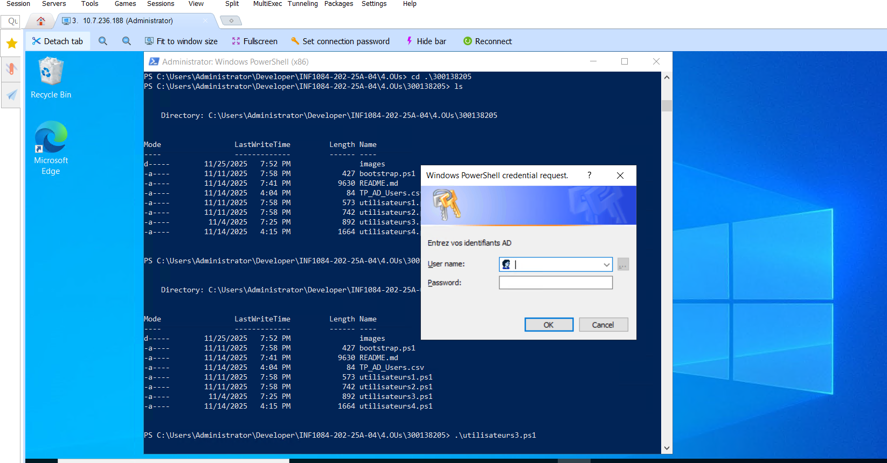

#300138205

0️⃣ bootstrap.ps1
```powershell
# vos informations
$studentNumber = 300138205
$studentInstance = "00"

# les noms respectifs
$domainName = "DC$studentNumber-$studentInstance.local"
$netbiosName = "DC$studentNumber-$studentInstance"

# les informations de sécurité
$plain = 'Infra@2024'
$secure = ConvertTo-SecureString $plain -AsPlainText -Force
$cred = New-Object System.Management.Automation.PSCredential("Administrator@$domainName", $secure)
```

<details>

  ```powershell


```

</details>

 utilidateurs1.ps1
```powershell
O
# Importer le module Active Directory
Import-Module ActiveDirectory

# Définir le nom de domaine
. .\bootstrap.ps1

# Vérifier le domaine
Get-ADDomain -Server $domainName

# Lister les contrôleurs de domaine
Get-ADDomainController -Filter * -Server $domainName     

 # Lister les utilisateurs activés sauf comptes système
Get-ADUser -Filter * -Server $domainName -Properties Name, SamAccountName, Enabled |
Where-Object { $_.Enabled -eq $true -and $_.SamAccountName -notin @("Administrator","Guest","krbtgt") } |
Select-Object Name, SamAccountName"
```

<details>

  ```powershell
AllowedDNSSuffixes                 : {}
ChildDomains                       : {}
ComputersContainer                 : CN=Computers,DC=DC300138205-00,DC=local
DeletedObjectsContainer            : CN=Deleted Objects,DC=DC300138205-00,DC=local
DistinguishedName                  : DC=DC300138205-00,DC=local
DNSRoot                            : DC300138205-00.local
DomainControllersContainer         : OU=Domain Controllers,DC=DC300138205-00,DC=local
DomainMode                         : Windows2016Domain
DomainSID                          : S-1-5-21-447135690-91861430-3213525697
ForeignSecurityPrincipalsContainer : CN=ForeignSecurityPrincipals,DC=DC300138205-00,DC=local
Forest                             : DC300138205-00.local
InfrastructureMaster               : DC300138205.DC300138205-00.local
LastLogonReplicationInterval       :
LinkedGroupPolicyObjects           : {CN={31B2F340-016D-11D2-945F-00C04FB984F9},CN=Policies,CN=System,DC=DC300138205-00
                                     ,DC=local}
LostAndFoundContainer              : CN=LostAndFound,DC=DC300138205-00,DC=local
ManagedBy                          :
Name                               : DC300138205-00
NetBIOSName                        : DC300138205-00
ObjectClass                        : domainDNS
ObjectGUID                         : 800ee0b0-fd42-4697-8af5-e9a68ebb1ab5
ParentDomain                       :
PDCEmulator                        : DC300138205.DC300138205-00.local
PublicKeyRequiredPasswordRolling   : True
QuotasContainer                    : CN=NTDS Quotas,DC=DC300138205-00,DC=local
ReadOnlyReplicaDirectoryServers    : {}
ReplicaDirectoryServers            : {DC300138205.DC300138205-00.local}
RIDMaster                          : DC300138205.DC300138205-00.local
SubordinateReferences              : {DC=ForestDnsZones,DC=DC300138205-00,DC=local,
                                     DC=DomainDnsZones,DC=DC300138205-00,DC=local,
                                     CN=Configuration,DC=DC300138205-00,DC=local}
SystemsContainer                   : CN=System,DC=DC300138205-00,DC=local
UsersContainer                     : CN=Users,DC=DC300138205-00,DC=local

ComputerObjectDN           : CN=DC300138205,OU=Domain Controllers,DC=DC300138205-00,DC=local
DefaultPartition           : DC=DC300138205-00,DC=local
Domain                     : DC300138205-00.local
Enabled                    : True
Forest                     : DC300138205-00.local
HostName                   : DC300138205.DC300138205-00.local
InvocationId               : 1b99d5ab-a237-4cbb-8a84-5fac0374566b
IPv4Address                : 169.254.73.139
IPv6Address                :
IsGlobalCatalog            : True
IsReadOnly                 : False
LdapPort                   : 389
Name                       : DC300138205
NTDSSettingsObjectDN       : CN=NTDS Settings,CN=DC300138205,CN=Servers,CN=Default-First-Site-Name,CN=Sites,CN=Configur
                             ation,DC=DC300138205-00,DC=local
OperatingSystem            : Windows Server 2022 Datacenter
OperatingSystemHotfix      :
OperatingSystemServicePack :
OperatingSystemVersion     : 10.0 (20348)
OperationMasterRoles       : {SchemaMaster, DomainNamingMaster, PDCEmulator, RIDMaster...}
Partitions                 : {DC=ForestDnsZones,DC=DC300138205-00,DC=local,
                             DC=DomainDnsZones,DC=DC300138205-00,DC=local,
                             CN=Schema,CN=Configuration,DC=DC300138205-00,DC=local,
                             CN=Configuration,DC=DC300138205-00,DC=local...}
ServerObjectDN             : CN=DC300138205,CN=Servers,CN=Default-First-Site-Name,CN=Sites,CN=Configuration,DC=DC300138
                             205-00,DC=local
ServerObjectGuid           : 36c4d8ed-88e6-4b8c-9ff2-d4ca8356630f
Site                       : Default-First-Site-Name
SslPort                    : 636

Name           : student1
SamAccountName : student1


```

</details>

0️⃣ utilidateurs2.ps1
```powershell
# Définir le domaine
. .\bootstrap.ps1

# Créer un nouvel utilisateur
New-ADUser `
    -Name "Alice Dupont" `
    -GivenName "Alice" `
    -Surname "Dupont" `
    -SamAccountName "alice.dupont" `
    -UserPrincipalName "alice.dupont@$domainName" `
    -Path "CN=Users,DC=DC300138205-00,DC=local" `
    -AccountPassword (ConvertTo-SecureString "MotDePasse123!" -AsPlainText -Force) `
    -Enabled $true

# Modifier une propriété
Set-ADUser -Identity "alice.dupont" -Description "Utilisateur de test"

# Désactiver le compte
Disable-ADAccount -Identity "alice.dupont"

# Réactiver le compte
Enable-ADAccount -Identity "alice.dupont"

# Supprimer le compte
Remove-ADUser -Identity "alice.dupont" -Confirm:$false
```

<details>





</details>


0️⃣ utilisateurs3.ps1
```powershell
# --- Script 1 : Recherche et export des utilisateurs AD ---
param(
    [string]$domain = "DC300138205-00.local"
)

$cred = Get-Credential -Message "Entrez vos identifiants AD"

Write-Host "Recherche des utilisateurs dont le prénom commence par 'A'..."

Get-ADUser -Filter "GivenName -like 'A*'" -Properties Name, SamAccountName -Server $domain -Credential $cred |
Select-Object Name, SamAccountName |
Format-Table -AutoSize

Write-Host "Exportation de tous les utilisateurs vers TP_AD_Users.csv..."

Get-ADUser -Filter * -Server $domain -Credential $cred -Properties Name, SamAccountName, EmailAddress, Enabled |
Where-Object { $_.SamAccountName -notin @('Administrator','Guest','krbtgt') } |
Select-Object Name, SamAccountName, EmailAddress, Enabled |
Export-Csv -Path "TP_AD_Users.csv" -NoTypeInformation -Encoding UTF8

Write-Host "Export terminé : fichier 'TP_AD_Users.csv' créé."
```

<details>

  ```powershell


PS C:\Users\Administrator\Developer\INF1084-202-25A-04\4.OUs\300138205> .\utilisateurs3.ps1
Recherche des utilisateurs dont le prénom commence par 'A'...
Exportation de tous les utilisateurs vers TP_AD_Users.csv...
Export terminé : fichier 'TP_AD_Users.csv' créé.
PS C:\Users\Administrator\Developer\INF1084-202-25A-04\4.OUs\300138205>


```

</details>


0️⃣ utilisateurs4.ps1
```powershell
# Définir le nom de domaine
. .\bootstrap.ps1
param(
    [string]$domainDN = "DC=DC300138205-00,DC=local"  # Domaine complet sous forme DN
)

# Demande des identifiants administratifs
$cred = Get-Credential -Message "Entrez vos identifiants AD"

Write-Host "Vérification de l'existence de l'OU 'Students'..." -ForegroundColor Cyan

# Vérifie si l’OU existe déjà
$ouExist = Get-ADOrganizationalUnit -Filter "Name -eq 'Students'" -ErrorAction SilentlyContinue

if (-not $ouExist) {
    New-ADOrganizationalUnit -Name "Students" -Path $domainDN -Credential $cred
    Write-Host "OU 'Students' créée avec succès." -ForegroundColor Green
} else {
    Write-Host "L'OU 'Students' existe déjà." -ForegroundColor Yellow
}

# Déplacement de l'utilisateur
Write-Host "Déplacement de l'utilisateur 'Alice Dupont' vers l'OU 'Students'..." -ForegroundColor Cyan

$sourcePath = "CN=Alice Dupont,CN=Users,$domainDN"
$targetPath = "OU=Students,$domainDN"

# Vérifie si l’utilisateur existe avant le déplacement
$user = Get-ADUser -Filter "SamAccountName -eq 'alice.dupont'" -ErrorAction SilentlyContinue
if ($user) {
    Move-ADObject -Identity $sourcePath -TargetPath $targetPath -Credential $cred
    Write-Host "L'utilisateur 'Alice Dupont' a été déplacé vers 'Students'." -ForegroundColor Green
} else {
    Write-Host "L'utilisateur 'alice.dupont' n'existe pas dans le domaine." -ForegroundColor Red
}

# Vérification du déplacement
Write-Host "Vérification du déplacement..." -ForegroundColor Cyan
Get-ADUser -Identity "alice.dupont" -Properties DistinguishedName |
Select-Object Name, DistinguishedName
```

<details>

  ```powershell

PS C:\Users\Administrator\Developer\INF1084-202-25A-04\4.OUs\300138205> .\utilisateurs4.ps1
Vérification de l'existence de l'OU 'Students'...
L'OU 'Students' existe déjà.
Déplacement de l'utilisateur 'Alice Dupont' vers l'OU 'Students'...
L'utilisateur 'alice.dupont' n'existe pas dans le domaine.
Vérification du déplacement...


```

</details>

