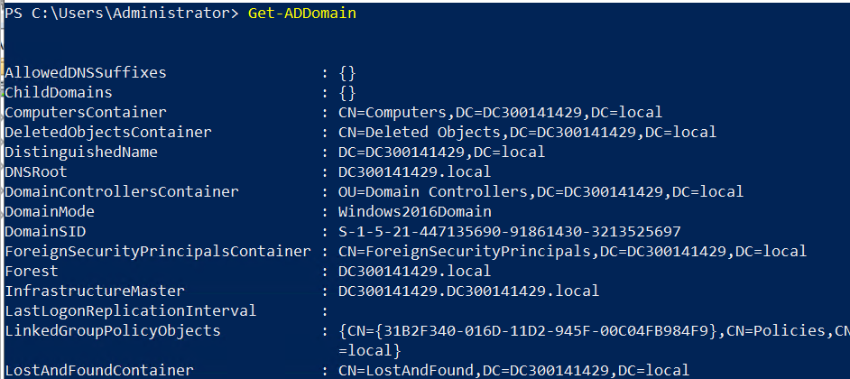
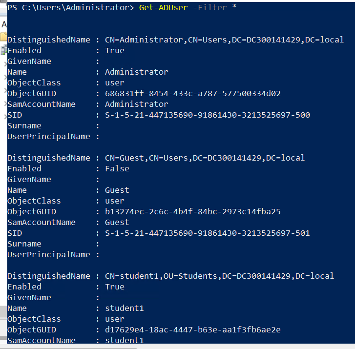
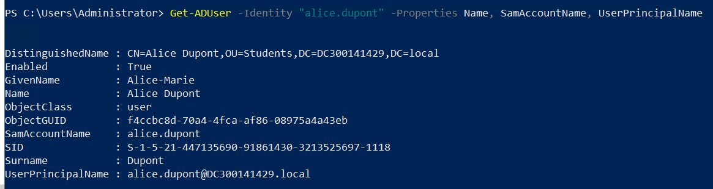
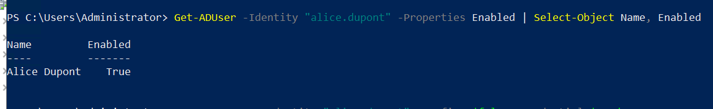
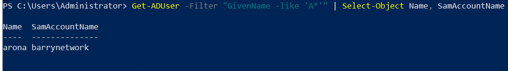

Vérifier le domaine et les DC
powershell
Get-ADDomain

Lister les utilisateurs actifs
powershell
Get-ADUser -Filter * 

Vérifier la création d’un utilisateur
powershell
Get-ADUser -Identity "alice.dupont" -Properties Name, SamAccountName, UserPrincipalName

Vérifier la désactivation
powershell
Get-ADUser -Identity "alice.dupont" -Properties Enabled | Select-Object Name, Enabled
👉 Preuve : Enabled = False.

Vérifier la réactivation
powershell
Get-ADUser -Identity "alice.dupont" -Properties Enabled | Select-Object Name, Enabled
Preuve : Enabled = True.

Vérifier la recherche avec filtre
powershell
Get-ADUser -Filter "GivenName -like 'A*'" | Select-Object Name, SamAccountName

.

