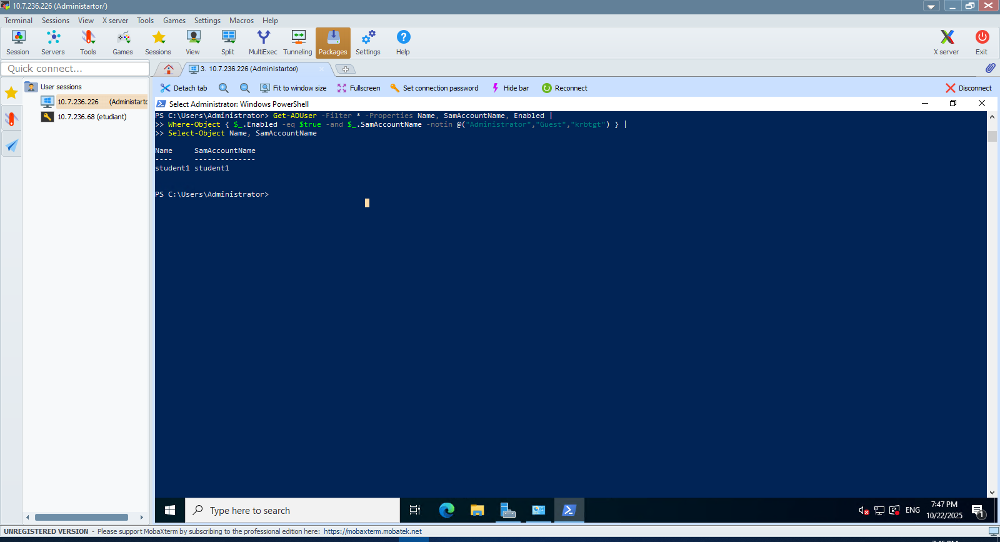
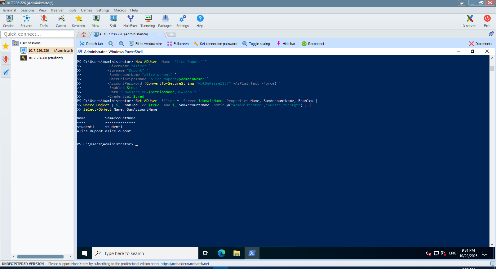

# TP Active Directory - OU
#300150205

---

Ce TP est divisé en **4 fichiers PowerShell** :

### 📄 **utilisateurs1.ps1** - Configuration et Listage
- Configuration initiale des variables de domaine
- Vérification de l'environnement Active Directory
- Listage des utilisateurs actifs du domaine

### 📄 **utilisateurs2.ps1** - Création et Modification
- Obtention des credentials administrateur (optionnel)
- Création d'un nouvel utilisateur (Alice Dupont)
- Modification des attributs utilisateur

### 📄 **utilisateurs3.ps1** - Gestion des comptes
- Désactivation et réactivation de comptes
- Recherche d'utilisateurs avec filtres
- Export des données vers CSV

### 📄 **utilisateurs4.ps1** - Gestion des OU et Nettoyage
- Création d'Unités Organisationnelles (OU)
- Déplacement d'utilisateurs entre containers

---


# 🚀 Étapes du laboratoire

## Étape 0 : Configuration des variables


```powershell
$studentNumber = 300150205
$studentInstance = "00"

$domainName = "DC$studentNumber-$studentInstance.local"
$netbiosName = "DC$studentNumber-$studentInstance"
```

<details>
<summary>🖼️ Capture d'écran</summary>


</details>

---

## Étape 1 : Vérification de l'environnement

```powershell
# Importer le module AD
Import-Module ActiveDirectory

# Vérifier le domaine et les DC
Get-ADDomain -Server $domainName
Get-ADDomainController -Filter * -Server $domainName
```
<details>
<summary>📋 Output</summary>

```powershell
PS C:\Users\Administrator> Import-Module ActiveDirectory
PS C:\Users\Administrator> Get-ADDomain -Server $domainName


AllowedDNSSuffixes                 : {}
ChildDomains                       : {}
ComputersContainer                 : CN=Computers,DC=DC300150205-00,DC=local
DeletedObjectsContainer            : CN=Deleted Objects,DC=DC300150205-00,DC=local
DistinguishedName                  : DC=DC300150205-00,DC=local
DNSRoot                            : DC300150205-00.local
DomainControllersContainer         : OU=Domain Controllers,DC=DC300150205-00,DC=local
DomainMode                         : Windows2016Domain
DomainSID                          : S-1-5-21-447135690-91861430-3213525697
ForeignSecurityPrincipalsContainer : CN=ForeignSecurityPrincipals,DC=DC300150205-00,DC=local
Forest                             : DC300150205-00.local
InfrastructureMaster               : DC300150205.DC300150205-00.local
LastLogonReplicationInterval       :
LinkedGroupPolicyObjects           : {CN={31B2F340-016D-11D2-945F-00C04FB984F9},CN=Policies,CN=System,DC=DC300150205-00,DC=local}
LostAndFoundContainer              : CN=LostAndFound,DC=DC300150205-00,DC=local
ManagedBy                          :
Name                               : DC300150205-00
NetBIOSName                        : DC300150205-00
ObjectClass                        : domainDNS
ObjectGUID                         : 81f13b99-c8d8-4066-bc23-767132c65141
ParentDomain                       :
PDCEmulator                        : DC300150205.DC300150205-00.local
PublicKeyRequiredPasswordRolling   : True
QuotasContainer                    : CN=NTDS Quotas,DC=DC300150205-00,DC=local
ReadOnlyReplicaDirectoryServers    : {}
ReplicaDirectoryServers            : {DC300150205.DC300150205-00.local}
RIDMaster                          : DC300150205.DC300150205-00.local
SubordinateReferences              : {DC=ForestDnsZones,DC=DC300150205-00,DC=local, DC=DomainDnsZones,DC=DC300150205-00,DC=local, CN=Configuration,DC=DC300150205-00,DC=local}
SystemsContainer                   : CN=System,DC=DC300150205-00,DC=local
UsersContainer                     : CN=Users,DC=DC300150205-00,DC=local


PS C:\Users\Administrator> Get-ADDomainController -Filter * -Server $domainName


ComputerObjectDN           : CN=DC300150205,OU=Domain Controllers,DC=DC300150205-00,DC=local
DefaultPartition           : DC=DC300150205-00,DC=local
Domain                     : DC300150205-00.local
Enabled                    : True
Forest                     : DC300150205-00.local
HostName                   : DC300150205.DC300150205-00.local
InvocationId               : ae730bec-276a-44a0-b3a1-4d29ce7f7b80
IPv4Address                : 10.7.236.226
IPv6Address                :
IsGlobalCatalog            : True
IsReadOnly                 : False
LdapPort                   : 389
Name                       : DC300150205
NTDSSettingsObjectDN       : CN=NTDS Settings,CN=DC300150205,CN=Servers,CN=Default-First-Site-Name,CN=Sites,CN=Configuration,DC=DC300150205-00,DC=local
OperatingSystem            : Windows Server 2022 Datacenter
OperatingSystemHotfix      :
OperatingSystemServicePack :
OperatingSystemVersion     : 10.0 (20348)
OperationMasterRoles       : {SchemaMaster, DomainNamingMaster, PDCEmulator, RIDMaster...}
Partitions                 : {DC=ForestDnsZones,DC=DC300150205-00,DC=local, DC=DomainDnsZones,DC=DC300150205-00,DC=local, CN=Schema,CN=Configuration,DC=DC300150205-00,DC=local,
                             CN=Configuration,DC=DC300150205-00,DC=local...}
ServerObjectDN             : CN=DC300150205,CN=Servers,CN=Default-First-Site-Name,CN=Sites,CN=Configuration,DC=DC300150205-00,DC=local
ServerObjectGuid           : 3cc177e4-e028-498f-acae-41a7aafcea0a
Site                       : Default-First-Site-Name
SslPort                    : 636
```
</details>

---

## Étape 2 : Liste des utilisateurs du domaine

```powershell
Get-ADUser -Filter * -Server $domainName -Properties Name, SamAccountName, Enabled |
Where-Object { $_.Enabled -eq $true -and $_.SamAccountName -notin @("Administrator","Guest","krbtgt") } |
Select-Object Name, SamAccountName
```

<details>
<summary>🖼️ Capture d'écran</summary>



</details>

---


## Étape 3 : Créer un nouvel utilisateur

```powershell
New-ADUser -Name "Alice Dupont" `
           -GivenName "Alice" `
           -Surname "Dupont" `
           -SamAccountName "alice.dupont" `
           -UserPrincipalName "alice.dupont@$domainName" `
           -AccountPassword (ConvertTo-SecureString "MotDePasse123!" -AsPlainText -Force) `
           -Enabled $true `
           -Path "CN=Users,DC=$netbiosName,DC=local" `
           -Credential $cred
```


<details>
<summary>🖼️ Capture d'écran</summary>



</details>

---

## Étape 4 : Modifier un utilisateur

```powershell
Set-ADUser -Identity "alice.dupont" `
           -EmailAddress "alice.dupont@exemple.com" `
           -GivenName "Alice-Marie" `
           -Credential $cred
```

<details>
<summary>🖼️ Capture d'écran</summary>


</details>

---

## Étape 5 : Désactiver un utilisateur

```powershell
Disable-ADAccount -Identity "alice.dupont" -Credential $cred
```

<details>
<summary>🖼️ Capture d'écran</summary>


</details>

---

## Étape 6 : Réactiver un utilisateur

```powershell
Enable-ADAccount -Identity "alice.dupont" -Credential $cred
```

<details>
<summary>🖼️ Capture d'écran</summary>


</details>

---

## Étape 7 : Supprimer un utilisateur

```powershell
Remove-ADUser -Identity "alice.dupont" -Confirm:$false -Credential $cred
```

<details>
<summary>🖼️ Capture d'écran</summary>


</details>

---

## Étape 8 : Rechercher des utilisateurs avec un filtre

```powershell
Get-ADUser -Filter "Name -like 's*'" -Properties Name, SamAccountName |
Select-Object Name, SamAccountName
```

<details>
<summary>🖼️ Capture d'écran</summary>


</details>

---

## Étape 9 : Exporter les utilisateurs dans un CSV

```powershell
Get-ADUser -Filter * -Server $domain -Properties Name, SamAccountName, EmailAddress, Enabled |
Where-Object { $_.SamAccountName -notin @("Administrator","Guest","krbtgt") } |
Select-Object Name, SamAccountName, EmailAddress, Enabled |
Export-Csv -Path "TP_AD_Users.csv" -NoTypeInformation -Encoding UTF8
```

<details>
<summary>🖼️ Capture d'écran</summary>


</details>

---

## Étape 10 : Créer une OU "Students"

```powershell
# Vérifier si l'OU existe
if (-not (Get-ADOrganizationalUnit -Filter "Name -eq 'Students'")) {
    New-ADOrganizationalUnit -Name "Students" -Path "DC=$netbiosName,DC=local"
}

#Déplacer l’utilisateur depuis CN=Users
Move-ADObject -Identity "CN=Alice Dupont,CN=Users,DC=$netbiosName,DC=local" `
              -TargetPath "OU=Students,DC=$netbiosName,DC=local" `
              -Credential $cred

#Vérifier le déplacement
Get-ADUser -Identity "alice.dupont" | Select-Object Name, DistinguishedName
```

<details>
<summary>🖼️ Capture d'écran</summary>


</details>

