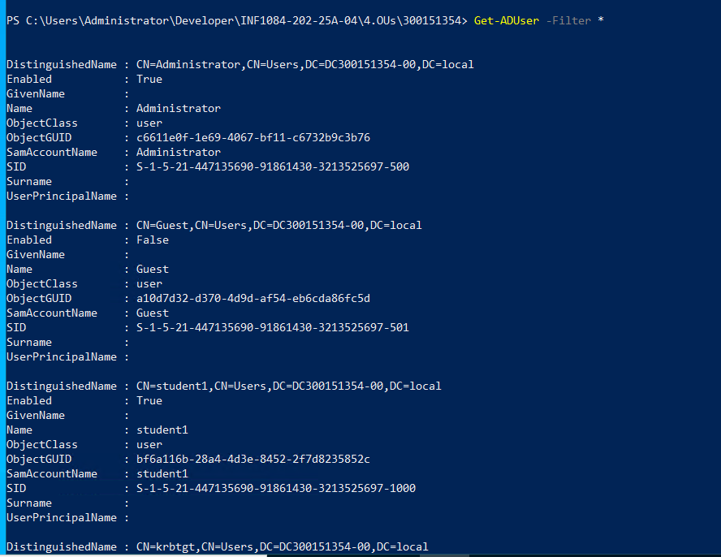
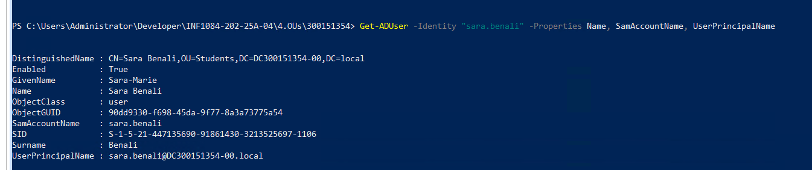
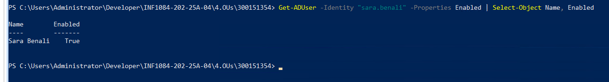
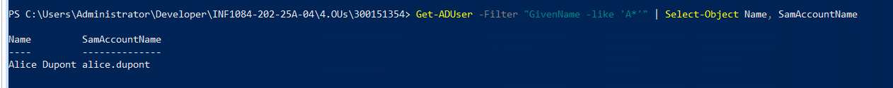

1) Informations complètes du domaine Active Directory
-) Get-ADDomain

Description :

Cette capture montre les propriétés détaillées du domaine AD auquel la machine est jointe.

2)Liste complète de tous les comptes utilisateurs AD
Get-ADUser -Filter *

Description :

Cette commande affiche tous les utilisateurs du domaine Active Directory.

3)Affichage complet des propriétés d’un compte utilisateur
Get-ADUser -Identity "sara.benali" -Properties Name, SamAccountName, UserPrincipalName

Description :

La commande affiche plusieurs propriétés détaillées du compte AD Sara Benali.

4)Vérification de l’état du compte d’un utilisateur (Enabled)
Get-ADUser -Identity "sara.benali" -Properties Enabled | Select-Object Name, Enabled

Description :

Cette capture montre une commande PowerShell utilisée pour vérifier si le compte Active Directory de Sara Benali est activé.

Résultat :

Name : Sara Benali

Enabled : True → le compte est actif

5)Recherche d’utilisateurs dont le prénom commence par A
Get-ADUser -Filter "GivenName -like 'A*'" | Select-Object Name, SamAccountName

Description :

Cette capture montre une commande PowerShell qui interroge Active Directory pour afficher les utilisateurs dont le prénom commence par la lettre A.

Résultat :

Un utilisateur correspondant apparaît : Alice Dupont

Son SamAccountName est : alice.dupont

