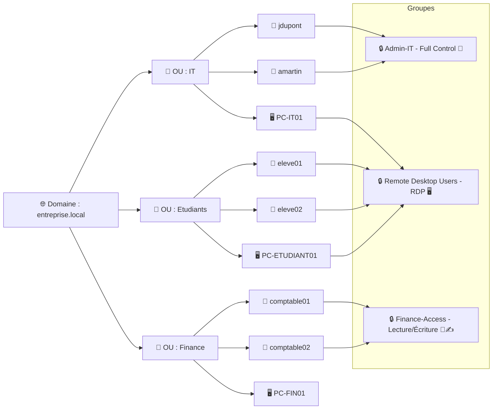

---

# :rocket: **TP : Gestion des utilisateurs Active Directory avec PowerShell**

[:tada: Participation](.scripts/Participation.md) 

---

# **Gestion de l’organisation administrative des comptes Active Directory** 🗂️💻

## **Objectif du module 🎯**

Apprendre à gérer l’organisation administrative des comptes et des groupes dans Active Directory afin d’assurer la sécurité 🔒, la conformité ✅ et le respect des standards de l’entreprise 🏢.

---

## **1. Les types de permissions dans Active Directory (2.1) 🛡️**

### **Définition**

Une **permission** est un droit attribué à un utilisateur ou un groupe sur un objet AD (dossier, fichier, OU, compte). Elle détermine ce que l’utilisateur peut faire sur l’objet.

### **Principaux types de permissions**

1. **Lecture (Read) 👀** : Voir l’objet et ses propriétés.
2. **Écriture (Write) ✍️** : Modifier certaines propriétés de l’objet.
3. **Création / Suppression (Create / Delete) 🆕❌** : Créer ou supprimer des objets.
4. **Contrôle total (Full Control) 👑** : Toutes les permissions possibles.

### **Techniques d’appui 🛠️**

* **RAFP GINQ/INFG 1,3** : Méthodes et outils pour vérifier et ajuster les permissions.
* Exemple PowerShell :

```powershell
Get-Acl "OU=Etudiants,DC=entreprise,DC=local" | Format-List
```

---

## **2. Organisation des comptes et des groupes (2.2) 🧑‍💼🖥️**

### **Concepts clés**

* **Compte utilisateur 👤** : Identité d’une personne dans l’entreprise.
  Exemple : `jdupont@entreprise.local`
* **Compte informatique 🖥️** : Représente un ordinateur sur le réseau.
  Exemple : `PC-ETUDIANT01`
* **Groupe 👥** : Regroupe des comptes pour appliquer des permissions collectives.
  Exemple : `Groupe-RDP`, `Groupe-IT`

### **Types de groupes**

1. **Groupes de sécurité 🔒** : Contrôlent l’accès aux ressources.
2. **Groupes de distribution ✉️** : Pour la messagerie, pas pour les permissions.

### **Organisation administrative**

* **Unités organisationnelles (OU) 🏢** : Structures hiérarchiques qui contiennent comptes et groupes.
* **Standard recommandé ✅** : une OU par département ou fonction, avec des groupes adaptés à l’accès aux ressources.

---

## **3. Concepts de permission dans Active Directory (2.3) ⚙️**

### **Héritage et propagation 🌱**

* Les permissions peuvent être **héritées** des objets parents (OU ou domaine) aux objets enfants (comptes et groupes).
* Permet un **contrôle centralisé** et moins d’erreurs.

### **Contrôle d’accès basé sur les rôles (RBAC) 🎭**

* Les **rôles** définissent quels groupes ont quelles permissions.
* Applique le principe du **moindre privilège** 🗝️ : donner seulement les droits nécessaires.

### **Exemples pratiques**

1. Ajouter un utilisateur au groupe RDP pour accès à distance :

```powershell
Add-ADGroupMember -Identity "Remote Desktop Users" -Members "jdupont"
```

2. Vérifier les permissions héritées d’une OU :

```powershell
Get-ACL "OU=IT,DC=entreprise,DC=local" | Format-List
```

---

## **Résumé / Bonnes pratiques 📌**

* Utiliser les **OU et groupes** pour organiser les comptes. 🗂️
* Appliquer des **permissions standardisées** 🔒 pour sécuriser les données.
* Respecter le **moindre privilège** 🗝️ et le contrôle centralisé.
* Documenter toutes modifications 📄 pour la traçabilité.

---

Voici un **schéma** qui montre **les OU, les comptes, les groupes et les permissions héritées** 👇



### ✅ Points clés visibles dans ce schéma

* Les **OU** structurent l’organisation 🏢.
* Les **comptes utilisateurs et ordinateurs** sont dans les OU correspondantes 👤🖥️.
* Les **groupes** appliquent des **permissions standardisées** 🔒.
* On distingue **les permissions spécifiques** (Full Control, RDP, Lecture/Écriture) avec des emojis.
* Le **principe de moindre privilège** est visible : chaque compte a accès uniquement aux groupes nécessaires 🔑.

# :abacus: Laboratoires

Gérer les utilisateurs dans ton domaine **`DC999999999-0.local`**, avec les corrections pour le container `CN=Users` et la création de l’OU `Students`.

## :books: Travail à soumettre :

- [ ] Créer un répertoire avec ton  :id: (votre identifiant boreal)
  - [ ] `mkdir ` :id:
  - [ ] `cd ` :id:
- [ ] dans le répertoire ajouter le fichier `README.md`
  - [ ] `touch README.md`
  - [ ] Créer un répertoire images
    - [ ] `mkdir images`
    - [ ] `touch images/.gitkeep`
- [ ] envoyer vers le serveur `git`
  - [ ] remonter au repertoire précédent
    - [ ] `cd ..`
  - [ ] `git add `:id:
  - [ ] `git commit -m "mon fichier ..."`
  - [ ] `git push`

---

**Domaine cible :** `DC999999999-0.local`
**Outils :** PowerShell avec module `ActiveDirectory`

:warning: **Chaque étudiant a un domaine unique basé sur son numéro étudiant**.

Voici comment organiser ça et l’adapter à PowerShell :

---

## **0️⃣ Nom du domaine basé  sur le numéro étudiant**

Si ton numéro d’étudiant est `999999999` et que tu as le numéro d'instance `netbios` 30 (pour éviter les erreurs de duplicatas):

```powershell
$studentNumber = 999999999
$studentInstance = 0

$domainName = "DC$studentNumber-$studentInstance.local"
$netbiosName = "DC$studentNumber-$studentInstance"
```

* **$domainName** : FQDN du domaine (`DC999999999-0.local`)
* **$netbiosName** : Nom NetBIOS court (`DC999999999-0`)
* Cela garantit **un nom unique pour chaque étudiant** même si plusieurs étudiants font le TP sur le même réseau isolé.

---

---

## **1️⃣ Préparer l’environnement**

```powershell
# Importer le module AD
Import-Module ActiveDirectory

# Vérifier le domaine et les DC
Get-ADDomain -Server $domainName
Get-ADDomainController -Filter * -Server $domainName
```

---

## **2️⃣ Liste des utilisateurs du domaine**

```powershell
Get-ADUser -Filter * -Server $domainName -Properties Name, SamAccountName, Enabled |
Where-Object { $_.Enabled -eq $true -and $_.SamAccountName -notin @("Administrator","Guest","krbtgt") } |
Select-Object Name, SamAccountName
```

> ⚠️ Remarque : les utilisateurs créés par défaut sont dans **`CN=Users`**, pas dans une OU.

---

:key: Pour les operations néscessitant les informations sécurisées de l'administrateur

```powershell
$cred = Get-Credential  # entrer Administrator@$domainName et le mot de passe
```

## **3️⃣ Créer un nouvel utilisateur**

```powershell
New-ADUser -Name "Alice Dupont" `
           -GivenName "Alice" `
           -Surname "Dupont" `
           -SamAccountName "alice.dupont" `
           -UserPrincipalName "alice.dupont@$domainName" `
           -AccountPassword (ConvertTo-SecureString "MotDePasse123!" -AsPlainText -Force) `
           -Enabled $true `
           -Path "CN=Users,DC=$netbiosName,DC=local" `
           -Credential $cred
```

---

## **4️⃣ Modifier un utilisateur**

```powershell
Set-ADUser -Identity "alice.dupont" `
           -EmailAddress "alice.dupont@exemple.com" `
           -GivenName "Alice-Marie" `
           -Credential $cred
```

---

## **5️⃣ Désactiver un utilisateur**

```powershell
Disable-ADAccount -Identity "alice.dupont" -Credential $cred
```

---

## **6️⃣ Réactiver un utilisateur**

```powershell
Enable-ADAccount -Identity "alice.dupont" -Credential $cred
```

---

## **7️⃣ Supprimer un utilisateur**

```powershell
Remove-ADUser -Identity "alice.dupont" -Confirm:$false -Credential $cred
```

---

## **8️⃣ Rechercher des utilisateurs avec un filtre**

```powershell
Get-ADUser -Filter "GivenName -like 'A*'" -Properties Name, SamAccountName |
Select-Object Name, SamAccountName
```

---

## **9️⃣ Exporter les utilisateurs dans un CSV**

```powershell
Get-ADUser -Filter * -Server $domain -Properties Name, SamAccountName, EmailAddress, Enabled |
Where-Object { $_.SamAccountName -notin @("Administrator","Guest","krbtgt") } |
Select-Object Name, SamAccountName, EmailAddress, Enabled |
Export-Csv -Path "TP_AD_Users.csv" -NoTypeInformation -Encoding UTF8
```

---

## **10️⃣ Déplacer un utilisateur vers une OU `Students`**

1. Crée l’OU si elle n’existe pas :

```powershell
# Vérifier si l'OU existe
if (-not (Get-ADOrganizationalUnit -Filter "Name -eq 'Students'")) {
    New-ADOrganizationalUnit -Name "Students" -Path "DC=$netbiosName,DC=local"
}
```

2. Déplacer l’utilisateur depuis `CN=Users` :

```powershell
Move-ADObject -Identity "CN=Alice Dupont,CN=Users,DC=$netbiosName,DC=local" `
              -TargetPath "OU=Students,DC=$netbiosName,DC=local" `
              -Credential $cred
```

3. Vérifier le déplacement :

```powershell
Get-ADUser -Identity "alice.dupont" | Select-Object Name, DistinguishedName
```

---

### ✅ **Bilan du TP**

Après ce TP, l’étudiant saura :

* Lister tous les utilisateurs d’un domaine
* Créer, modifier, activer/désactiver et supprimer des utilisateurs
* Appliquer des filtres et exporter les données
* Déplacer des utilisateurs depuis le container par défaut `CN=Users` vers une OU spécifique

