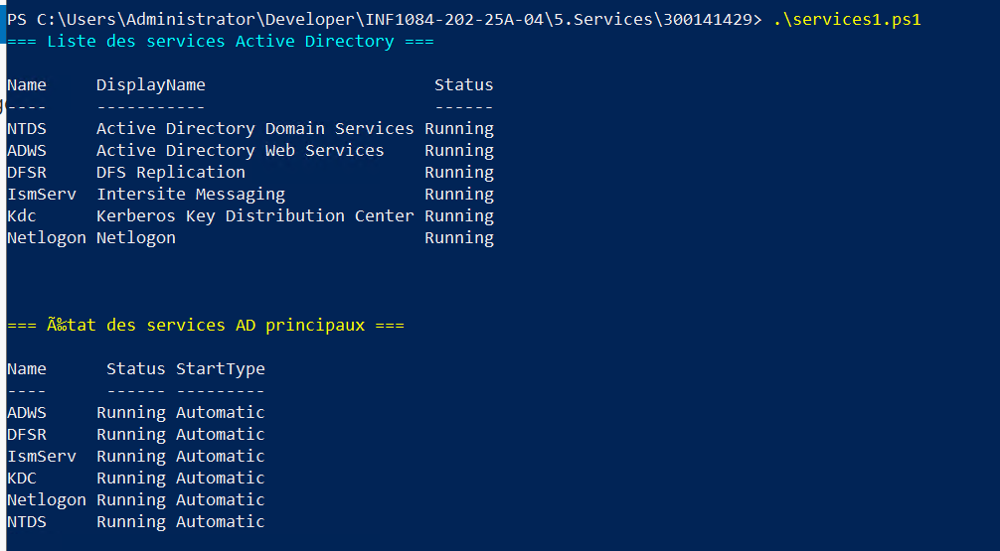
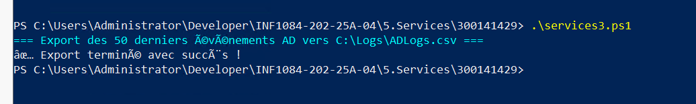
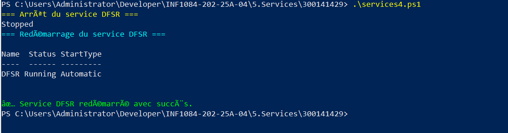

## Description des scripts

### services1.ps1

Ce script affiche les services principaux d'Active Directory et leur état :

- NTDS
- ADWS
- DFSR
- KDC
- Netlogon
- IsmServ

Il permet de vérifier si tous les services sont en cours d’exécution (Running).

---

### services2.ps1

Ce script récupère et affiche les 20 derniers événements du service NTDS à partir du journal des événements Windows.

Ces événements permettent de surveiller l’activité du contrôleur de domaine.

---

### services3.ps1

Ce script exporte les 50 derniers événements AD dans un fichier CSV situé à l’adresse suivante :

C:\Logs\ADLogs.csv

Cela permet d’avoir un historique des événements pour analyse.

---

### services4.ps1

Ce script arrête puis redémarre le service DFSR (DFS Replication) afin de tester la gestion et la relance d’un service critique.

