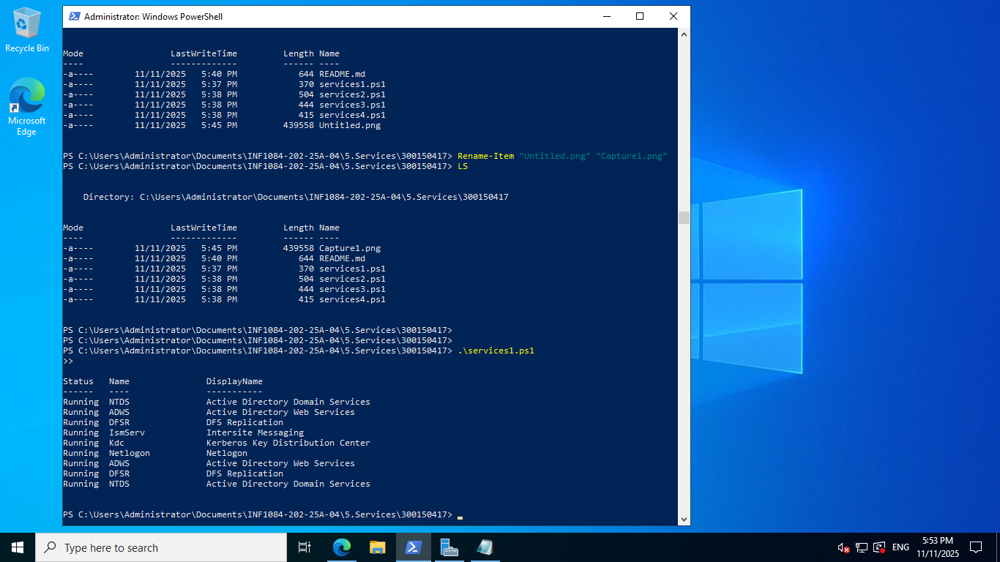
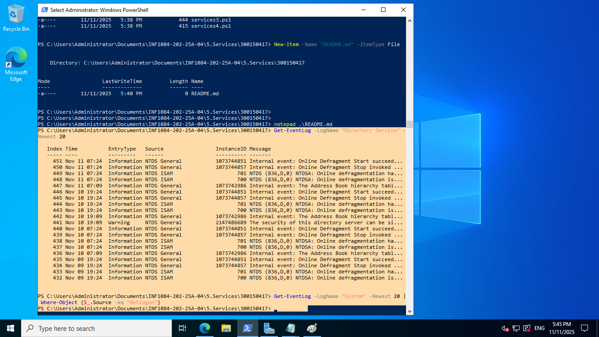
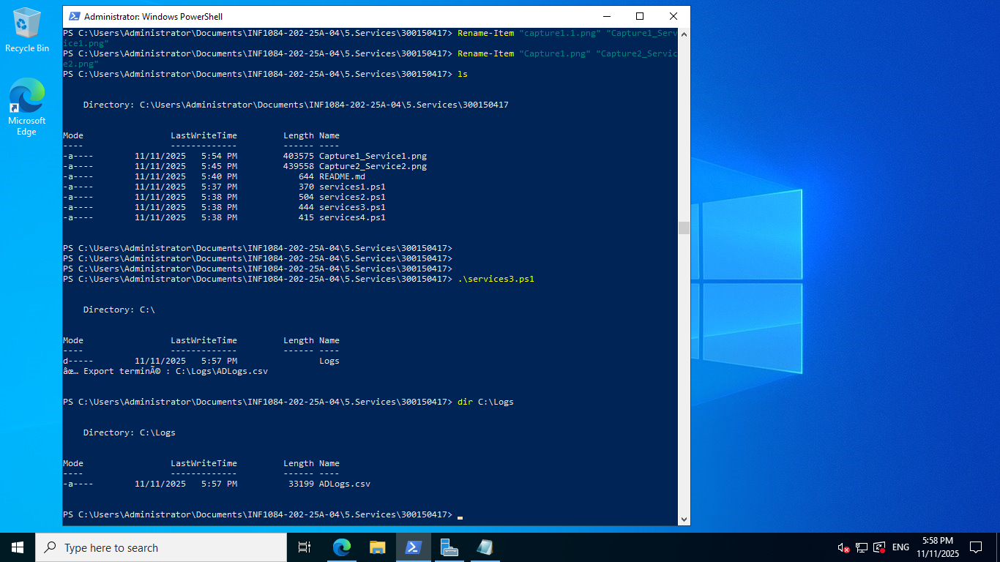
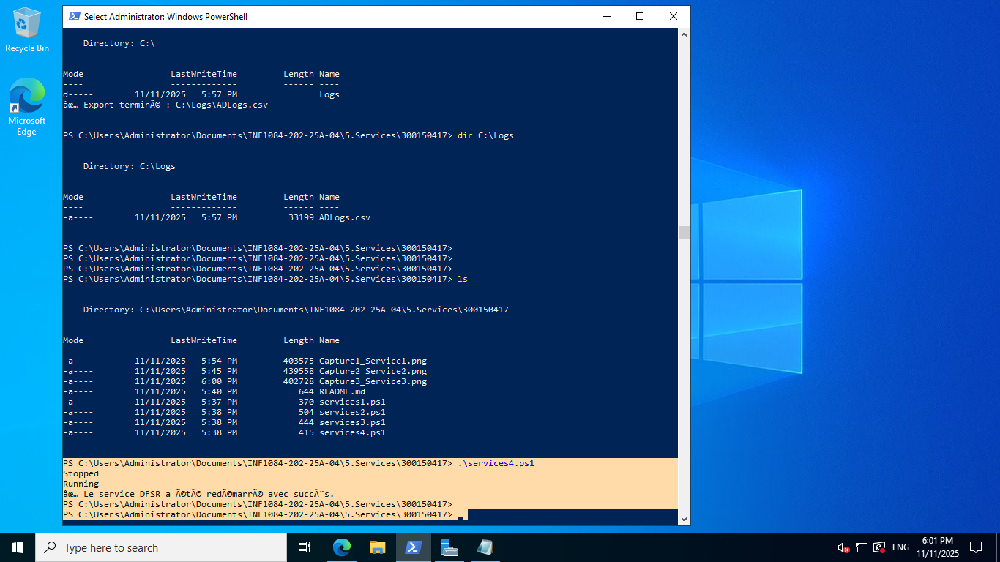

# TP - Services Windows et Active Directory

## 🎯 Objectifs
- Identifier et gérer les services essentiels d’Active Directory.
- Utiliser PowerShell pour explorer, analyser et contrôler les services AD DS.
- Capturer les événements liés à Active Directory.

---

## 1️⃣ Liste des services AD (services1.ps1)
Ce script affiche les principaux services liés à Active Directory et leur état.

### Commandes :
```powershell
Get-Service | Where-Object {
    $_.DisplayName -like "*Directory*" -or $_.Name -match "NTDS|ADWS|DFSR|kdc|Netlogon|IsmServ"
} | Sort-Object DisplayName

Get-Service -Name NTDS, ADWS, DFSR

```
📸 **Capture 1 – services1.ps1 :**



---

## 2️⃣ Consultation des journaux (services2.ps1)
Ce script affiche les 20 derniers événements liés à NTDS et Netlogon.

### Commandes :
```powershell
Get-EventLog -LogName "Directory Service" -Newest 20
Get-EventLog -LogName "System" -Newest 20 | Where-Object {$_.Source -eq "Netlogon"}
Get-WinEvent -LogName "Directory Service" -MaxEvents 20 | Format-Table TimeCreated, Id, LevelDisplayName, Message -AutoSize

```

📸 **Capture 2 – services2.ps1 :**


---

## 3️⃣ Exportation des journaux (services3.ps1)
Ce script exporte les 50 derniers événements AD vers un fichier CSV dans `C:\Logs\ADLogs.csv`.

### Commandes :
```powershell
New-Item -Path "C:\" -Name "Logs" -ItemType Directory -ErrorAction SilentlyContinue
Get-WinEvent -LogName "Directory Service" -MaxEvents 50 | Export-Csv -Path "C:\Logs\ADLogs.csv" -NoTypeInformation

```
📸 **Capture 3 – services3.ps1 :**

---

## 4️⃣ Démarrage/Arrêt d’un service (services4.ps1)
Ce script arrête et redémarre le service DFSR, puis affiche son état avant et après.

### Commandes :
```powershell
Stop-Service -Name DFSR
(Get-Service -Name DFSR).Status
Start-Service -Name DFSR
(Get-Service -Name DFSR).Status


```
📸 **Capture 4 – services4.ps1 :**
