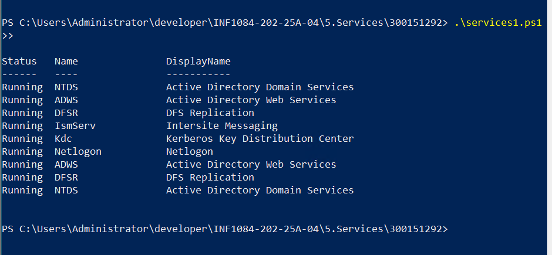
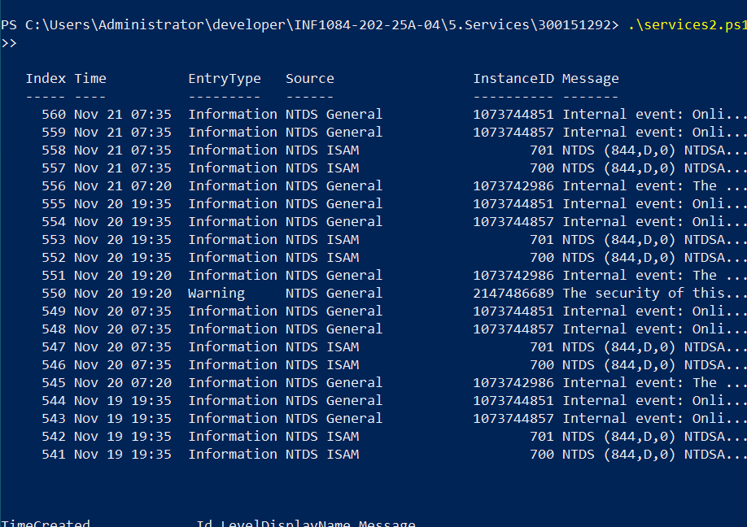
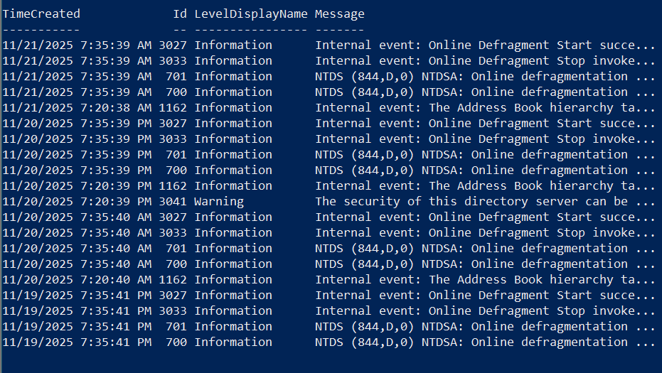
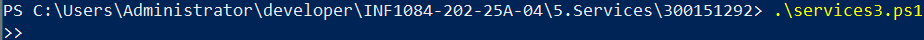
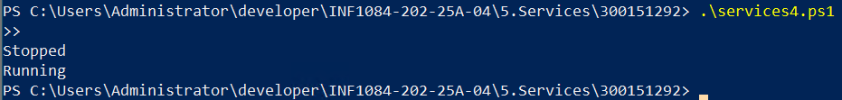

📘 TP – Services Windows & Active Directory

Étudiant : 300151292 – Amine Kahil
Cours : INF1084 – Systèmes Windows

🧪 Objectifs du laboratoire

Ce TP a pour but d’apprendre à utiliser PowerShell pour gérer les services liés à Active Directory (AD DS) :

Lister les services Active Directory et leur état

Afficher les événements (logs) d’un service AD

Exporter les événements AD dans un fichier CSV

Arrêter et redémarrer un service Windows

Tous les scripts sont nommés selon l’instruction du professeur :
services1.ps1 → services4.ps1

1️⃣ Script : services1.ps1
🎯 Objectif

Lister les services AD et vérifier leur état.

📌 Contenu du script
# Lister tous les services liés à AD
Get-Service | Where-Object {
    $_.DisplayName -like "*Directory*" -or $_.Name -match "NTDS|ADWS|DFSR|kdc|Netlogon|IsmServ"
} | Sort-Object DisplayName

# Vérifier l’état d’un service spécifique
Get-Service -Name NTDS, ADWS, DFSR

✔️ Résultat attendu

Affiche les services AD (NTDS, ADWS, DFSR, Netlogon, KDC…) et leur état (Running / Stopped).

2️⃣ Script : services2.ps1
🎯 Objectif

Afficher les derniers événements enregistrés par NTDS et Netlogon.

📌 Contenu du script
# Afficher les 20 derniers événements liés à NTDS
Get-EventLog -LogName "Directory Service" -Newest 20

# Afficher les logs du système filtrés sur Netlogon
Get-EventLog -LogName "System" -Newest 20 | Where-Object {$_.Source -eq "Netlogon"}

# Afficher les logs via le journal moderne (Event Viewer v2)
Get-WinEvent -LogName "Directory Service" -MaxEvents 20 |
Format-Table TimeCreated, Id, LevelDisplayName, Message -AutoSize

✔️ Résultat attendu

Liste des erreurs, warnings et informations produits par NTDS et Netlogon.

3️⃣ Script : services3.ps1
🎯 Objectif

Exporter les événements AD dans un fichier CSV.

📌 Contenu du script
Get-WinEvent -LogName "Directory Service" -MaxEvents 50 |
Export-Csv -Path "C:\Logs\ADLogs.csv" -NoTypeInformation

✔️ Résultat attendu

Un fichier CSV nommé ADLogs.csv créé dans C:\Logs.

4️⃣ Script : services4.ps1
🎯 Objectif

Arrêter, vérifier et redémarrer le service DFSR.

📌 Contenu du script
Stop-Service -Name DFSR
(Get-Service -Name DFSR).Status
Start-Service -Name DFSR
(Get-Service -Name DFSR).Status

✔️ Résultat attendu

Avant redémarrage : Stopped

Après redémarrage : Running

capture d'ecran 
## 📸 Résultats des scripts

Lister les services AD

Lire les événements AD

(partie 2)

Exporter les logs

Stop/Start DFSR

✨ Auteur

Amine Kahil – 300151292
Collège Boréal