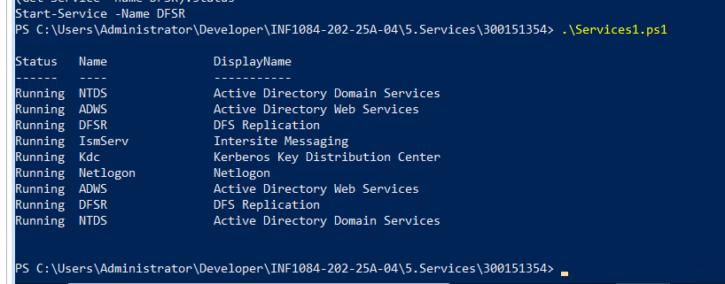
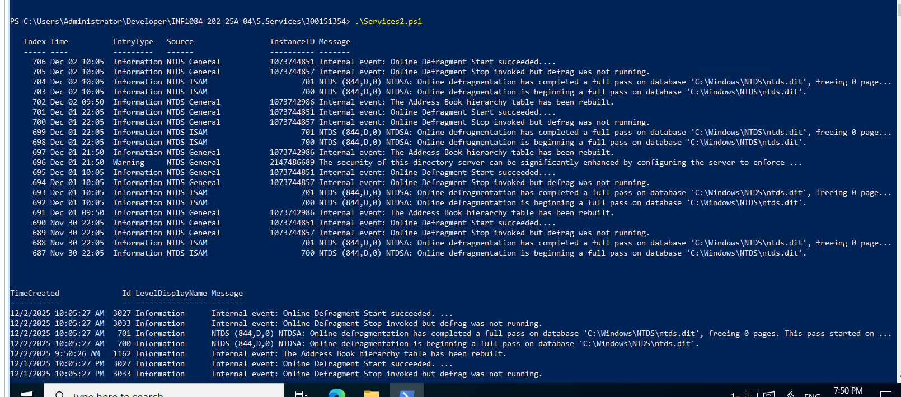
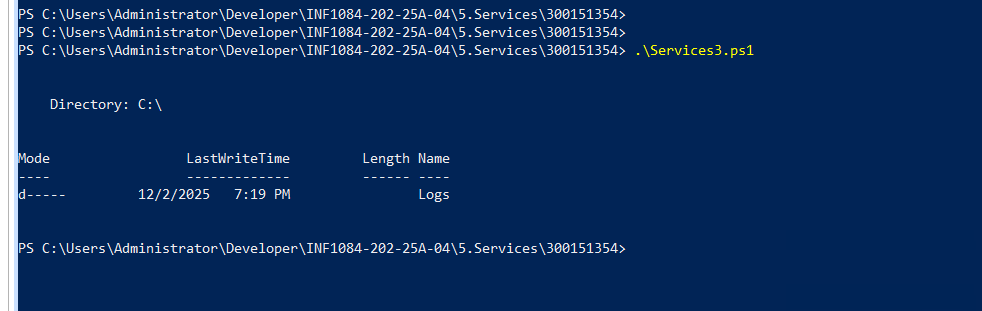
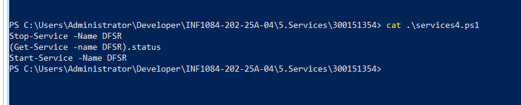

1) Script : services1.ps1

Le script filtre les services Windows liés à AD (NTDS, KDC, Netlogon, DFSR…)

Affiche leur état : Running / Stopped

Permet aussi de vérifier rapidement trois services essentiels : NTDS, ADWS, DFSR

2) Script : services2.ps1

 

 Ce script récupère et affiche les 20 derniers événements liés au service NTDS à partir du journal Directory Service de Windows.
Ces informations permettent de surveiller l’activité du contrôleur de domaine, détecter des erreurs, des avertissements ou des opérations importantes d’Active Directory.

Il affiche également les événements du service Netlogon dans le journal Système, ainsi que les entrées du journal moderne via Get-WinEvent, offrant ainsi une vue plus complète des événements AD.

3) services3.ps1

 

 Ce script extrait les 50 derniers événements du journal Directory Service (Active Directory) puis les enregistre dans un fichier CSV situé dans C:\Logs\ADLogs.csv.
L’export permet de conserver une trace des événements, de les analyser plus facilement (par exemple dans Excel) ou de les utiliser pour un audit ou une résolution d’incident.

4) services1.ps1

 

 Ce script arrête puis redémarre le service DFSR (Distributed File System Replication), utilisé pour la réplication du dossier SYSVOL entre les contrôleurs de domaine.
Il vérifie également l’état du service après l’arrêt afin de confirmer que l’opération a bien été effectuée.
