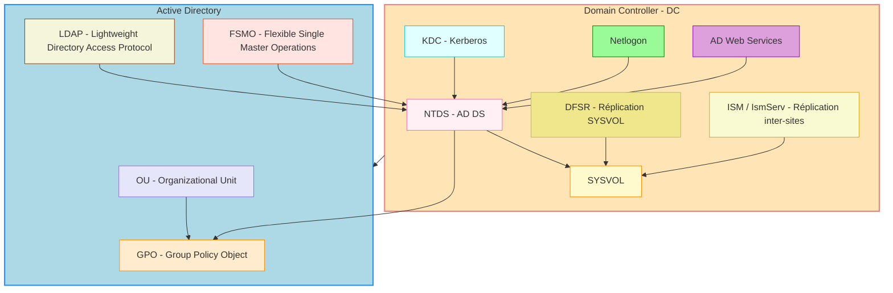
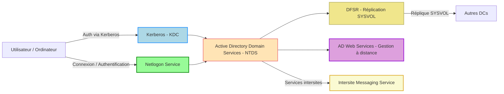
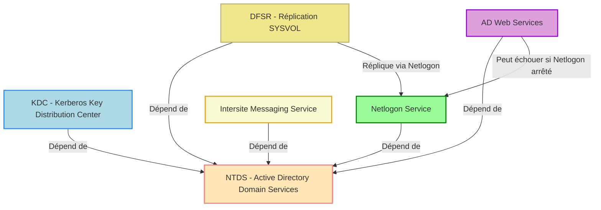

# 🖥️ Leçon : Les services Windows et AD DS

|:hash: | Fonctions                                          |
|-------|:---------------------------------------------------|
| :one: | [:tada: Participation](.scripts/Participation.md)  |


## :zero: Introduction aux services Windows

Un **service Windows** est un programme qui s’exécute en arrière-plan pour fournir des fonctionnalités spécifiques au système ou aux applications.

* Ils **ne nécessitent pas d’interface graphique**.
* Ils peuvent **démarrer automatiquement au démarrage** ou **manuellement**.
* Les services assurent la **stabilité et la continuité** des fonctions essentielles de Windows.

**Exemples de services Windows :**

* `WinDefend` : Windows Defender
* `W32Time` : Service de temps Windows
* `Spooler` : Gestion de l’impression

---

## 1️⃣ Les Relations dans AD

Les principales abréviations et services d’Active Directory et leurs relations:



---

### 💡 Explications du schéma

* **DC** contient tous les services critiques : NTDS, KDC, Netlogon, DFSR, ADWS, ISM.
* **NTDS** est le cœur d’AD DS, lié à SYSVOL et aux GPO.
* **DFS et ISM** assurent la réplication des dossiers et des politiques.
* **OU, GPO, LDAP, FSMO** représentent les concepts et objets AD utilisés par les services.
* Les flèches indiquent les dépendances et interactions entre services et concepts.

## 2️⃣ Les services liés à Active Directory

Active Directory (AD) est une **infrastructure de gestion centralisée** des utilisateurs, ordinateurs et ressources réseau.
Les services AD dépendent de plusieurs **services Windows critiques**.

### 2.1 Liste des services AD importants

| Service                                 | Nom du service | Rôle / Description                                                                              |
| --------------------------------------- | -------------- | ----------------------------------------------------------------------------------------------- |
| **Active Directory Domain Services**    | `NTDS`         | Base de données AD, gestion des objets (utilisateurs, groupes, ordinateurs) et GPO.             |
| **Active Directory Web Services**       | `ADWS`         | Permet aux outils de gestion AD (PowerShell, ADUC) de se connecter à distance via web services. |
| **Distributed File System Replication** | `DFSR`         | Réplique les dossiers SYSVOL entre DC pour la cohérence des scripts et GPO.                     |
| **Kerberos Key Distribution Center**    | `kdc`          | Fournit les tickets Kerberos pour l’authentification des utilisateurs et ordinateurs.           |
| **Netlogon**                            | `Netlogon`     | Authentification des utilisateurs, localisation des DC et enregistrement des services dans AD.  |
| **Intersite Messaging Service**         | `IsmServ`      | Assure la réplication des données AD entre différents sites.                                    |

---

### 2.2 Commandes PowerShell utiles pour explorer les services AD

```powershell
# Lister tous les services liés à AD
Get-Service | Where-Object {
    $_.DisplayName -like "*Directory*" -or $_.Name -match "NTDS|ADWS|DFSR|kdc|Netlogon|IsmServ"
} | Sort-Object DisplayName

# Vérifier l’état d’un service spécifique
Get-Service -Name NTDS, ADWS, DFSR
```

💡 **Astuce pédagogique :** Demander aux étudiants d’exécuter ces commandes sur un DC pour identifier les services essentiels.

---

## 3️⃣ Comment fonctionnent les services AD ensemble

Voici un schéma Mermaid simplifié pour visualiser les interactions :



**Explications :**

* **NTDS** est le cœur, toutes les autres fonctions gravitent autour.
* **KDC** gère l’authentification Kerberos.
* **Netlogon** est indispensable pour l’accès réseau et la découverte des DC.
* **DFSR** garantit que tous les DC ont les mêmes scripts et GPO.
* **ADWS** permet la gestion distante de l’AD.
* **IsmServ** synchronise les données entre sites différents.

---

## 4️⃣ Points clés à retenir

1. Les services Windows sont essentiels pour la stabilité et les fonctions réseau.
2. Les **services AD DS** sont interconnectés et critiques pour :

   * Authentification (KDC, Netlogon)
   * Gestion des objets et GPO (NTDS)
   * Réplication intersites (DFSR, IsmServ)
   * Administration distante (ADWS)
3. Un problème sur un service AD critique peut **paralyser l’authentification** et la **gestion des ressources** dans le domaine.

## Dépendances

Dépendances critiques entre les services Active Directory et l’impact possible de l’arrêt d’un service :



---

### 💡 Explications

* **NTDS** est le cœur : si arrêté, tous les autres services AD sont impactés.
* **KDC** : arrêt → impossible de générer des tickets Kerberos.
* **Netlogon** : arrêt → clients ne peuvent plus s’authentifier ; services dépendants peuvent fonctionner mais seront limités.
* **DFSR** : arrêt → bloque la réplication SYSVOL.
* **ADWS** : arrêt → empêche la gestion à distance.
* **IsmServ** : arrêt → réplication inter-sites bloquée.

---

# Gestion des services 

**Récapitulatif des commandes de base Windows** pour gérer les services et visualiser leurs logs, avec un focus sur les services AD si nécessaire.

---

## 1️⃣ Démarrer et arrêter un service

### **PowerShell**

```powershell
# Démarrer un service
Start-Service -Name <NomService>

# Exemple : démarrer le service Netlogon
Start-Service -Name Netlogon

# Arrêter un service
Stop-Service -Name <NomService>

# Exemple : arrêter le service DFSR
Stop-Service -Name DFSR

# Redémarrer un service
Restart-Service -Name <NomService>

# Vérifier l’état d’un service
Get-Service -Name <NomService>

# Exemple : état des services AD principaux
Get-Service -Name NTDS, ADWS, DFSR, KDC, Netlogon, IsmServ
```

---

### **Invite de commandes (cmd)**

```cmd
# Démarrer un service
net start <NomService>

# Exemple :
net start Netlogon

# Arrêter un service
net stop <NomService>

# Exemple :
net stop DFSR
```

---

## 2️⃣ Visualiser les logs d’un service

#### 💠 En PowerShell :

1. Tu peux aussi l’ouvrir via :

```powershell
Start-Process eventvwr.msc
```

> 📋 Cette console permet de gérer logs.


2. Naviguer vers :

   ```
   Event Viewer → Applications and Services Logs → Directory Service
   ```
3. Filtrer par service ou ID d’événement.

 </img>

---

### **PowerShell pour consulter les logs**

```powershell
# Afficher les 20 derniers événements liés à NTDS
Get-EventLog -LogName "Directory Service" -Newest 20

# Afficher les logs du système
Get-EventLog -LogName "System" -Newest 20 | Where-Object {$_.Source -eq "Netlogon"}

# Afficher les logs via le journal moderne (Event Viewer v2)
Get-WinEvent -LogName "Directory Service" -MaxEvents 20 | Format-Table TimeCreated, Id, LevelDisplayName, Message -AutoSize
```

---

## 3️⃣ Bonnes pratiques

* Toujours **vérifier les dépendances** avant d’arrêter un service critique (ex. NTDS, KDC, Netlogon).
* Utiliser `Restart-Service` pour redémarrer un service sans avoir à l’arrêter puis le démarrer manuellement.
* Sur un DC, consultez **Directory Service** dans Event Viewer pour détecter des problèmes liés à l’AD.
* Pour un suivi régulier, on peut **exporter les logs vers un fichier CSV** :

```powershell
Get-WinEvent -LogName "Directory Service" -MaxEvents 50 | Export-Csv -Path "C:\Logs\ADLogs.csv" -NoTypeInformation
```


---

# :abacus: Laboratoires

## Objectifs

* Lister les services AD et leur état
* Afficher les évenements d'un service AD
* Capturer les évenements d'un service AD dans un fichier
* Arrêt et redémarrage d'un service

:bookmark: Nommez vos scripts Powershell selon le format suivant `services`[1-4]`.ps1`

> cat .\services1.ps1
```powershell
# Lister tous les services liés à AD
Get-Service | Where-Object {
    $_.DisplayName -like "*Directory*" -or $_.Name -match "NTDS|ADWS|DFSR|kdc|Netlogon|IsmServ"
} | Sort-Object DisplayName

# Vérifier l’état d’un service spécifique
Get-Service -Name NTDS, ADWS, DFSR
```

> cat .\services2.ps1
```powershell
# Afficher les 20 derniers événements liés à NTDS
Get-EventLog -LogName "Directory Service" -Newest 20

# Afficher les logs du système
Get-EventLog -LogName "System" -Newest 20 | Where-Object {$_.Source -eq "Netlogon"}

# Afficher les logs via le journal moderne (Event Viewer v2)
Get-WinEvent -LogName "Directory Service" -MaxEvents 20 | Format-Table TimeCreated, Id, LevelDisplayName, Message -AutoSize
```

> cat .\services3.ps1
```powershell
Get-WinEvent -LogName "Directory Service" -MaxEvents 50 | Export-Csv -Path "C:\Logs\ADLogs.csv" -NoTypeInformation
```

> cat .\services4.ps1
```powershell
Stop-Service -Name DFSR
(Get-Service -name DFSR).status
Start-Service -Name DFSR
```

# :books: References

Voici un **guide clair des principales abréviations et concepts d’Active Directory** (AD) :

---

## 1️⃣ **DC – Domain Controller (Contrôleur de Domaine)**

* **Rôle :** Serveur qui **authentifie les utilisateurs et ordinateurs** dans un domaine.
* **Fonctions principales :**

  * Stocke la base de données AD (NTDS.dit)
  * Applique les **GPO**
  * Fournit les services **Kerberos** et **Netlogon**
  * Réplique les données avec d’autres DC
* **Exemple :** Si un utilisateur se connecte à Windows avec un compte AD, le DC vérifie ses identifiants.

---

## 2️⃣ **GPO – Group Policy Object (Objet de Stratégie de Groupe)**

* **Rôle :** Permet de **configurer automatiquement des paramètres pour utilisateurs et ordinateurs** dans un domaine.
* **Exemples de paramètres :**

  * Verrouillage automatique des écrans
  * Scripts de connexion/déconnexion
  * Installation d’applications
* Les GPO sont **stockés dans SYSVOL** et répliqués via **DFSR**.

---

## 3️⃣ **AD DS – Active Directory Domain Services**

* **Rôle :** Fournit l’**infrastructure principale de gestion des identités** et des ressources réseau.
* **Fonctions principales :**

  * Gestion des comptes et groupes
  * Authentification et autorisation (via Kerberos)
  * Réplication inter-sites
* Le service principal côté serveur est **NTDS**.

---

## 4️⃣ **ADWS – Active Directory Web Services**

* Permet la **gestion à distance** de l’AD via PowerShell ou ADUC.
* Sert pour les outils modernes d’administration.

---

## 5️⃣ **DFSR – Distributed File System Replication**

* Réplique **SYSVOL** et d’autres dossiers entre DC.
* Garantit que les **scripts, GPO et politiques** sont identiques sur tous les DC.

---

## 6️⃣ **KDC – Key Distribution Center (Centre de distribution de clés)**

* Partie du service Kerberos.
* Génère les **tickets d’authentification** pour les utilisateurs et ordinateurs.

---

## 7️⃣ **Netlogon**

* Service qui :

  * Authentifie les comptes sur le réseau
  * Permet aux clients de **localiser les DC**
  * Met à jour les enregistrements DNS du DC

---

## 8️⃣ **ISM / IsmServ – Intersite Messaging Service**

* Assure la **réplication inter-sites** pour que tous les sites AD aient les mêmes données.

---

## 9️⃣ Autres abréviations utiles

| Abréviation | Signification                         | Rôle                                                                  |
| ----------- | ------------------------------------- | --------------------------------------------------------------------- |
| **OU**      | Organizational Unit                   | Conteneur pour organiser les comptes et appliquer des GPO spécifiques |
| **FSMO**    | Flexible Single Master Operations     | Rôles spéciaux qui ne peuvent être détenus que par certains DC        |
| **LDAP**    | Lightweight Directory Access Protocol | Protocole utilisé pour interroger et modifier l’annuaire              |
| **SYSVOL**  | System Volume                         | Dossier partagé contenant scripts et GPO à répliquer                  |
| **RDP**     | Remote Desktop Protocol               | Connexion distante vers les DC pour administration                    |


