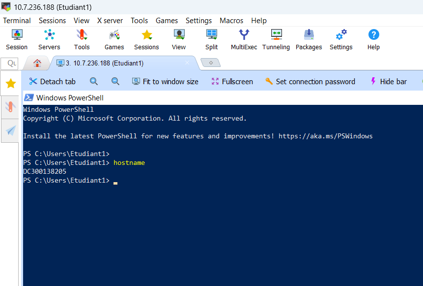
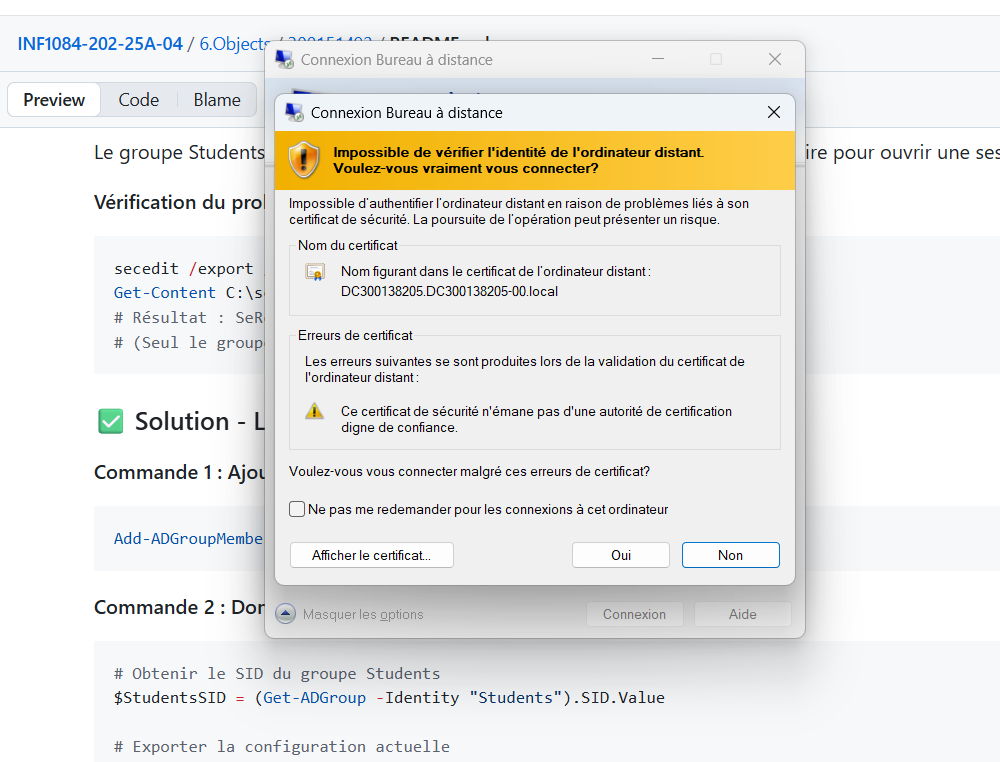
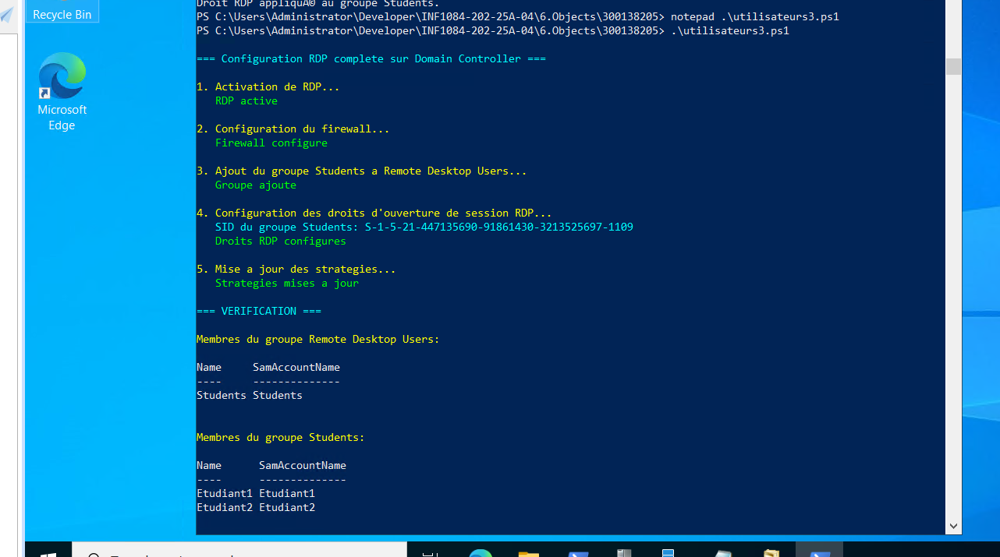
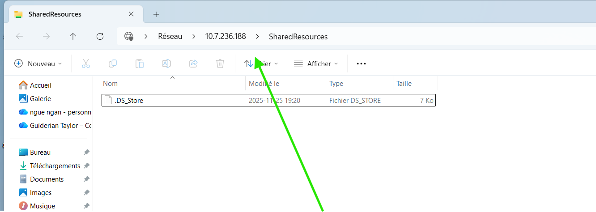
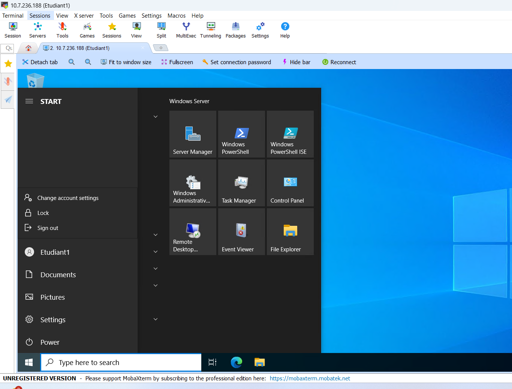

300138205
# 🧠 Laboratoire Active Directory : Objets gérables et GPO

## 👤 Étudiant

* **Prénom :** Taylor
* **ID Étudiant :** 300138205

  ## 🎯 Objectifs

1. Comprendre les objets AD et leur utilité.
2. Créer et partager un dossier réseau SMB.
3. Créer des utilisateurs et groupes AD.
4. Mapper un lecteur réseau (Z:) via un GPO.
5. Activer le RDP pour un groupe spécifique.
6. Tester les accès et permissions.


```powershell
Import-Module ActiveDirectory
# Chemin du dossier
$SharedFolder = "C:\SharedResources"

# Créer le dossier
New-Item -Path $SharedFolder -ItemType Directory -Force

# Créer un partage SMB pour le groupe Students
$GroupName = "Students"

# Créer le groupe AD
New-ADGroup -Name $GroupName -GroupScope Global -Description "Users allowed RDP and shared folder access"

# Créer des utilisateurs AD et les ajouter au groupe
$Users = @("Etudiant1","Etudiant2")
foreach ($user in $Users) {
    New-ADUser -Name $user -SamAccountName $user -AccountPassword (ConvertTo-SecureString "Pass123!" -AsPlainText -Force) -Enabled $true
    Add-ADGroupMember -Identity $GroupName -Members $user
}

# Partager le dossier avec le groupe
New-SmbShare -Name "SharedResources" -Path $SharedFolder -FullAccess $GroupName
```

<details>

  ```powershell


    Directory: C:\


Mode                 LastWriteTime         Length Name
----                 -------------         ------ ----
d-----        11/14/2025   5:15 PM                SharedResources

AvailabilityType      : NonClustered
CachingMode           : Manual
CATimeout             : 0
CompressData          : False
ConcurrentUserLimit   : 0
ContinuouslyAvailable : False
CurrentUsers          : 0
Description           :
EncryptData           : False
FolderEnumerationMode : Unrestricted
IdentityRemoting      : False
Infrastructure        : False
LeasingMode           : Full
Name                  : SharedResources
Path                  : C:\SharedResources
Scoped                : False
ScopeName             : *
SecurityDescriptor    : O:SYG:SYD:(A;;FA;;;S-1-5-21-447135690-91861430-3213525697-1109)
ShadowCopy            : False
ShareState            : Online
ShareType             : FileSystemDirectory
SmbInstance           : Default
Special               : False
Temporary             : False
Volume                : \\?\Volume{d9f7716d-765c-4de2-bbd2-1c33f3e87e19}\
PSComputerName        :
PresetPathAcl         : System.Security.AccessControl.DirectorySecurity


```

</details>


```powershell
Import-Module GroupPolicy
# Chemin du dossier
$SharedFolder = "C:\SharedResources"

# Créer le dossier
New-Item -Path $SharedFolder -ItemType Directory -Force

# Créer un partage SMB pour le groupe Students
$GroupName = "Students"

# Créer le groupe AD
New-ADGroup -Name $GroupName -GroupScope Global -Description "Users allowed RDP and shared folder access"

# Créer des utilisateurs AD et les ajouter au groupe
$Users = @("Etudiant1","Etudiant2")
foreach ($user in $Users) {
    New-ADUser -Name $user -SamAccountName $user -AccountPassword (ConvertTo-SecureString "Pass123!" -AsPlainText -Force) -Enabled $true
    Add-ADGroupMember -Identity $GroupName -Members $user
}

# Partager le dossier avec le groupe
New-SmbShare -Name "SharedResources" -Path $SharedFolder -FullAccess $GroupName
```

<details>

  ```powershell

PS C:\Users\Administrator\Developer\INF1084-202-25A-04\6.Objects\300138205> .\utilisateurs2.ps1
Script logon créé : C:\Scripts\MapDrive-Z.bat
GPO 'MapSharedFolder' existe déjà.
GPO liée à l'OU OU=Students,DC=DC300138205-00,DC=local.
Script copié dans SYSVOL : C:\Windows\SYSVOL\sysvol\DC300138205-00.LOCAL\Policies\{bf80a4a4-b15e-4aae-b34e-344136ccb53a}\User\Scripts\Logon
Script ajouté à scripts.ini de la GPO.
RDP activé et firewall configuré.
Droit Logon via RDP pour 'Students' à gérer via secpol.cfg

The task has completed successfully.
See log %windir%\security\logs\scesrv.log for detail info.
Après modification de 'SeRemoteInteractiveLogonRight', réimporter avec : secedit /import /cfg C:\secpol.cfg /db C:\secpol.sdb /overwrite
Configuration terminée avec succès.
PS C:\Users\Administrator\Developer\INF1084-202-25A-04\6.Objects\300138205>

```

</details>
# verification








## ✅ Vérifications et tests

### Tests effectués :

* ✅ Connexion RDP avec **Etudiant1** (Pass123!)
* ✅ Connexion RDP avec **Etudiant2** (Pass123!)
* ✅ Le lecteur Z: est mappé automatiquement vers `\\DC300151492-00\SharedResources`
* ✅ Accès au dossier partagé fonctionnel
* ✅ Groupe Students membre de "Remote Desktop Users"
* ✅ Droit SeRemoteInteractiveLogonRight accordé au groupe Students

### Test d'un utilisateur hors du groupe :

* ❌ Pas d'accès RDP
* ❌ Aucun lecteur réseau mappé

---
