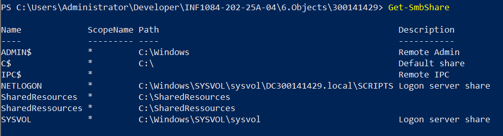
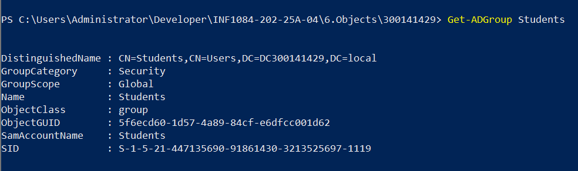
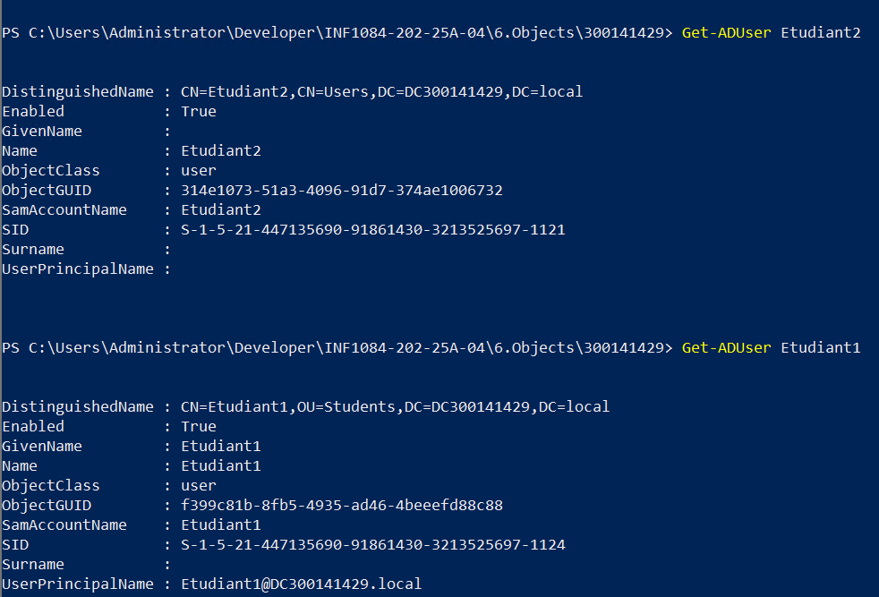
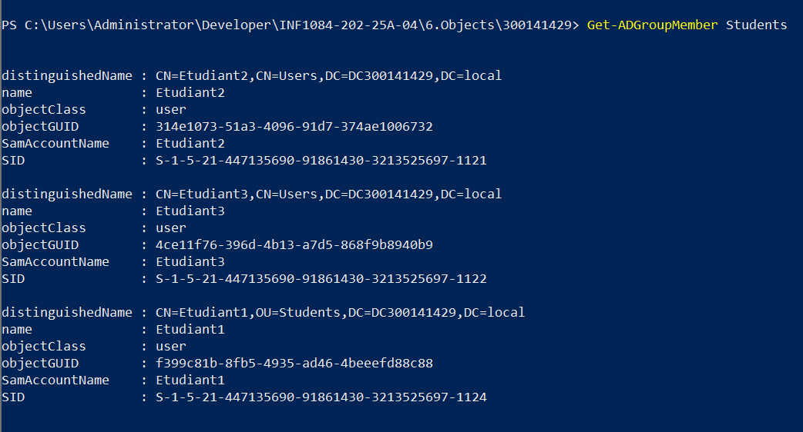
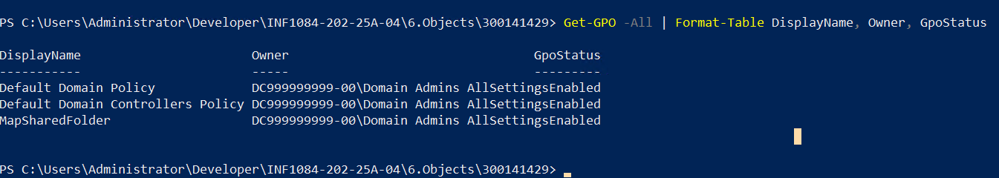
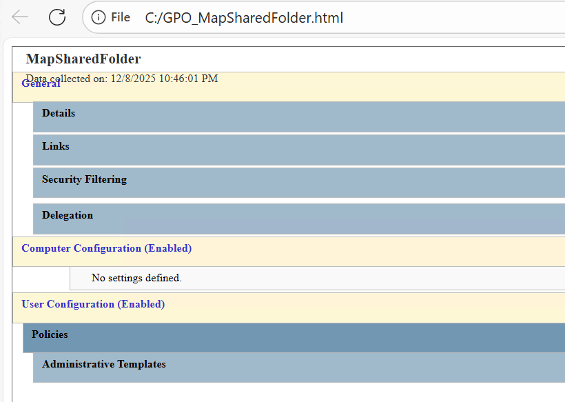
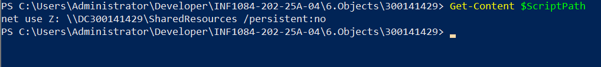
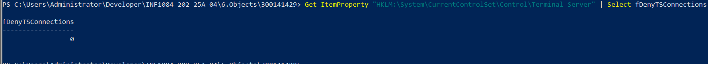
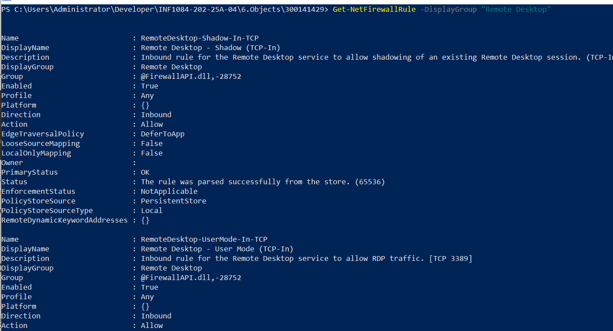
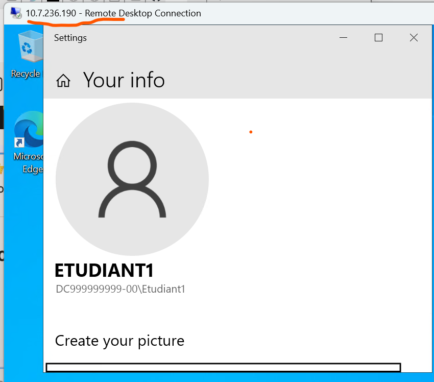

```powershell
Vérifier le partage SMB

Get-SmbShare
Cette commande liste tous les partages SMB existants sur le serveur et montre la preuve que le dossier SharedResources est bien partagé et accessible au groupe Students.

```

```powershell
Vérifier le groupe AD

Get-ADGroup Students
Description : Affiche les propriétés du groupe Students dans Active Directory. Preuve que le groupe a été créé avec succès.

```

```powershell
Vérifier les utilisateurs créés

Get-ADUser Etudiant1
Get-ADUser Etudiant2
Montre les informations des comptes utilisateurs.  Preuve que Etudiant1 et Etudiant2 existent dans l’OU Students.

```

```powershell
Vérifier les membres du groupe
powershell
Get-ADGroupMember Students
Liste les membres du groupe Students.Preuve que les utilisateurs ont bien été ajoutés au groupe.

```

```powershell
Vérifier la GPO
powershell
Get-GPO -All | Format-Table DisplayName, Owner, GpoStatus
Affiche toutes les GPO du domaine avec leurs propriétés principales. Preuve que la GPO MapSharedFolder existe.

```

```powershell
Vérifier le lien GPO avec l’OU
Get-GPOReport -Name "MapSharedFolder" -ReportType Html -Path C:\GPO_MapSharedFolder.html
Ce rapport montre toutes les informations de la GPO, y compris les liens (OU, domaine, site).

```

```powershell

Vérifier le script logon

Get-Content C:\Scripts\MapDrive-Z.bat
 Affiche le contenu du script logon.Preuve que le script contient bien la commande pour mapper le lecteur Z: vers \\DC300141429\SharedResources.

```

```powershell
Vérifier l’activation du RDP
Get-ItemProperty "HKLM:\System\CurrentControlSet\Control\Terminal Server" | Select fDenyTSConnections
Vérifie si RDP est activé (0 = activé, 1 = désactivé). Preuve que le serveur autorise les connexions RDP.

```

```powershell
Vérifier le firewall

Get-NetFirewallRule -DisplayGroup "Remote Desktop"
Liste les règles du firewall liées à RDP. Preuve que les règles sont activées et permettent les connexions.

```

```powershell
Test utilisateur  Etudiant1 pour la connectivite.
```

l'image montre que le test a marche mais comme le netbios je n'avais pas mis mon id cela a pris le DC99999999-00 par defaut il ya la confirmation avec le soulignement que j'ai mis en haut qui montre que c'est mon serveur vous pouvez tentez de connecter avec Etudiant1 en mettant comme username Etudiant1@DC300141429.local cela marchera aussi.


Voici l'utilisateur student cree pour un teste n'appartenant pas au groupe ne se connecte pas.

