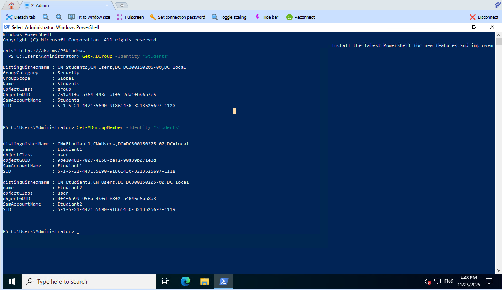
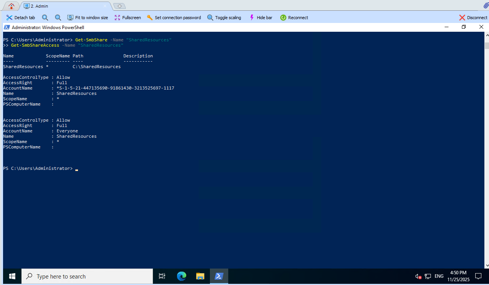
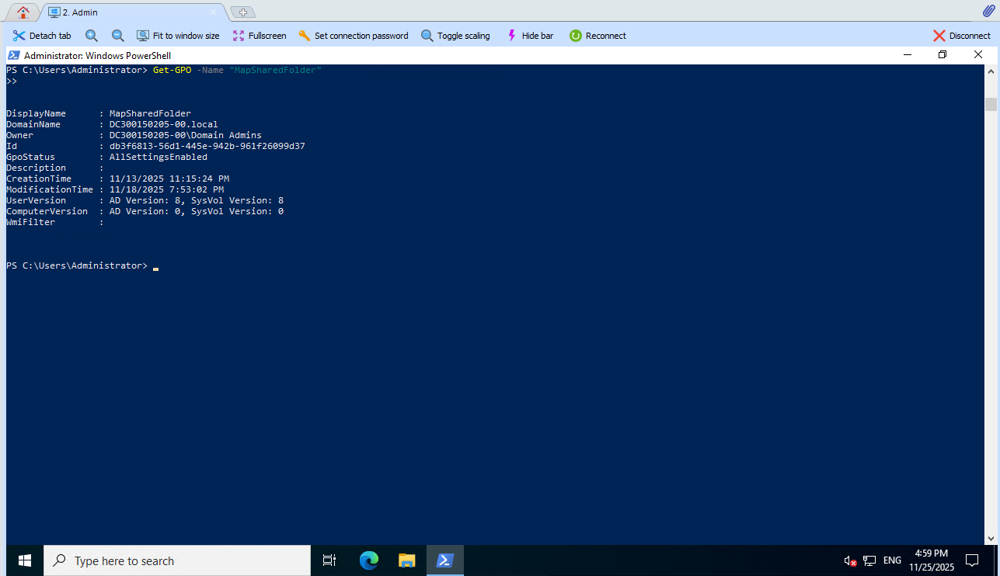
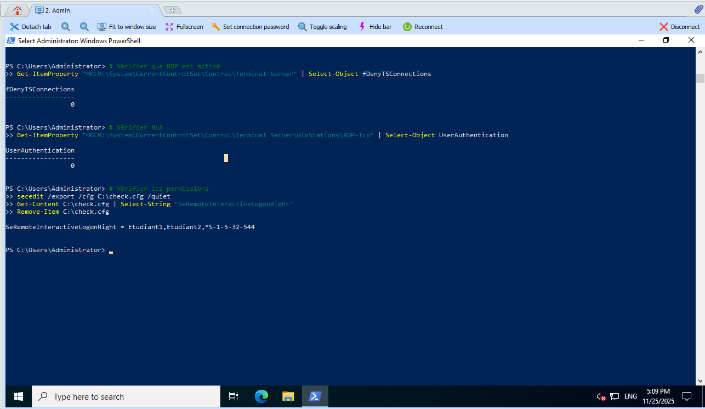
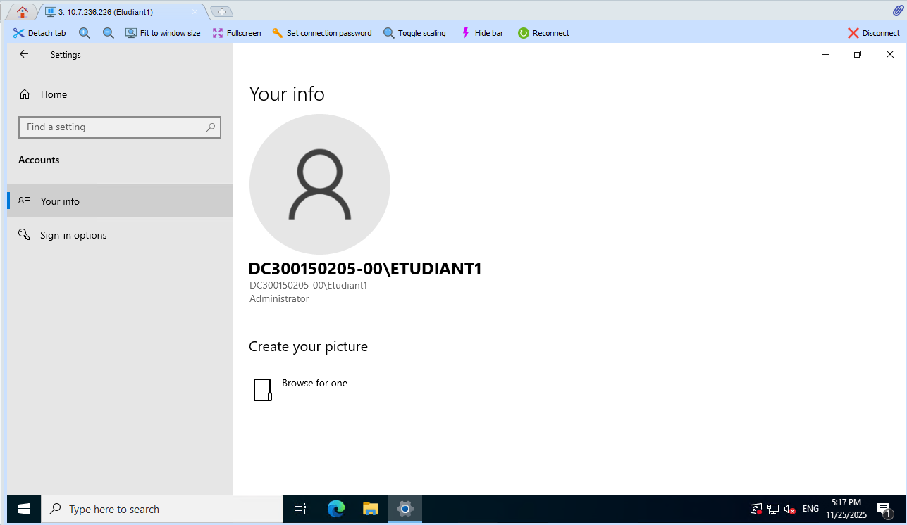
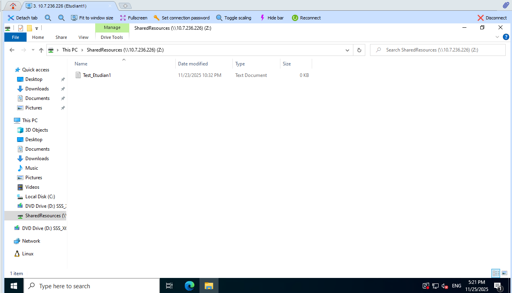
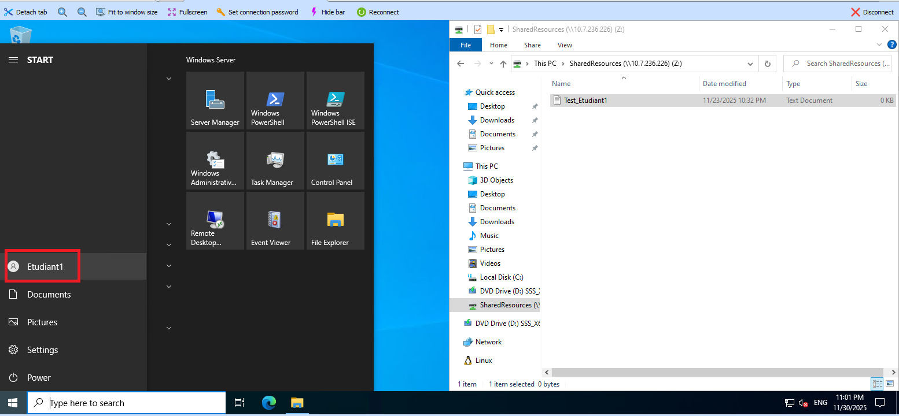
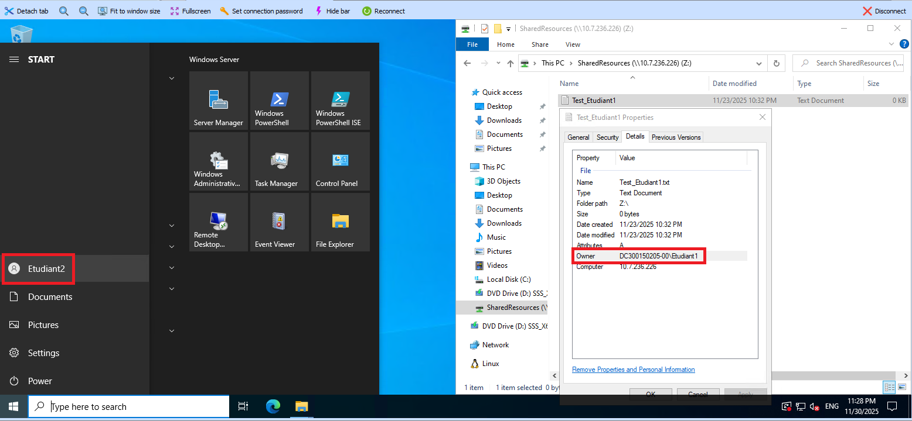
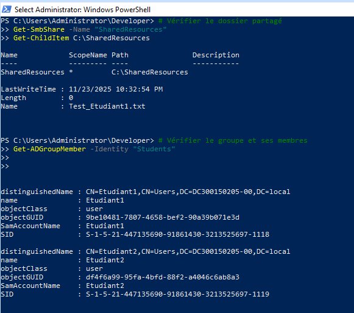
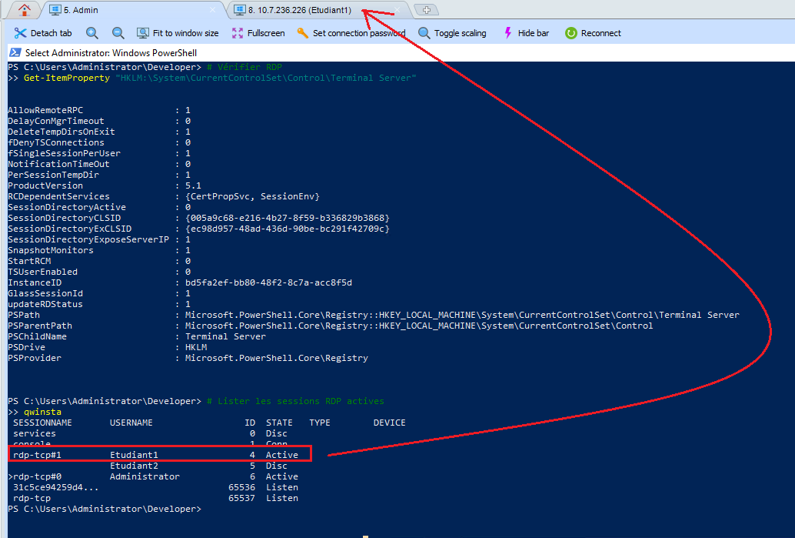

# TP Active Directory - Partage Réseau et RDP
#300150205

---

Ce TP est divisé en **3 fichiers PowerShell** + les scripts du TP précédent :

### 📄 **utilisateurs1.ps1** - Création du partage et des utilisateurs
- Création du dossier partagé `C:\SharedResources`
- Création du groupe AD `Students`
- Création des utilisateurs `Etudiant1` et `Etudiant2`
- Configuration du partage SMB avec permissions NTFS

### 📄 **utilisateurs2.ps1** - Configuration GPO pour mappage réseau
- Création de la GPO `MapSharedFolder`
- Configuration du script de logon pour mapper le lecteur Z:
- Lien de la GPO à l'OU Students

### 📄 **activerRDP.ps1** - Activation RDP pour le groupe Students
- Activation du Remote Desktop
- Configuration du pare-feu
- Attribution des droits RDP au groupe Students
- Désactivation de NLA (pour environnement lab)

---

# 🚀 Étapes du laboratoire

## Étape 0 : Configuration des variables

Le fichier `bootstrap.ps1` contient vos informations :

```powershell
$studentNumber = 300150205
$studentInstance = "00"

$domainName = "DC$studentNumber-$studentInstance.local"
$netbiosName = "DC$studentNumber-$studentInstance"
```


---

## Étape 1 : Exécution du script utilisateurs1.ps1

Ce script crée l'infrastructure de base : dossier partagé, groupe AD, et utilisateurs.

```powershell
.\utilisateurs1.ps1
```

**Résultat attendu:**
- Création du dossier `C:\SharedResources`
- Groupe AD `Students` créé
- Utilisateurs `Etudiant1` et `Etudiant2` créés
- Partage SMB configuré avec permissions


---

## Étape 2 : Vérification du groupe et des membres

Vérifiez que le groupe Students contient les deux utilisateurs :

```powershell
Get-ADGroup -Identity "Students"
Get-ADGroupMember -Identity "Students"
```

<details>
<summary>🖼️ Capture d'écran</summary>



</details>

---

## Étape 3 : Vérification du partage SMB

Vérifiez que le partage réseau est correctement configuré :

```powershell
Get-SmbShare -Name "SharedResources"
Get-SmbShareAccess -Name "SharedResources"
```

<details>
<summary>🖼️ Capture d'écran</summary>



</details>

---

## Étape 4 : Création de l'OU Students

Avant d'exécuter `utilisateurs2.ps1`, créez l'OU Students :

```powershell
New-ADOrganizationalUnit -Name "Students" -Path "DC=$netbiosName,DC=local"
```


---

## Étape 5 : Exécution du script utilisateurs2.ps1

Ce script crée la GPO pour mapper automatiquement le lecteur réseau :

```powershell
.\utilisateurs2.ps1
```

**Résultat attendu:**
- GPO `MapSharedFolder` créée
- Script de logon créé dans `C:\Scripts\MapDrive.bat`
- GPO liée à l'OU Students


---

## Étape 6 : Vérification de la GPO

Vérifiez que la GPO existe et est liée :

```powershell
Get-GPO -Name "MapSharedFolder"
```

<details>
<summary>🖼️ Capture d'écran</summary>



</details>

---

## Étape 7 : Activation de RDP avec activerRDP.ps1

Ce script active le Remote Desktop et configure les permissions :

```powershell
.\activerRDP.ps1
```

**Résultat attendu:**
- RDP activé sur le serveur
- Règles de pare-feu activées
- Groupe Students autorisé à se connecter via RDP


---

## Étape 8 : Vérification de la configuration RDP

Vérifiez que RDP est activé et configuré :

```powershell
# Vérifier que RDP est activé
Get-ItemProperty "HKLM:\System\CurrentControlSet\Control\Terminal Server" | Select-Object fDenyTSConnections

# Vérifier NLA
Get-ItemProperty "HKLM:\System\CurrentControlSet\Control\Terminal Server\WinStations\RDP-Tcp" | Select-Object UserAuthentication

# Vérifier les permissions
secedit /export /cfg C:\check.cfg /quiet
Get-Content C:\check.cfg | Select-String "SeRemoteInteractiveLogonRight"
Remove-Item C:\check.cfg
```

<details>
<summary>🖼️ Capture d'écran</summary>



</details>

---

## Étape 9 : Test de connexion RDP avec Etudiant1

Testez la connexion RDP depuis une machine cliente :

**Paramètres de connexion:**
- Serveur: `10.7.236.226`
- Utilisateur: `Etudiant1@DC300150205-00.local`
- Mot de passe: `Pass123!`

<details>
<summary>🖼️ Capture d'écran</summary>



</details>

---

## Étape 10 : Accès au dossier partagé (Méthode manuelle)

Depuis la session RDP de Etudiant1, accédez au partage :

```powershell
# Mapper manuellement le lecteur Z:
net use Z: \\10.7.236.226\SharedResources

# Vérifier l'accès
Get-ChildItem Z:\
```

Ou via l'explorateur Windows : `\\10.7.236.226\SharedResources`

<details>
<summary>🖼️ Capture d'écran</summary>



</details>

---

## Étape 11 : Test de création de fichier

Créez un fichier test dans le partage :

```powershell
New-Item -Path "Z:\test_etudiant1.txt" -ItemType File -Value "Test depuis Etudiant1"
```

Ou via l'explorateur : clic droit → Nouveau → Document texte

<details>
<summary>🖼️ Capture d'écran</summary>



</details>

---

## Étape 12 : Test avec Etudiant2

Connectez-vous avec Etudiant2 et vérifiez qu'il peut voir le fichier créé par Etudiant1 :

**Connexion:**
- Utilisateur: `Etudiant2@DC300150205-00.local`
- Mot de passe: `Pass123!`

Accédez au partage et listez les fichiers.

<details>
<summary>🖼️ Capture d'écran</summary>



</details>

---

## Étape 13 : Vérification finale - Vue d'ensemble

Depuis l'Administrator, vérifiez l'état complet :

```powershell
# Vérifier le dossier partagé
Get-SmbShare -Name "SharedResources"
Get-ChildItem C:\SharedResources

# Vérifier le groupe et ses membres
Get-ADGroupMember -Identity "Students"

# Vérifier RDP
Get-ItemProperty "HKLM:\System\CurrentControlSet\Control\Terminal Server"

# Lister les sessions RDP actives
qwinsta
```

<details>
<summary>🖼️ Capture d'écran</summary>




</details>

---

# 📋 Résumé de la configuration

## ✅ Composants créés:

1. **Dossier partagé:** `C:\SharedResources`
   - Accessible via `\\10.7.236.226\SharedResources`
   
2. **Groupe AD:** `Students`
   - Membres: Etudiant1, Etudiant2
   
3. **Utilisateurs AD:**
   - `Etudiant1` / `Pass123!`
   - `Etudiant2` / `Pass123!`
   
4. **GPO:** `MapSharedFolder`
   - Liée à l'OU Students
   - Script logon: `C:\Scripts\MapDrive.bat`
   
5. **RDP Configuration:**
   - Activé avec NLA désactivé
   - Groupe Students autorisé

## 🔧 Paramètres importants:

- **Format de connexion RDP:** `utilisateur@DC300150205-00.local`
- **Adresse serveur:** `10.7.236.226` (utiliser l'IP pour éviter problèmes DNS)
- **NLA désactivé:** Nécessaire pour l'authentification des utilisateurs non-admin dans ce lab

## ⚠️ Notes importantes:

1. **NLA désactivé:** Dans un environnement de production, il faudrait configurer correctement la Default Domain Controllers Policy plutôt que désactiver NLA
2. **Utiliser l'IP:** Le hostname peut causer des problèmes de résolution DNS, utiliser `10.7.236.226` est plus fiable
3. **Format UPN:** Toujours utiliser le format complet `utilisateur@domaine.local` pour la connexion RDP

---

# 🎯 Objectifs atteints:

- ✅ Dossier partagé accessible aux membres du groupe Students
- ✅ Lecteur réseau Z: configurable via GPO
- ✅ Connexion RDP fonctionnelle pour les étudiants
- ✅ Permissions NTFS et SMB correctement configurées
- ✅ Isolation des accès par groupe AD

---

**Date de réalisation:** Novembre 2025  
**Étudiant:** #300150205