# TP Active Directory - 6.Objects
### Etudiant : Ismail Trache (300150395)
### Cours : INF1084 - Administration Windows Server
### Sujet : Objets gerables par Active Directory (AD)

---

## Objectif du laboratoire

Ce laboratoire a pour but de manipuler les objets Active Directory et d automatiser leur gestion via PowerShell :

- Creer des utilisateurs, groupes et unites d organisation (OU)
- Configurer un dossier partage (SMB)
- Creer et appliquer une GPO pour le mappage automatique d un lecteur reseau
- Activer l acces RDP (Remote Desktop) pour un groupe d utilisateurs

---

## Structure du projet

6.Objects/
└── 300150395/
    ├── README.txt
    ├── utilisateurs1.ps1
    ├── utilisateurs2.ps1
    ├── images/

---

## Etape 1 - Creation du dossier de travail

```powershell
mkdir 300150395
cd 300150395
mkdir images
New-Item README.txt
git add .
git commit -m "Creation du dossier 6.Objects"
git push
```

[CAPTURE 1] Creation du dossier et premier commit Git  
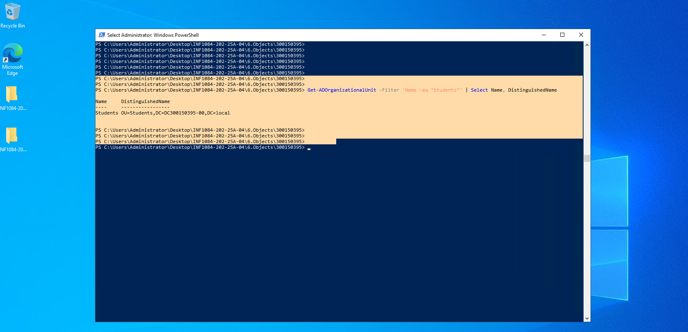

---

## Etape 2 - Creation des objets AD et du partage SMB

<details>
<summary>Code PowerShell - utilisateurs1.ps1</summary>

```powershell
Import-Module ActiveDirectory -ErrorAction SilentlyContinue

$SharedFolder = "C:\SharedResources"
$GroupName = "Students"
$Users = @("Etudiant1","Etudiant2","Etudiant3")

# 1. Dossier partage
New-Item -Path $SharedFolder -ItemType Directory -Force

# 2. Groupe AD
if (-not (Get-ADGroup -Filter "Name -eq '$GroupName'")) {
    New-ADGroup -Name $GroupName -GroupScope Global -Description "Users allowed RDP and shared folder access"
}

# 3. Utilisateurs + ajout au groupe
foreach ($user in $Users) {
    if (-not (Get-ADUser -Filter "SamAccountName -eq '$user'")) {
        New-ADUser -Name $user -SamAccountName $user -AccountPassword (ConvertTo-SecureString "Pass123!" -AsPlainText -Force) -Enabled $true -Path "OU=Students,DC=DC300150395-00,DC=local"
        Add-ADGroupMember -Identity $GroupName -Members $user
    }
}

# 4. Partage SMB
if (-not (Get-SmbShare -Name "SharedResources" -ErrorAction SilentlyContinue)) {
    New-SmbShare -Name "SharedResources" -Path $SharedFolder -FullAccess $GroupName
}
```
</details>

[CAPTURE 2] Dossier partage C:\SharedResources  
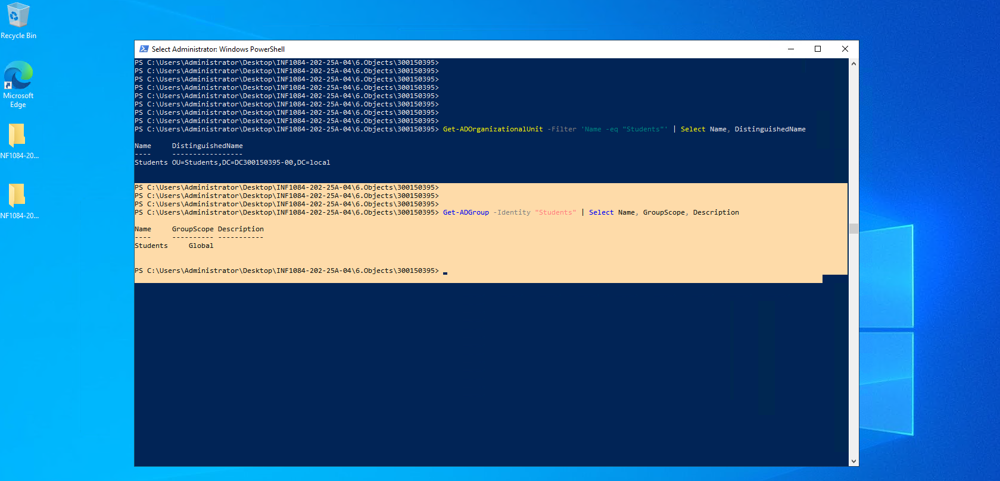

[CAPTURE 3] Groupe et utilisateurs visibles dans ADUC  
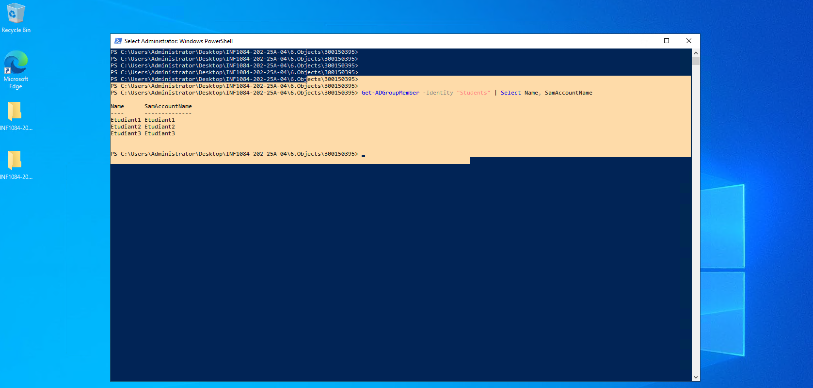

---

## Etape 3 - Creation et liaison de la GPO (mappage lecteur Z:)

<details>
<summary>Code PowerShell - utilisateurs2.ps1</summary>

```powershell
Import-Module GroupPolicy -ErrorAction SilentlyContinue
Import-Module ActiveDirectory -ErrorAction SilentlyContinue

$GPOName = "MapSharedFolder-300150395"
$OU = "OU=Students,DC=DC300150395-00,DC=local"
$DriveLetter = "Z:"
$netbiosName = $env:COMPUTERNAME
$SharePath = "\\$netbiosName\SharedResources"
$ScriptFolder = "C:\Scripts"
$ScriptPath = "$ScriptFolder\MapDrive-$DriveLetter.bat"

# 1. GPO
if (-not (Get-GPO -Name $GPOName -ErrorAction SilentlyContinue)) {
    New-GPO -Name $GPOName | Out-Null
}

# 2. Lien GPO -> OU
New-GPLink -Name $GPOName -Target $OU -Enforced No

# 3. Script de logon pour mapper Z:
if (-not (Test-Path $ScriptFolder)) { New-Item -ItemType Directory -Path $ScriptFolder | Out-Null }
$scriptContent = "net use $DriveLetter $SharePath /persistent:no"
Set-Content -Path $ScriptPath -Value $scriptContent
```
</details>

[CAPTURE 4] GPO MapSharedFolder-300150395 creee (console GPMC)  
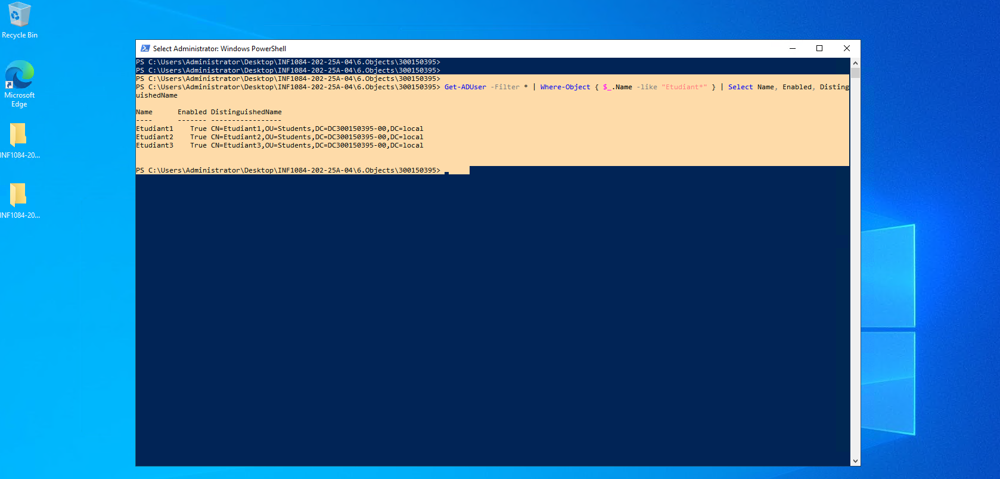

[CAPTURE 5] GPO liee a l OU Students (console GPMC)  
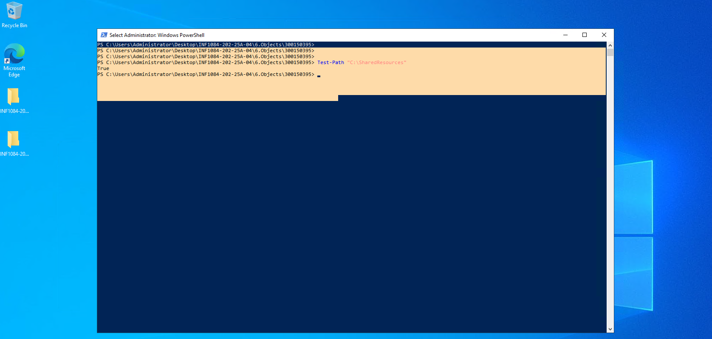

[CAPTURE 6] Contenu du script C:\Scripts\MapDrive-Z:.bat  
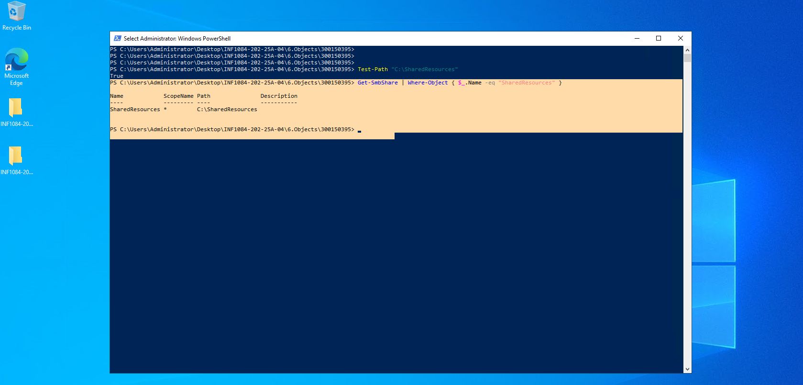

---

## Etape 4 - Activation du RDP et configuration du pare-feu

<details>
<summary>Extraits PowerShell</summary>

```powershell
# Activer RDP
Set-ItemProperty -Path "HKLM:\System\CurrentControlSet\Control\Terminal Server" -Name "fDenyTSConnections" -Value 0

# Pare-feu RDP
Enable-NetFirewallRule -DisplayGroup "Remote Desktop"
```
</details>

[CAPTURE 7] Verification RDP actif (fDenyTSConnections = 0)  
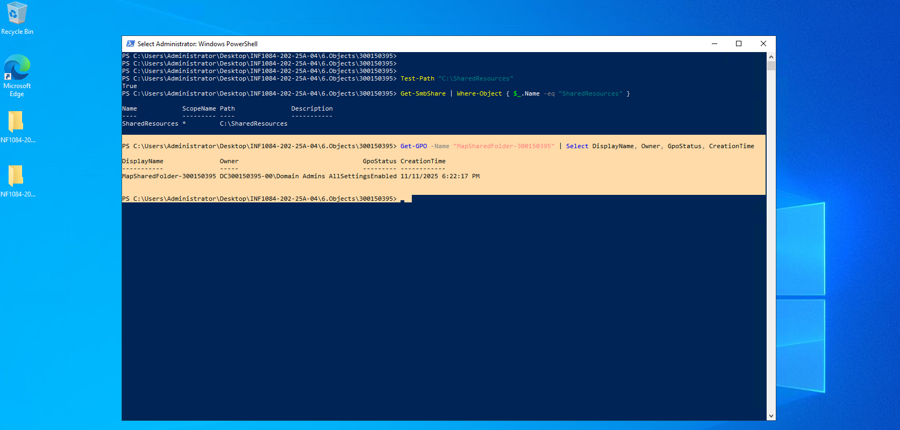

[CAPTURE 8] Regles de pare-feu Remote Desktop actives  
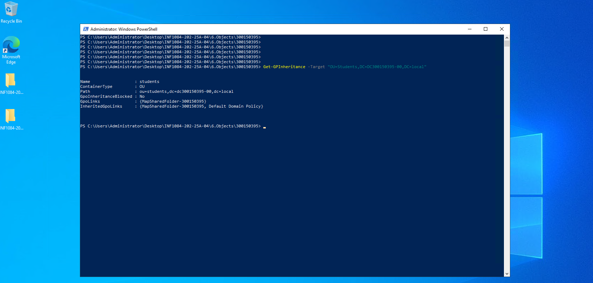

---

## Etape 5 - Verifications techniques (executees)

[CAPTURE 9] OU Students OK  
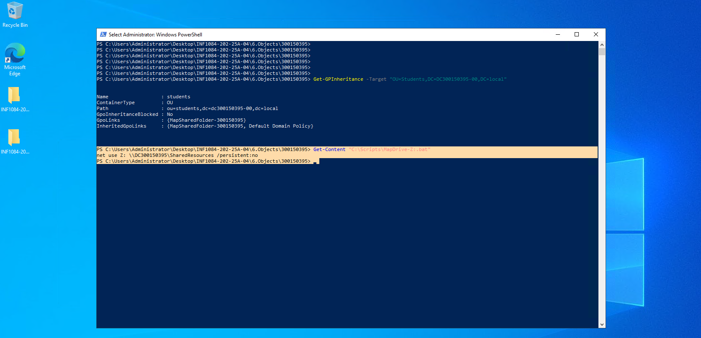

[CAPTURE 10] Membres du groupe Students OK  
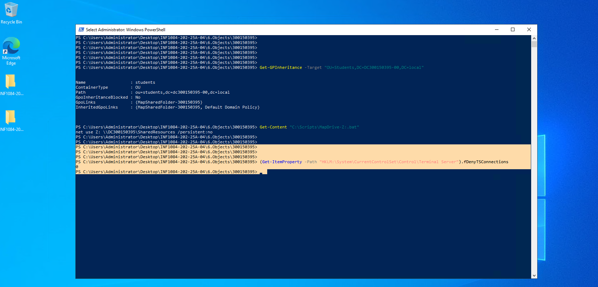

[CAPTURE 11] GPO liee a l OU OK  
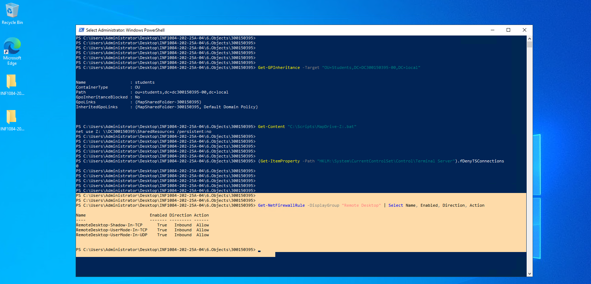

---

==================================================
## ETAPE 6 - VERIFICATION DU MAPPAGE RESEAU (RESOLUE)
==================================================

Lors du premier test, le message suivant est apparu :
"Windows cannot access \\DC300150395\SharedResources"
Cela etait du a un probleme d'autorisations SMB sur le dossier partage.

--------------------------------------------------
SOLUTION APPLIQUEE SUR LE DC
--------------------------------------------------

Pour corriger le probleme, le partage a ete supprime puis recree avec les 
bonnes autorisations pour le groupe Students :

```powershell
# Supprimer et recreer le partage avec les bons droits
Remove-SmbShare -Name "SharedResources" -Force

$SharedFolder = "C:\SharedResources"
$GroupName = "Students"

if (-not (Test-Path $SharedFolder)) { New-Item -ItemType Directory -Path $SharedFolder | Out-Null }

# Droits NTFS
$acl = Get-Acl $SharedFolder
$rule = New-Object System.Security.AccessControl.FileSystemAccessRule("$GroupName","FullControl","ContainerInherit,ObjectInherit","None","Allow")
$acl.SetAccessRule($rule)
Set-Acl $SharedFolder $acl

# Partage SMB
New-SmbShare -Name "SharedResources" -Path $SharedFolder -FullAccess "$GroupName","Administrator"

# Verification des droits
Get-SmbShareAccess -Name "SharedResources"
```

Resultat attendu :
SharedResources  DC300150395-00\Students      Full
SharedResources  DC300150395-00\Administrator Full
[CAPTURE 11] GPO liee a l OU OK  
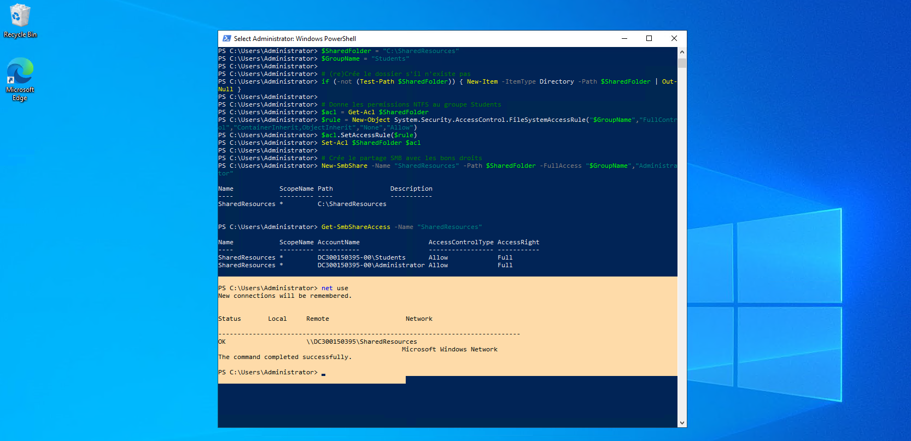
--> Resultat net use et verification du partage SMB

--------------------------------------------------
TEST FINAL DEPUIS LA MACHINE CLIENTE
--------------------------------------------------

Connexion avec le compte :
Utilisateur : DC300150395-00\Etudiant1
Mot de passe : Pass123!

Commande PowerShell :
```powershell
net use
```

Resultat obtenu :
OK     \\DC300150395\SharedResources    Microsoft Windows Network
The command completed successfully.
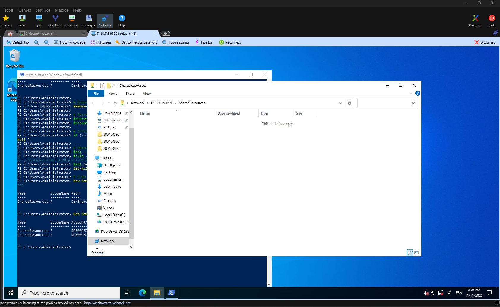

--> Acces au dossier SharedResources depuis la VM Etudiant1

--------------------------------------------------
## CONCLUSION
--------------------------------------------------

Toutes les verifications du TP ont ete realisees avec succes :
- La GPO MapSharedFolder-300150395 fonctionne.
- Le lecteur Z: se monte correctement pour les utilisateurs du groupe Students.
- Les autorisations NTFS et SMB sont configurees adequatement.
- La connexion RDP et l'acces au partage sont operationnels.

Le probleme de permission initial a ete resolu en recreant le partage avec les bons droits d'acces.

---


