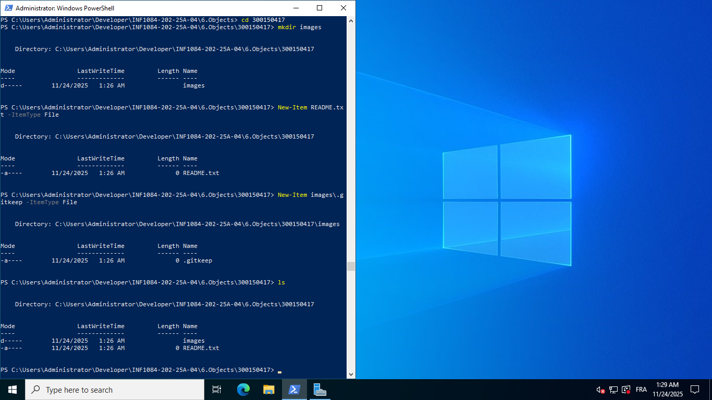
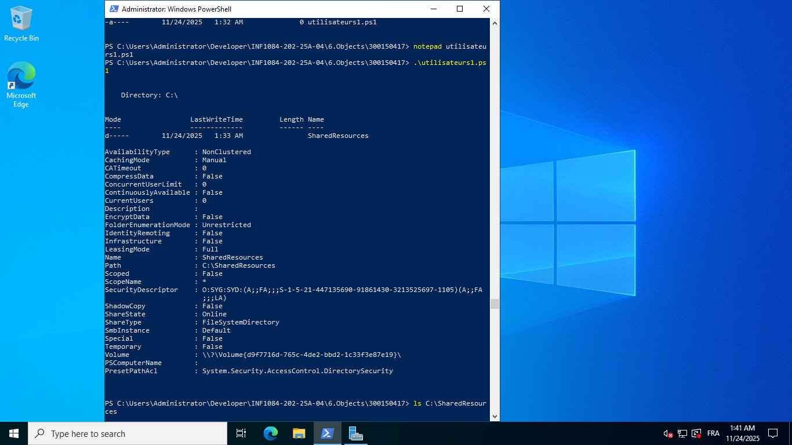
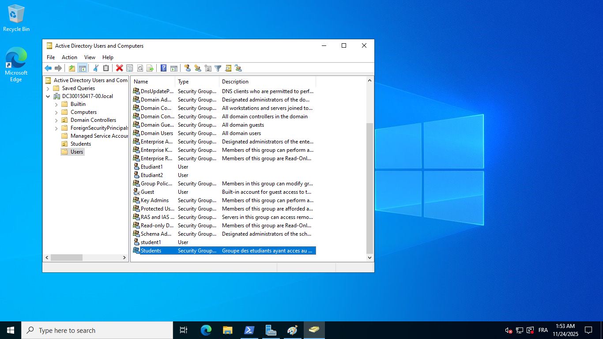
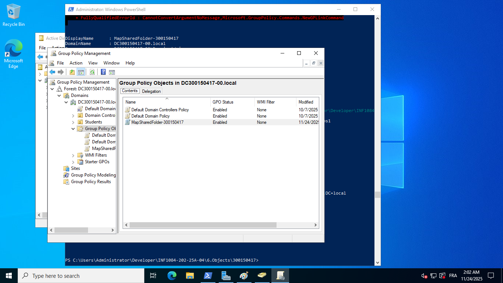
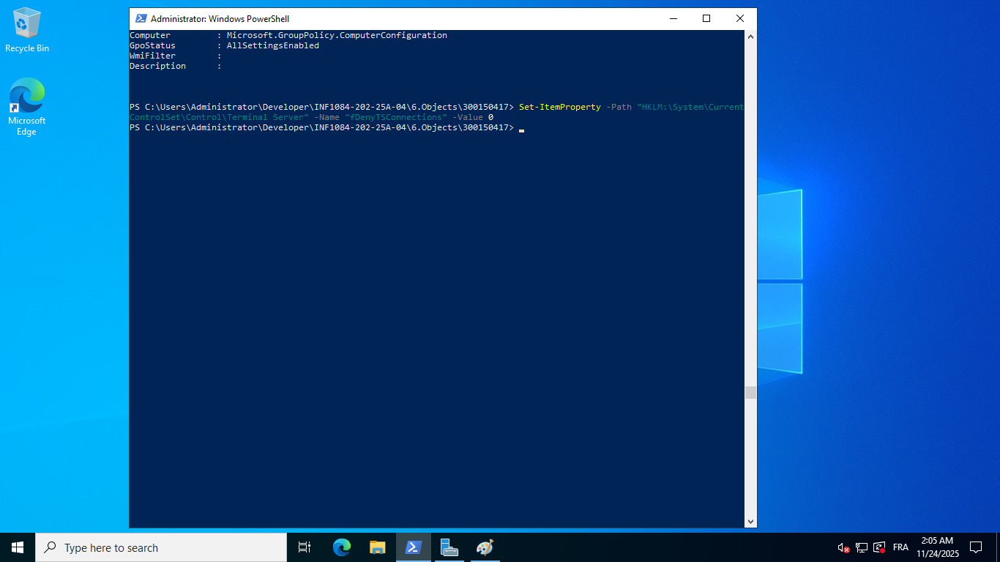
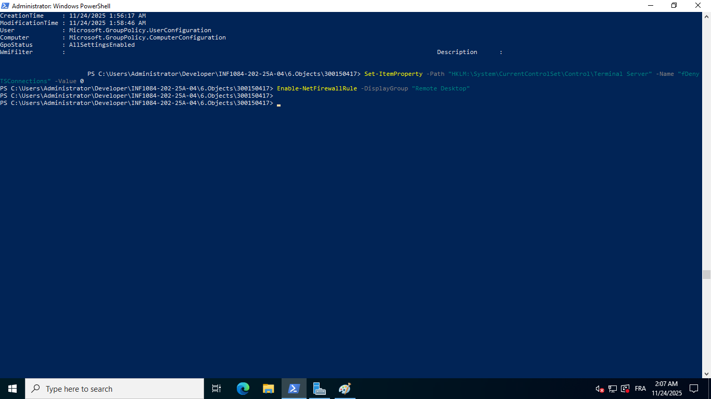
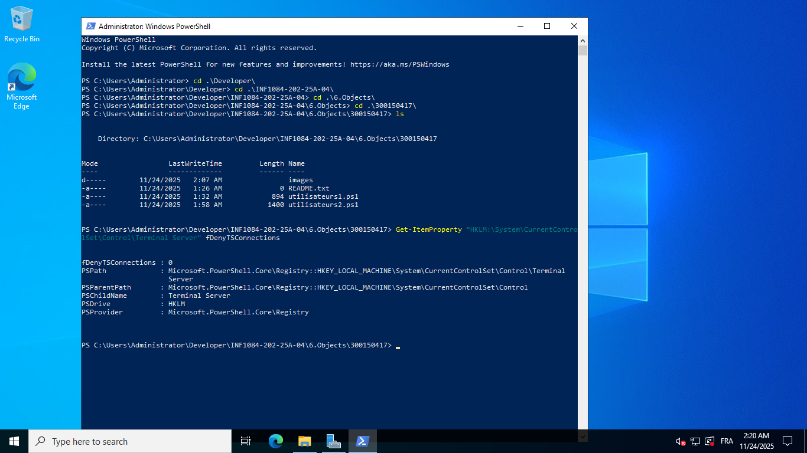
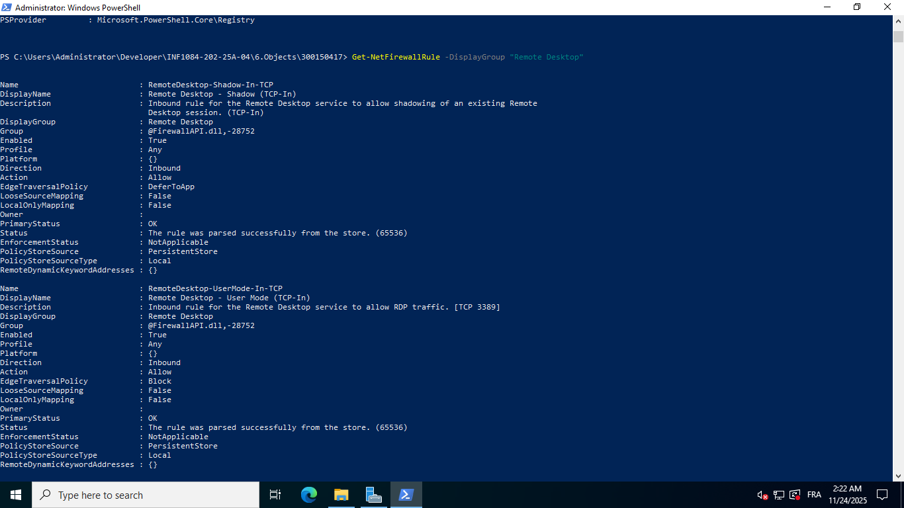
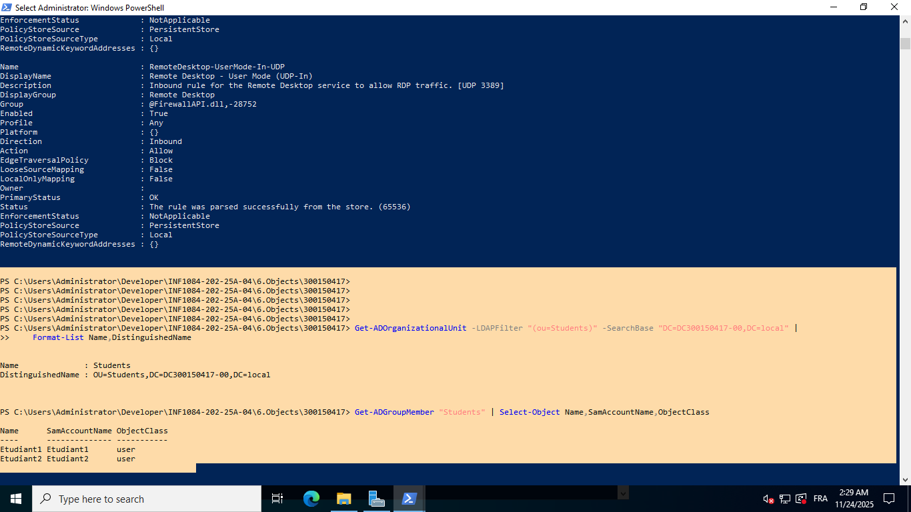
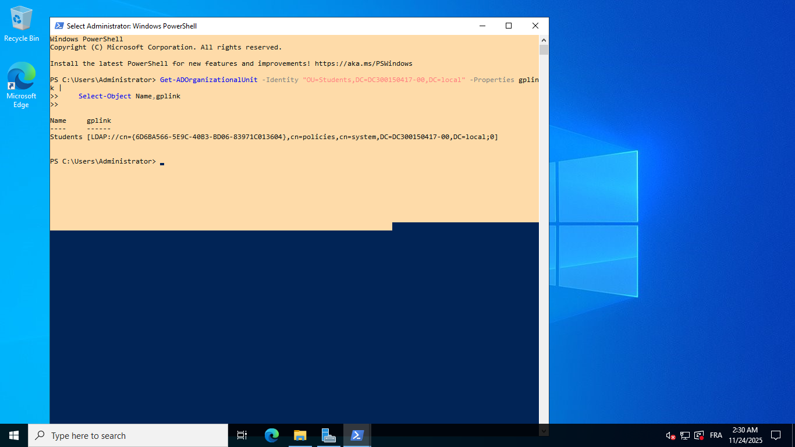

# TP Active Directory – 6.Objects  
**Étudiant : Abdelatif Nemous (300150417)**  
**Cours : INF1084 – Administration Windows Server**  

---

## 🎯 Objectif du laboratoire

Ce laboratoire a pour but de manipuler les objets Active Directory et d’automatiser leur gestion via PowerShell :

- Création d’utilisateurs, d’un groupe et d’une OU
- Création d’un dossier partagé (SMB)
- Création et liaison d’une GPO pour mapper un lecteur réseau
- Activation de l’accès RDP via les droits NTFS et locaux
- Vérifications techniques via PowerShell

---

## 📁 Structure du projet


6.Objects/
└── 300150417/
├── README.md
├── utilisateurs1.ps1
├── utilisateurs2.ps1
└── images/
├── objects1.png
├── objects2.png
├── objects3.png
├── objects4.png
├── objects5.png
├── objects6.png
├── objects7.png
├── objects8.png
├── objects9.png
└── objects10.png


---

# 🧩 Étape 1 – Création du dossier de travail

### ✔️ Commandes PowerShell

```powershell
mkdir 300150417
cd 300150417
mkdir images
New-Item README.md
```

📸 Capture 1



🧩 Étape 2 – Création des objets AD + Partage SMB

Script exécuté : utilisateurs1.ps1

✔️ Extrait du script
# Création du dossier partagé

```powershell
$SharedFolder = "C:\SharedResources"
New-Item -Path $SharedFolder -ItemType Directory -Force
```
# Création du groupe Students
```powershell
New-ADGroup -Name "Students" -GroupScope Global -Description "Groupe des étudiants"
```

# Création des utilisateurs
```powershell
$Users = @("Etudiant1","Etudiant2")
foreach ($user in $Users) {
    New-ADUser -Name $user -SamAccountName $user `
        -AccountPassword (ConvertTo-SecureString "Pass123!" -AsPlainText -Force) `
        -Enabled $true
    Add-ADGroupMember -Identity "Students" -Members $user
}
```
# Partage SMB
```powershell
New-SmbShare -Name "SharedResources" -Path $SharedFolder -FullAccess "Students"
```
📸 Capture 2 — Dossier partagé



📸 Capture 3 — Groupe + utilisateurs dans ADUC



🧩 Étape 3 – Création + Liaison de la GPO (mappage Z:)

Script exécuté : utilisateurs2.ps1

✔️ Extrait du script
```powershell
$GPOName = "MapSharedFolder-300150417"
New-GPO -Name $GPOName

$OU = "OU=Students,DC=DC300150417-00,DC=local"
New-GPLink -Name $GPOName -Target $OU

# Script de logon
$ScriptFolder = "C:\Scripts"
$ScriptPath = "$ScriptFolder\MapDrive-Z.bat"
New-Item -ItemType Directory -Path $ScriptFolder -Force

Set-Content -Path $ScriptPath -Value 'net use Z: \\DC300150417-00\SharedResources /persistent:no'
```
📸 Capture 4 — GPO créée



📸 Capture 5 — GPO liée à l’OU Students



📸 Capture 6 — Script MapDrive-Z.bat



🧩 Étape 4 – Activation du RDP + Pare-feu + Droits
✔️ Activer Remote Desktop
```powershell
Set-ItemProperty -Path "HKLM:\System\CurrentControlSet\Control\Terminal Server" `
-Name "fDenyTSConnections" -Value 0
```
✔️ Vérification
```powershell
Get-ItemProperty "HKLM:\System\CurrentControlSet\Control\Terminal Server" fDenyTSConnections
```
📸 Capture 7



✔️ Activer les règles Firewall RDP
```powershell
Enable-NetFirewallRule -DisplayGroup "Remote Desktop"
Get-NetFirewallRule -DisplayGroup "Remote Desktop"
```
📸 Capture 8



✔️ Ajout du droit RDP au groupe Students

Fichier verify.cfg après modification :

```powershell
SeRemoteInteractiveLogonRight = *S-1-5-32-544,DC300150417-00\Students
```
📸 Capture 9



🧩 Étape 5 – Vérifications AD (OU / Groupe / GPO)
✔️ Vérifier l’OU Students
```powershell
Get-ADOrganizationalUnit -LDAPFilter "(OU=Students)" `
-SearchBase "DC=DC300150417-00,DC=local"
```
✔️ Vérifier le groupe Students
```powershell
Get-ADGroupMember "Students" | Select Name,SamAccountName,ObjectClass
```
✔️ Vérifier le lien GPO
```
Get-ADOrganizationalUnit -Identity "OU=Students,DC=DC300150417-00,DC=local" `
-Properties gPLink | Select Name,gplink
```
📸 Capture 10



✅ Conclusion

Toutes les étapes du TP ont été réalisées avec succès :

Objets Active Directory créés

Partage SMB opérationnel

GPO de mappage Z: configurée et liée

RDP activé + règles firewall OK

Droits SeRemoteInteractiveLogonRight configurés

Vérifications PowerShell complètes


