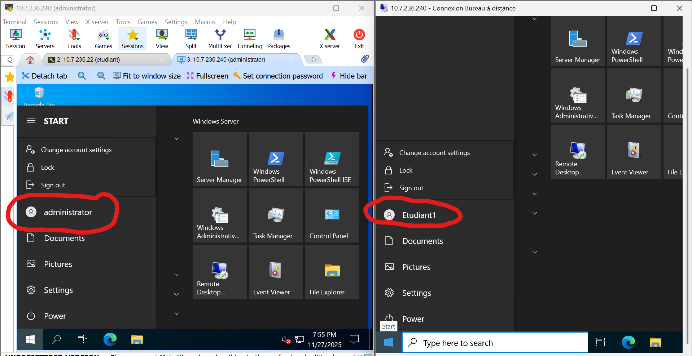
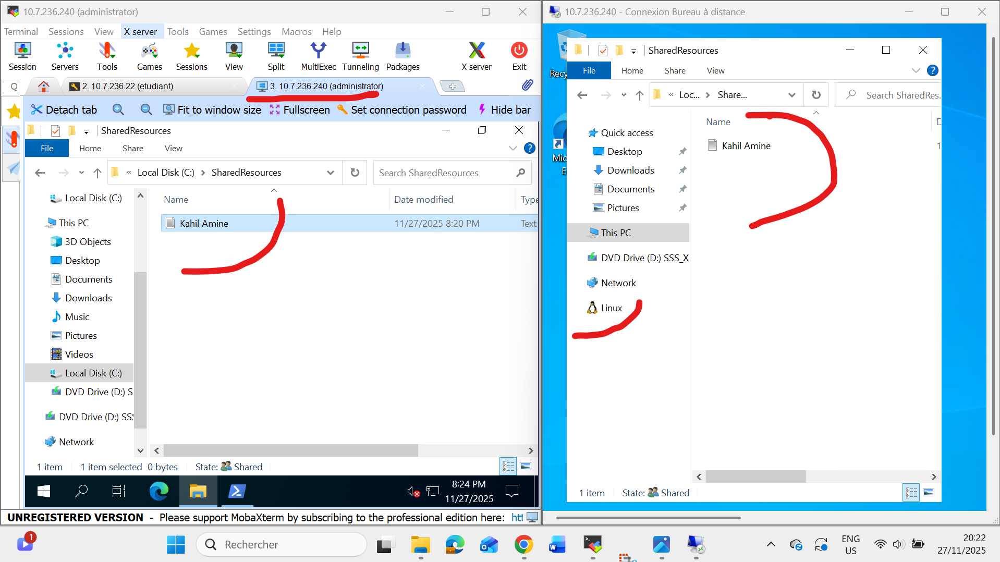

# 🧮 TP Active Directory – Partage de ressources & RDP via PowerShell
**Étudiant : 300151292**

Ce laboratoire a pour objectif de manipuler un environnement Active Directory sous Windows Server 2022 entièrement à l’aide de PowerShell :  
- création de dossiers partagés  
- création de groupes et utilisateurs AD  
- configuration d’une GPO pour mapper un lecteur réseau  
- activation sécurisée du RDP  
- tests finaux sur une VM cliente

---

## 📌 1. Structure du projet

6.Objects/
└── 300151292/
├── README.md
├── utilisateurs1.ps1
├── utilisateurs2.ps1
├── utilisateurs3.ps1
└── images/
└── .gitkeep

yaml
Copier le code

---

## 📌 2. utilisateurs1.ps1 — Partage SMB + Groupe + Utilisateurs

### ✔ Actions réalisées :
- Création du dossier partagé **C:\SharedResources**
- Création du groupe AD : **Students**
- Création des utilisateurs : **Etudiant1**, **Etudiant2**
- Ajout des utilisateurs dans le groupe Students
- Création du partage SMB : **\\DC300151292-00\SharedResources**

---

## 📌 3. utilisateurs2.ps1 — GPO pour mapper le lecteur réseau Z:

### ✔ Actions réalisées :
- Création de la GPO **MapSharedFolder**
- Liaison de la GPO à l’OU **Students**
- Création d’un script logon : `C:\Scripts\MapDrive-Z.bat`
- Configuration du lecteur **Z:** → `\\DC300151292-00\SharedResources`

---

## 📌 4. utilisateurs3.ps1 — Activation du RDP

### ✔ Actions réalisées :
- Activation de la connexion RDP
- Activation du firewall Remote Desktop
- Export / modification / import du fichier `secpol.cfg`
- Ajout du groupe **Students** dans :  
  `SeRemoteInteractiveLogonRight`
- Ajout du groupe Students dans **Remote Desktop Users**
- Test réussi de connexion RDP avec **Etudiant1**

---

## 📌 5. Tests finaux

### 🔹 RDP depuis la VM cliente  
➡ **OK : connexion réussie avec Etudiant1 / Pass123!**

### 🔹 Accès au partage  
➡ **OK : accès complet pour Students**

## 🏁 Conclusion
Ce laboratoire m’a permis de comprendre et configurer un environnement Active Directory complet à l’aide de scripts PowerShell.  
J’ai acquis les compétences suivantes :

- Gestion des objets AD (utilisateurs, groupes, OU)
- Configuration d’un partage réseau sécurisé (SMB)
- Création et liaison d'une GPO
- Automatisation d’un lecteur réseau
- Activation contrôlée du RDP dans un domaine
- Résolution de problèmes réseau (interfaces, APIPA)
- Vérification et tests fonctionnels

L’environnement est maintenant totalement opérationnel et automatisé.
