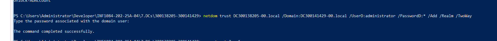

# Projet final Active Directory : Trusts entre deux domains
### Etudiants : TAYLOR (300138205) , BARRY (300141429)
### Cours : INF1084 – Administration Windows Server

---

## Objectif du laboratoire

Ce laboratoire a pour objectif de vérifier la communication et l’accès entre deux contrôleurs de domaine :

- Vérifier la connectivité réseau entre les domaines  
- Récupérer les informations du domaine distant  
- Naviguer dans l’Active Directory distant

---

## 🔐 Définition d’un Trust dans AD DS

Une relation d’approbation (trust) dans Active Directory est un lien d’authentification sécurisé entre deux domaines ou forêts permettant aux utilisateurs d’un domaine d’accéder aux ressources d’un autre domaine.

---

#  le script  trusts.ps1

Dans ce laboration, nous avons realisé un trust unidirectionnel et celui qui a fait cette action est le serveur 10.7.236.188 ( DC300138205-00)

```powershell
trusts.ps1
```

<details>

  




</details>

### **b. Vérifieons la connectivité au contrôleur de domaine DC300141429**

```powershell
Test-Connection -ComputerName DC300141429.local -Count 2
```


---


