# Projet final Active Directory : Trusts entre deux domains
### Etudiants : TAYLOR (300138205) , BARRY (300141429)
### Cours : INF1084 – Administration Windows Server

---

## Objectif du laboratoire

Ce laboratoire a pour objectif de vérifier la communication et l’accès entre deux contrôleurs de domaine :

- Vérifier la connectivité réseau entre les domaines  
- Récupérer les informations du domaine distant  
- Naviguer dans l’Active Directory distant

---

## 🔐 Définition d’un Trust dans AD DS

Une relation d’approbation (trust) dans Active Directory est un lien d’authentification sécurisé entre deux domaines ou forêts permettant aux utilisateurs d’un domaine d’accéder aux ressources d’un autre domaine.

---

#  le script  trusts.ps1

🧑‍🚀Dans ce laboration, nous avons realisé un trust bidirectionnel et celui qui a fait cette action est le serveur 10.7.236.188 ( DC300138205-00) en permier.

```powershell
netdom trust DC300138205-00.local /Domain:DC300141429.local /UserD:administrator /PasswordD:* /Add /Realm /TwoWay
```

<details>

  


</details>

🌀le serveur donc l'ip 10.7.236.190 a aussi fait pour lui donc le trusts est bidirectionnel
```powershell
netdom trust DC300141429.local /Domain:DC300138205-00.local /UserD:administrator /PasswordD:* /Add /Realm /TwoWay
```


  

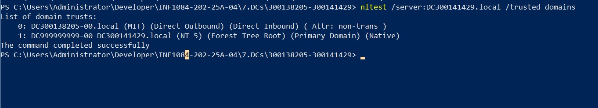
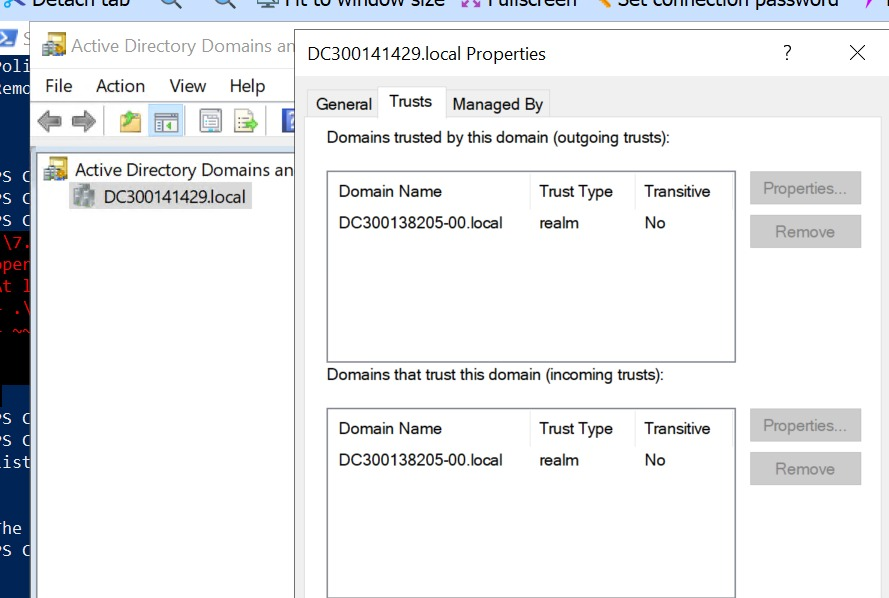


### **b. Vérifieons la connectivité au contrôleur de domaine DC300141429**

```powershell
Test-Connection -ComputerName DC300141429.local -Count 2
```
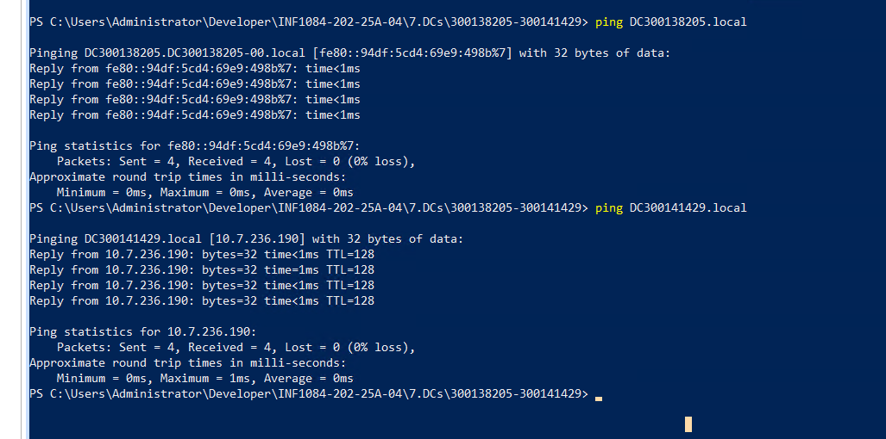
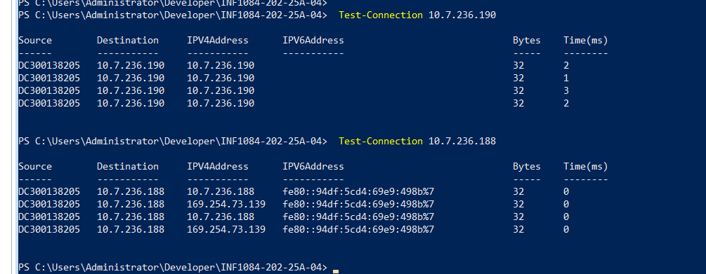

#  Installation des modules AS DC
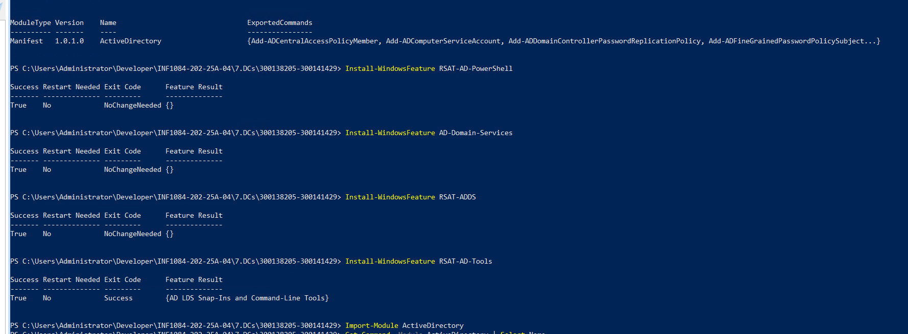

# Verification du trusts dans le serveur 10.7.236.188


# verification via les lignes de commandes

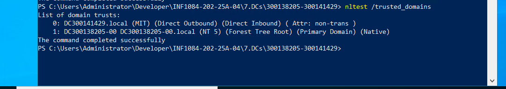
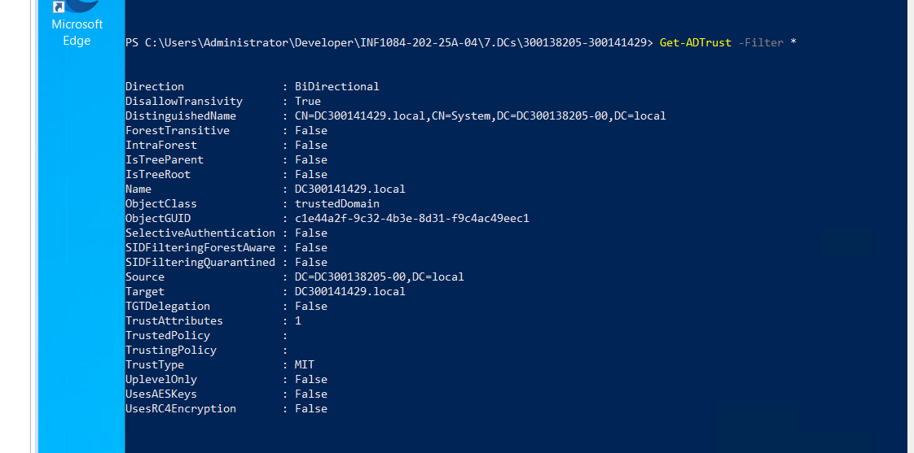


#  le script  trusts2.ps1

Dans ce laboration, nous avons realisé la navigation d'un domaine à un autre dont le script trusts2.ps1 qui a ete fait sur le serveur (300141429.local)

---
```powershell
Chargement des identifiants du domaine distant

Utilise Get-Credential pour demander un compte du domaine DC300138205.local.
Sécurise l’authentification sans stocker de mot de passe en clair.
```
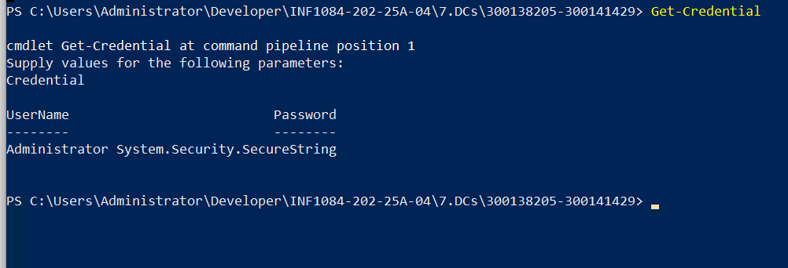

```powershell
Test de connectivité et résolution DNS

Test-Connection vérifie que le contrôleur de domaine distant est joignable.
Confirme que la résolution DNS fonctionne et que le réseau est accessible.
```
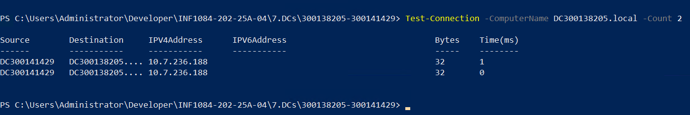

```powershell
Informations du domaine local

Get-ADDomain affiche les détails du domaine actuel (DC300141429.local).
Permet de comparer avec les informations du domaine distant.
```
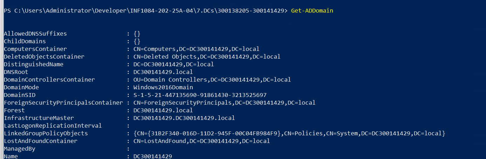

```powershell
Informations du domaine distant via le trust
Get-ADDomain -Server DC300138205.local -Credential $cred interroge le domaine distant.
Montre que le trust permet d’accéder aux données de l’autre domaine.
```
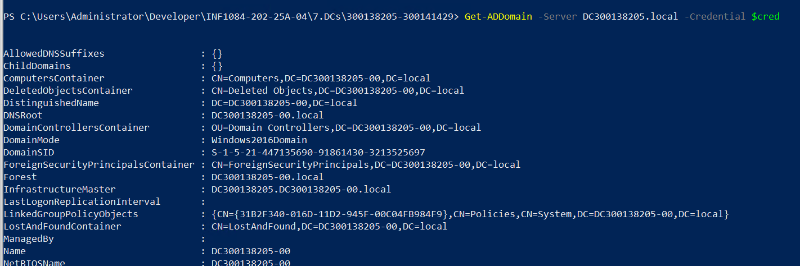

```powershell
Liste des utilisateurs du domaine distant
Get-ADUser -Filter * récupère les comptes utilisateurs du domaine DC300138205.local.
Affiche leurs SamAccountName et DistinguishedName.
```
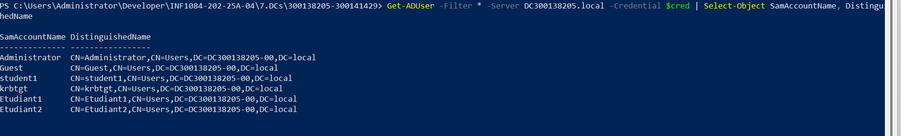

```powershell
Vérification de l’état du trust
Get-ADTrust -Filter * liste les relations de confiance existantes.
Confirme que le trust entre les deux domaines est actif.
```
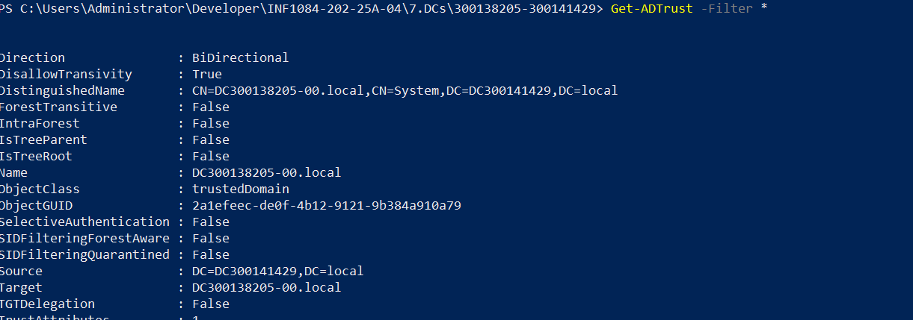

```powershell
Test de navigabilité (accès croisé)
On vérifie la navigabilité en tentant d’accéder au dossier partagé SharedResources sur le domaine distant DC300138205.local. Après saisie du mot de passe de l’administrateur, la commande net use renvoie le message “The command completed successfully”, ce qui confirme que l’accès au partage est autorisé et que les ressources du domaine distant sont effectivement accessibles depuis le domaine local.
```
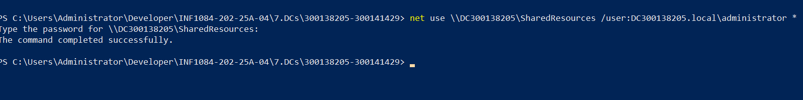


