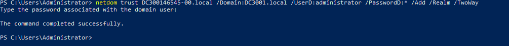
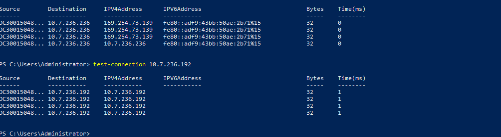
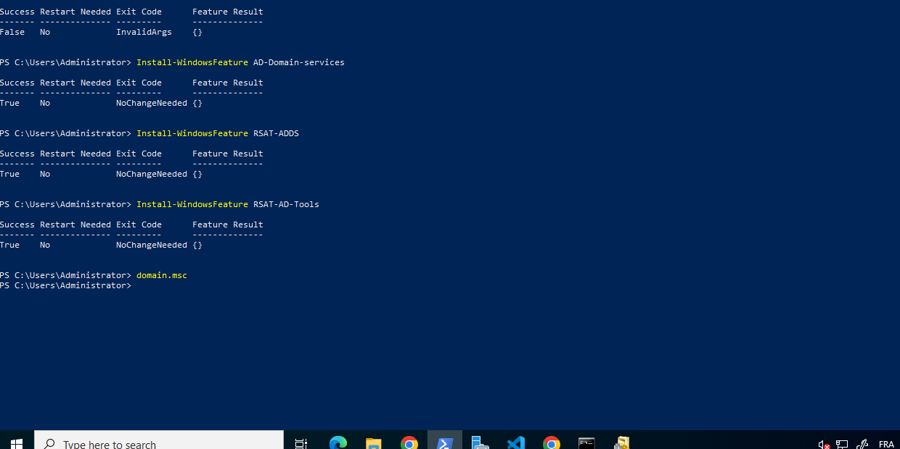
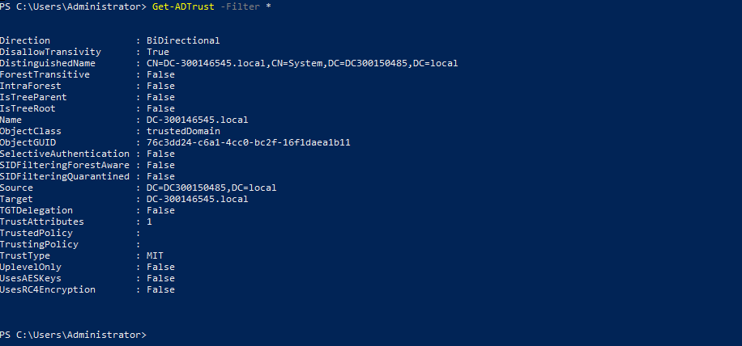
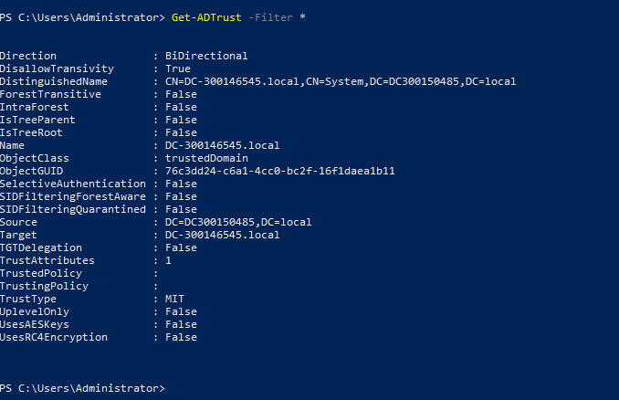
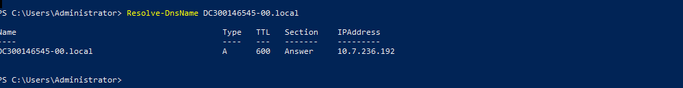
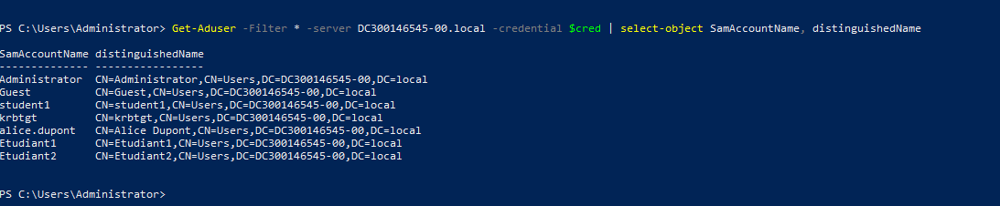
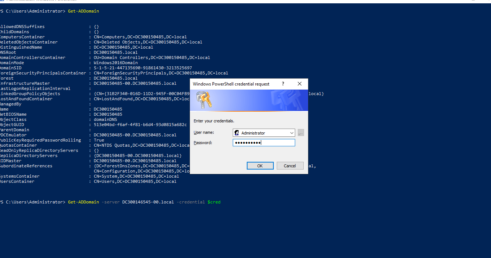
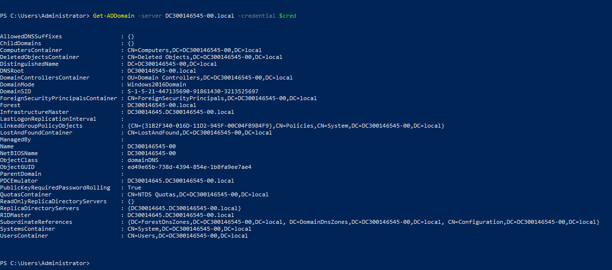

🛡️ Projet final Active Directory : Trusts entre deux domaines

Étudiants : Saoudi Allaoua (300146545) – Fetis Nadir (300150485)
Cours : INF1084 – Administration Windows Server

🎯 Objectif du laboratoire

Ce laboratoire a pour objectif de vérifier :

La connectivité réseau entre les domaines

La récupération des informations du domaine distant

La navigation dans l’Active Directory distant

🔐 Définition d’un Trust dans AD DS

Une relation d’approbation (trust) dans Active Directory est un lien d’authentification sécurisé entre deux domaines ou forêts permettant aux utilisateurs d’un domaine d’accéder aux ressources d’un autre.

🧩 Script trusts.ps1 – Création du Trust

Dans ce laboratoire, nous avons réalisé un trust bidirectionnel, et l’action a été effectuée depuis le serveur :

10.7.236.236 (DC300150485-00)

🔧 Commande utilisée :
netdom trust DC300146545-00.local /Domain:DC300150485.local /Add /TwoWay /Forest /UserD:administrator /PasswordD:* /UserO:administrator /PasswordO:*

🌐 Vérification de la connectivité réseau
Test-Connection -ComputerName DC300150485.local -Count 2

⚙️ Installation des modules AD DS

📸 Capture installation modules AD

🏛️ Vérification du Trust dans le serveur 10.7.236.192

🖥️ Script trusts2.ps1 – Navigation entre domaines

Dans ce laboratoire, nous avons réalisé la navigation entre deux domaines via le script trusts2.ps1, exécuté sur le serveur :

DC300150485.local

🔑 Chargement des identifiants du domaine distant

Get-Credential demande un compte du domaine DC300150485.local, pour une authentification sécurisée.

🌍 Test de connectivité et résolution DNS

Test-Connection vérifie :

que le contrôleur de domaine distant est joignable

que la résolution DNS fonctionne

que le réseau autorise la navigation inter-domaine

🏢 Informations du domaine local

Get-ADDomain affiche les détails du domaine actuel (DC300146545.local) pour comparer avec le domaine distant.

🌐 Informations du domaine distant à travers le Trust
Get-ADDomain -Server DC300146545.local -Credential $cred

Ce qui confirme que le trust permet d’accéder au domaine partenaire.

[Image10](images/10.PNG)

👥 Liste des utilisateurs du domaine distant
Get-ADUser -Filter * -Server DC300146545.local

Affiche les :

SamAccountName

DistinguishedName

🧪 Vérification de l’état du Trust
Get-ADTrust -Filter *

Permet de confirmer que la relation de confiance est active.

📸

🎉 Conclusion

Le trust entre les domaines DC300146545.local et DC300150485.local est :

✔️ opérationnel
✔️ testé avec succès via PowerShell
✔️ validé via l’interface graphique
✔️ fonctionnel pour la navigation et l’accès aux ressources

Ce laboratoire démontre notre capacité à configurer un trust, valider sa connectivité, et interagir de manière sécurisée entre deux domaines Active Directory.
