# TP Active Directory – Vérification inter-domaines
### Etudiants : Ismail Trache (300150395) lounas allouti (300150295)
### Cours : INF1084 – Administration Windows Server
### Sujet : Vérifications entre deux domaines Active Directory (AD)

---

## Objectif du laboratoire

Ce laboratoire a pour objectif de vérifier la communication et l’accès entre deux contrôleurs de domaine :

- Vérifier la connectivité réseau entre les domaines  
- Vérifier la résolution DNS  
- Récupérer les informations du domaine distant  
- Naviguer dans l’Active Directory distant via un PSDrive  
- Automatiser tous les tests via un script PowerShell  

---

## Structure du projet

7.DCs/  
└── 300150395/300150295
  ├── README.txt  
  ├── check-trust.ps1
  ├── images/  
    ├── 0.png  
    ├── 1.png  
    ├── 2.png  
    ├── 3.png  
    ├── 4.png  
    ├── 4.5.png  
    ├── 5.png  

---

## Étape 1 – Vérifier la connectivité


Test-Connection -ComputerName DC300150295-00 -Count 2
Resolve-DnsName DC300150295-00.local


[CAPTURE 1] Vérification du ping et de la résolution DNS

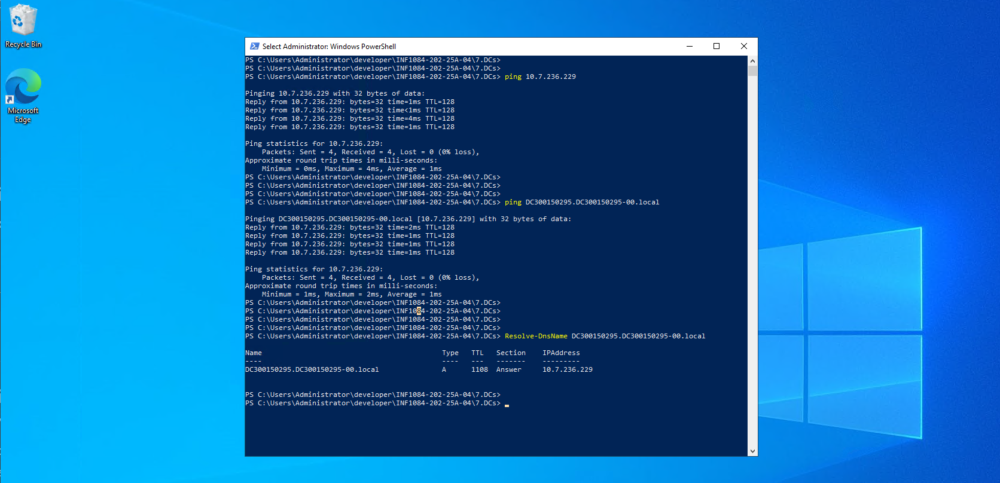
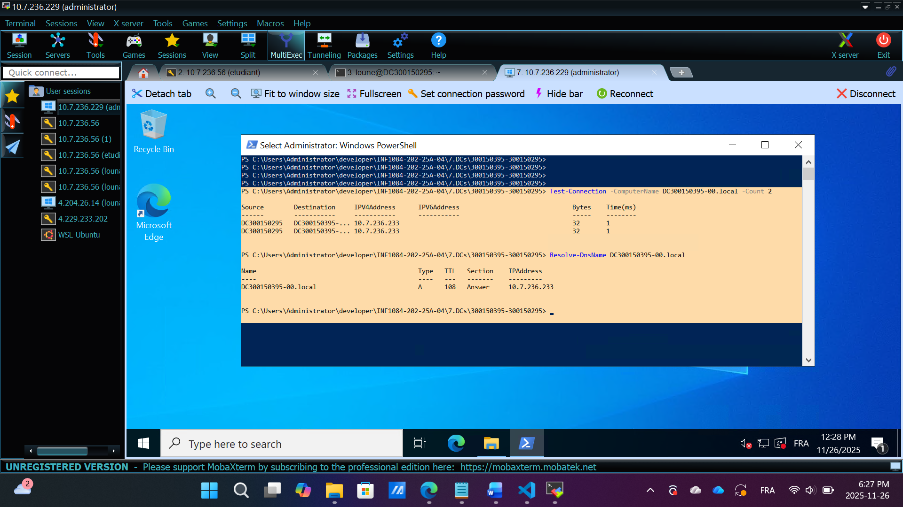


Étape 2 – Informations du domaine distant
<details> <summary>Commande PowerShell utilisée</summary>
```powershell

$credAD2 = Get-Credential
Get-ADDomain -Server DC300150295-00.local -Credential $credAD2

</details>

```

[CAPTURE 2] Infos complètes du domaine distant

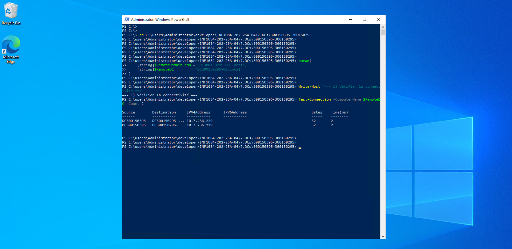   

Étape 3 – Navigation dans l’AD distant (PSDrive AD2:)
<details> <summary>Création du lecteur Active Directory AD2:\</summary>

```powershell 

New-PSDrive -Name AD2 `
    -PSProvider ActiveDirectory `
    -Root "DC=DC300150295-00,DC=local" `
    -Server DC300150295-00 `
    -Credential $credAD2

Set-Location AD2:\
Get-ChildItem
</details>

```

[CAPTURE 3] PSDrive AD2 créé
        
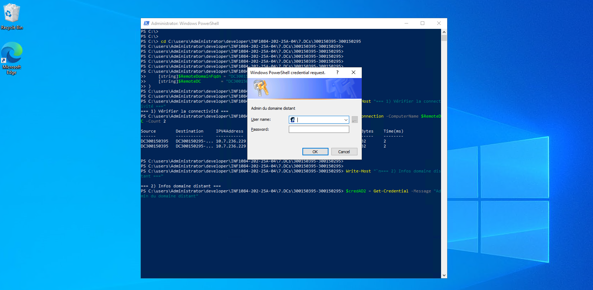     
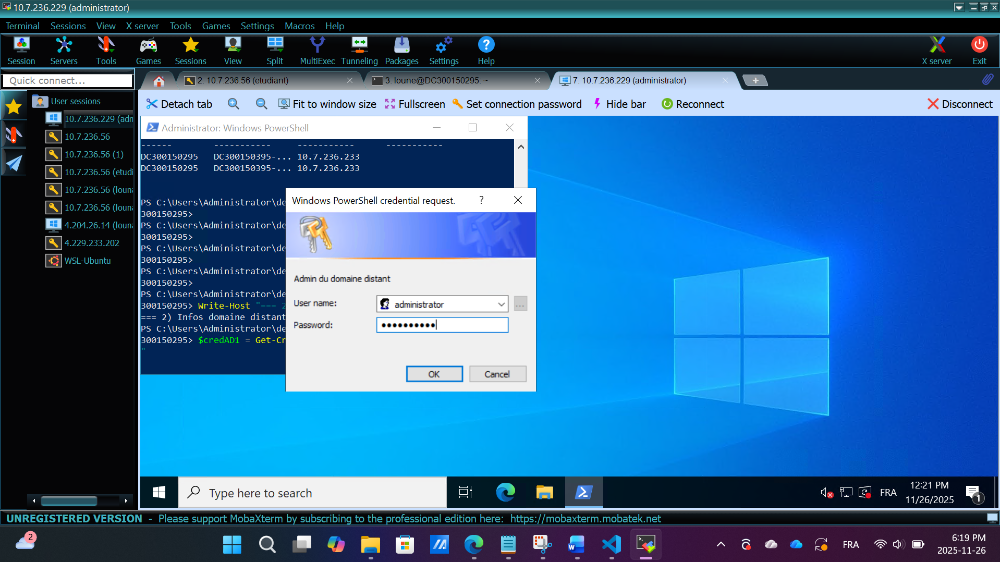     

[CAPTURE 4] Navigation dans les OU du domaine distant

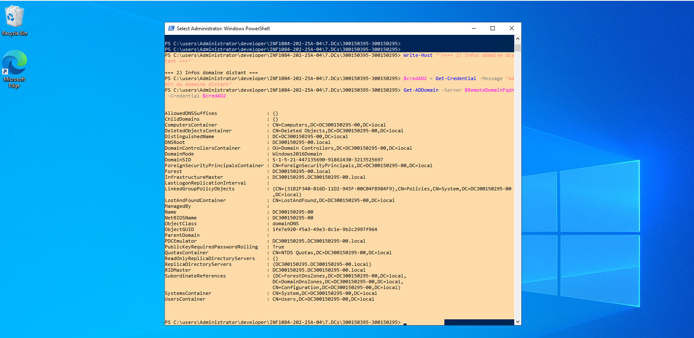                                                               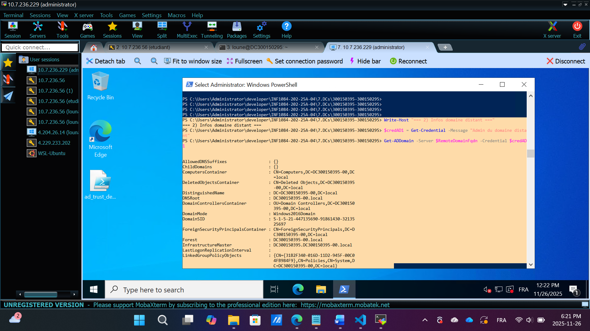                                                                


Navigation dans les OU du domaine distant

Étape 4 – Script d’automatisation (verif.ps1)

<details> <summary>Code complet du script utilisé</summary>
```powershell 

param(
    [string]$RemoteDomainFqdn = "DC300150295-00.local",
    [string]$RemoteDC = "DC300150295-00"
)

Write-Host "=== 1) Vérifier la connectivité ==="
Test-Connection -ComputerName $RemoteDC -Count 2

Write-Host "=== 2) Infos domaine distant ==="
$credAD2 = Get-Credential -Message "Admin du domaine distant"
Get-ADDomain -Server $RemoteDomainFqdn -Credential $credAD2

Write-Host "=== 3) Navigation AD2 ==="
New-PSDrive `
    -Name AD2 `
    -PSProvider ActiveDirectory `
    -Root "DC=DC300150295-00,DC=local" `
    -Server $RemoteDC `
    -Credential $credAD2 -ErrorAction Stop

Set-Location AD2:\
Get-ChildItem

Set-Location C:\

Write-Host "=== Fin du script ==="
</details>
```

[CAPTURE 5] Exécution du script + fenêtre Credential
        
 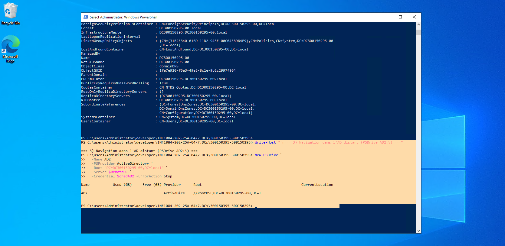 
 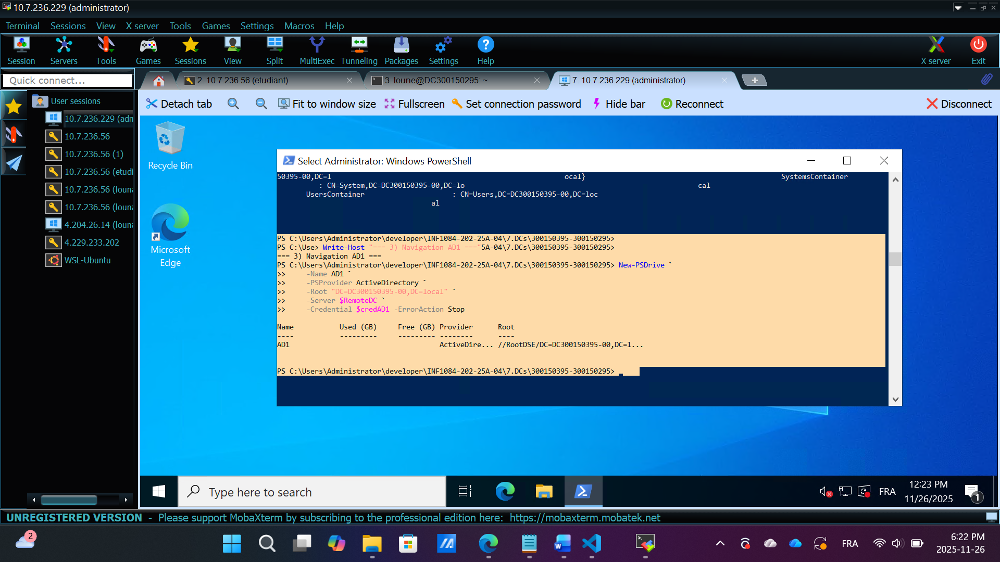 

Étape 5 – Résultat final
Toutes les vérifications ont été réussies :

Connectivité OK

DNS OK

Accès au domaine distant OK

PSDrive fonctionnel

Navigation dans les OU possible

Automatisation OK

[CAPTURE 6] Fin du script – état final

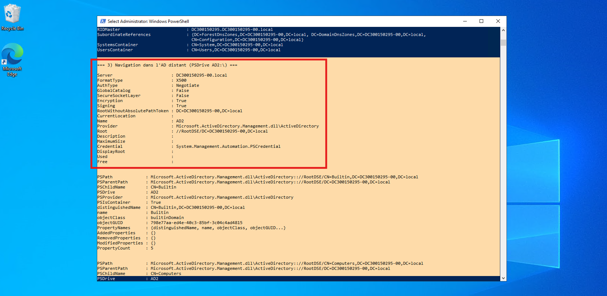 
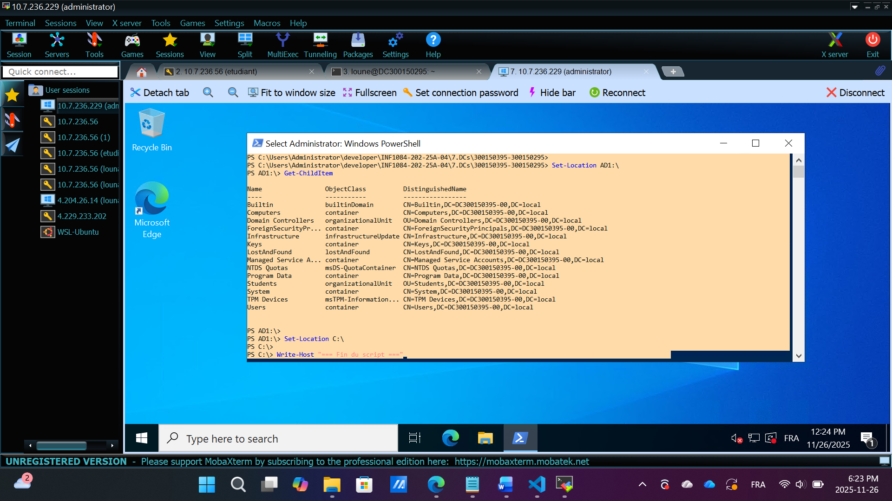 
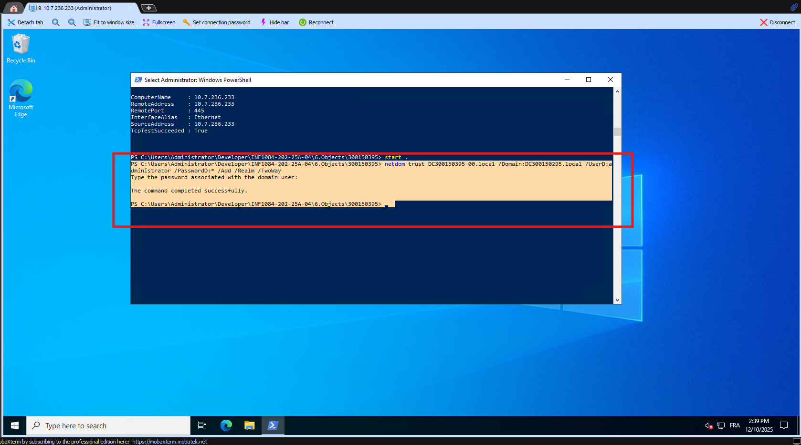 
Conclusion
Les deux domaines peuvent communiquer correctement.
L’accès à l’Active Directory distant fonctionne parfaitement et le script permet d’automatiser toutes les vérifications demandées.


